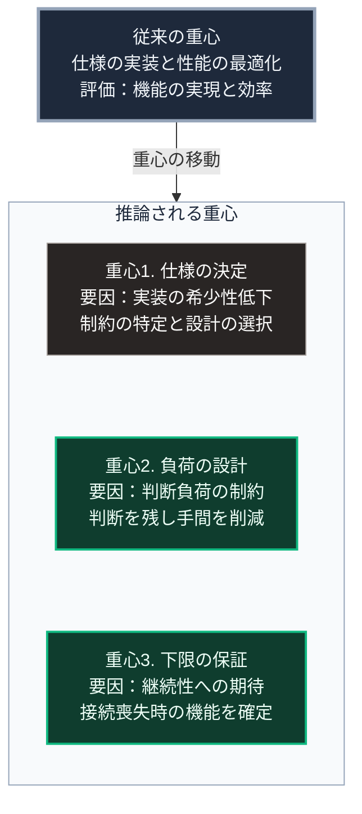

本記事は、Zenn Book『未来予測の設計図』の付録Aです。本編の[第Ⅳ部](https://zenn.dev/takenori_kusaka/books/sovereign-resilience-blueprint/viewer/implication-state)までの推論を踏まえ、技術者という職能が将来社会において何を担うのかを検討します。

本編はこちらです。[未来予測の設計図 ―― 歴史的事実・現在の外部入力・20年後の社会構造](https://zenn.dev/takenori_kusaka/books/sovereign-resilience-blueprint)

---

### 序論：本付録が扱う範囲

本付録は、技術者という職能が将来の社会において何を担うのかを検討します。

本書の本編は、社会構造の変化を扱いました。本付録は、その変化のなかで特定の職能がどう位置づけられるかという、より限定的な問いを扱います。

この問いを付録として扱う理由は、対象が限定されるためです。本編の推論は、職業を問わず読者に関係します。一方、本付録の内容が関係する範囲は、技術系の職種で働く読者に限られます。

本付録の記述は推論です。[第Ⅲ部-1](https://zenn.dev/takenori_kusaka/books/sovereign-resilience-blueprint/viewer/future-method)の確度の階層に照らせば、階層3または階層4に属します。したがって、確度は本編の他の部分より低くなります。

### 1. 技術者という職能の歴史的な位置

[第Ⅰ部C-1](https://zenn.dev/takenori_kusaka/books/sovereign-resilience-blueprint/viewer/innovation-overview)で整理した4段階モデルにおいて、技術者が関与するのは主として効果1と効果2です。すなわち、作業の代替と、組織の再設計です。

効果3の職能の再編と、効果4の制度の変更については、技術者は当事者の1人ではありますが、決定の主体ではありません。

この位置づけには、非対称があります。技術者は変化を実装する側にいますが、その変化がもたらす社会的な帰結を制御する立場にはありません。

[第Ⅰ部D-2](https://zenn.dev/takenori_kusaka/books/sovereign-resilience-blueprint/viewer/war-technology-evolution)で整理したとおり、軍事技術の変化は費用構造を通じて社会に作用しました。同じ構造が、民生技術にも当てはまります。ある技術を安価に利用可能にする実装の判断が、その技術の社会的な分布を規定します。

### 2. 生成AIが技術者の職能に及ぼす作用

[第Ⅲ部-5](https://zenn.dev/takenori_kusaka/books/sovereign-resilience-blueprint/viewer/20_autonomous-society-frictions)で参照した観測によれば、生成AIの導入効果は経験の浅い作業者において大きく、経験の長い作業者において小さいという分布が報告されています。

この分布が技術者の職能に当てはまる場合、次の推論が成立します。

**推論1：実装作業そのものの希少性は低下します**

仕様が明確であり、既存の方式で解決可能な実装については、その作業の希少性が低下します。

**推論2：仕様を定める作業の比重が高まります**

何を作るべきかを決める作業、すなわち要求の把握、制約の特定、そして設計判断は、依然として人が担います。

**推論3：責任の帰属が明確な作業の比重が高まります**

[第Ⅳ部-4](https://zenn.dev/takenori_kusaka/books/sovereign-resilience-blueprint/viewer/implication-individual)で述べたとおり、責任は機械に帰属させることができません。設計の妥当性を保証し、障害の原因を説明し、改善を約束する行為は、責任の所在を伴います。

### 3. 本書の推論から導かれる技術者の役割

[第Ⅳ部](https://zenn.dev/takenori_kusaka/books/sovereign-resilience-blueprint/viewer/implication-state)の4章に共通する結論は、変化の実現が意識ではなく設計に依存するというものでした。

この結論を技術者の役割として読み替えると、次の3点になります。

**役割1：判断の負荷を下げる設計をすること**

[第Ⅲ部-5](https://zenn.dev/takenori_kusaka/books/sovereign-resilience-blueprint/viewer/20_autonomous-society-frictions)で整理したとおり、人は負荷の低い選択肢を選びます。判断の主体を利用者に残すことが望ましいとしても、その負荷が高ければ、実際には選ばれません。

したがって求められるのは、利用者に努力を求める設計ではなく、判断に要する負荷を下げる設計です。その具体的な要件は、[第Ⅴ部-17](https://zenn.dev/takenori_kusaka/books/sovereign-resilience-blueprint/viewer/59_p2p-mesh-lora-offline-communication)で根拠の提示、動作の変更可能性、手動経路の保持として整理しました。

**役割2：時間軸の長い指標を、実装の判断に組み込むこと**

[第Ⅳ部-3](https://zenn.dev/takenori_kusaka/books/sovereign-resilience-blueprint/viewer/implication-company)で整理したとおり、企業の評価指標には測定周期の差があります。短期の指標が優先される構造は、意思決定者の資質ではなく誘因の構造に起因します。

技術者は、この誘因の構造の外側にいるわけではありません。しかし、実装の判断において、継続能力に関わる選択の余地は持ちます。供給元の分散、記録の可搬性、そして特定の事業者への依存度は、いずれも実装段階で決まります。

**役割3：機能する状態の下限を保証すること**

[第Ⅳ部-1](https://zenn.dev/takenori_kusaka/books/sovereign-resilience-blueprint/viewer/implication-state)で整理したとおり、期待される機能の重心は「高い水準」から「途絶しないこと」へ移る可能性があります。

この要請を技術的に読み替えた要件は、[第Ⅴ部-10](https://zenn.dev/takenori_kusaka/books/sovereign-resilience-blueprint/viewer/52_vpp-peer-to-peer-load-sharing)および[第Ⅴ部-11](https://zenn.dev/takenori_kusaka/books/sovereign-resilience-blueprint/viewer/53_decentralized-water-wota-closed-loop)で整理しました。外部との接続が失われた状態で維持する機能を設計時に定め、その状態への移行を自動化することです。

### 🗺️ 図：技術者の役割の重心

従来の重心と、推論される重心を対比します。

#### 図の読み方

この図は、上段の従来の重心から下段の枠へ、重心の移動として読みます。枠内には推論される3つの重心が縦に並び、各箱の2行目に移動を生む要因を示しています。

この図が示すのは、技術者の職能が消滅するのでも、単に高度化するのでもないという点です。重心が移動します。

枠内の最上段の重心1は、従来から技術者の業務に含まれていました。変化するのは比重です。

枠内の下2つ、すなわち重心2と重心3は、従来は明示的な設計目標として扱われることが少なかった領域です。

重心2について。利用者の判断負荷は、使いやすさの一部として扱われてきました。ここで述べているのは、それとは異なる論点です。使いやすさは、しばしば判断そのものを減らす方向で追求されます。一方、ここで求めるのは、判断を残したまま負荷を下げる設計です。両者は別の目標です。

重心3について。可用性は従来から設計目標でした。ここで述べているのは、外部接続が長期にわたり失われた状態を設計条件に含めるという点です。これは、冗長化による可用性の向上とは異なる要請です。

[第Ⅴ部](https://zenn.dev/takenori_kusaka/books/sovereign-resilience-blueprint/viewer/42_taoist-wu-wei-non-action)で扱った各要件は、重心2と重心3の具体形にあたります。
---

### 本付録の位置づけ

1.  **本付録の確度**

    本付録の推論は、本編より確度が低くなります。職能の構成は、[第Ⅲ部-1](https://zenn.dev/takenori_kusaka/books/sovereign-resilience-blueprint/viewer/future-method)の確度の階層において階層3または階層4に属するためです。

    とりわけ推論1、すなわち実装作業の希少性に関する推論は、観測データの蓄積が始まった段階の知見に基づいています。5年後には異なる評価が可能になっている可能性があります。

2.  **本付録が主張しないこと**

    本付録は、特定の技術や職種を推奨しません。また、技術者が社会的な責任を負うべきであるという規範的な主張も行いません。

    述べたのは、本書の推論が妥当である場合に、技術者の業務内容がどう変化するかという記述です。

3.  **読者への提案**

    本付録の推論を検証する方法は、第Ⅲ部-12で示した指標を追跡することです。とりわけ、業務手順を実際に変更した組織の比率と、職種別の求人構成の変化が、直接の指標となります。

    これらの指標が、本付録の推論と異なる動きを示す場合、推論は修正されるべきです。
