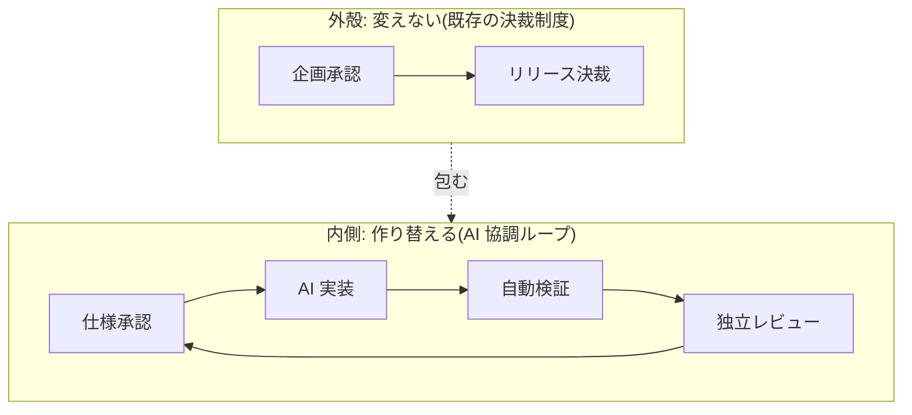

「日本の会社の稟議やレビュー文化では、AI 開発なんて無理だ」——よく聞く話です。半分は当たっています。ただし、**有利な点と不利な点は別々に評価すべき**です。

---

## 有利な点: 独立レビューを制度として持っている

生成が速く自律的になるほど、人間の検証帯域が律速点になります。だから AI 前提のプロセスは、例外なく人間の承認ゲートを置きます。

- AIDLC は Human-in-the-loop の承認ループを明示する
- 仕様駆動開発は仕様の人間承認を工程として置く
- GitHub は「自分の PR を承認できない」設計を持っている

つまり、**AI 時代のプロセスが要求するのは「作った本人以外が確認する」構造**です。

日本の製造業・SIer が積み上げてきたものを見ると、この要求と重なるものが少なくありません。

| 既存の仕組み | AI 前提のプロセスでの位置づけ |
| --- | --- |
| 出荷判定を開発ラインの外に置く | G-7 出荷判定 |
| 設計審査(DR)で第三者が見る | G-3 技術設計判断 / G-6 独立レビュー |
| 判定を記録として残す | ゲート判定記録 |
| 品質保証部門が独立している | 出荷判定者と開発ラインの分離 |

「独立した第三者が確認し、記録を残す」という文化は、**この構造では資産になります**。ゼロから作る組織より有利な位置にいる、というのが本書の見立てです。

:::message
これは「日本のやり方は正しかった」という話ではありません。**たまたま今回の要求と噛み合う部分がある**、という限定的な主張です。
:::

---

## 不利な点: 責任が分散する

一方で、はっきり不利な点もあります。

### 稟議は責任を分散させる

稟議は多数の承認印を集める仕組みです。**全員が承認しているが、誰も結果に責任を負っていない**という状態を作りやすい。

AI が生成した成果物では、この構造が致命的になります。「AI が勝手にやった」「承認欄には印があるが誰も中身を見ていない」という状態が、責任の所在を消してしまう。

だからピットイン方式は、成果物ごとに**結果責任を1人に固定**します。

- どの成果物にも、結果責任(A)を持つ人が1人だけいる
- **AI は結果責任を持てない**。AI はどこまでも実行(R)
- 委譲しても結果責任は移らない

### 決定権が職位で決まる

技術判断を、技術の分からない職位者が決裁する構造はよく見られます。これは判定を形骸化させます。中身を判断できない人は、差し戻す根拠を持てないからです。

ピットイン方式では、**技術判断と事業決裁を別のゲートに分けます**。

| ゲート | 判定するもの | 誰が |
| --- | --- | --- |
| G-3 技術設計判断 | 設計の可逆性・非機能・代替案の比較 | 技術判断者(技術力量で任命) |
| G-1 / G-8 事業決裁 | 投資とリリースの是非 | 事業決裁者(既存の決裁権限規程どおり) |

**事業決裁者は技術判断に関与しません。**技術判断者は職位ではなく技術力量で任命します。

### 合議が速度を落とす

「関係者を集めて決める」形式は、AI の生成速度と最も相性が悪い部分です。

ピットイン方式は**単独判定**を原則にします。ただし、日本の組織で機能させるための工夫を入れています。

- 判定の前に**非同期のコメント期間**を置く(事前の相談は歓迎する)
- コメントは集約するが、**判定は1人が単独で行う**
- 判定には期限を置く。超過しても**自動承認にせず**、エスカレーションする

「根回しをなくす」のではなく、**根回しを非同期化して、判定だけを単独にする**という設計です。

---

## 既存制度に対して変更を求めるのは2点だけ

ここが提案の要点です。ピットイン方式が既存制度に対して変えることを求めるのは、次の2点しかありません。

1. **技術判断を事業決裁から分離する**
2. **ゲートの判定を単独判定にする**

逆に、次のものは変えません。

- 既存の稟議・決裁権限規程
- 品質保証部門による出荷判定
- 設計審査の会議体(規模に応じて対応づける)

**外側の事業ゲートはそのまま使い、内側の開発ループだけを作り替える**。この二層構造が、既存組織へ導入するための設計です。

---

## 受託開発ではどうなるか

発注側と受注側に分かれる場合、責任の分界が問題になります。ピットイン方式の立場は明確です。

**契約の類型(請負 / 準委任)で責任を決めません。判定を置いた側が結果責任を持ちます。**

契約類型を軸にすると、同じ工程の責任が契約書の表題で変わってしまいます。それよりも「このゲートの判定はどちらが行うか」を締結時に決めるほうが、争点が具体的になります。

| ゲート | 判定を置く側 |
| --- | --- |
| G-1 企画承認 / G-4 機能仕様承認 / G-7 出荷判定 / G-8 リリース決裁 | **発注側で固定** |
| G-3 技術設計判断 / G-6 独立レビュー | どちらでもよい。置いた側が責任と判定帯域を負う |

もう1つ重要な論点があります。**発注側に AI 生成コードを読み解く帯域がない場合、受注側の検証の正しさを確かめる方法はありません。**

この状態に対する代替手段を、本標準は用意していません。読めないまま統治する構成が存在しないからです。選択肢は3つで、いずれも選ばない状態は認めません。

- 発注側へ読解の担い手を置く
- 読解を第三者へ委託する(当該案件に関与していない者)
- 対象を、読解しなくても受け入れられる範囲へ限定する

---

## この章のまとめ

- 有利な点: 独立した第三者レビューと記録の文化が、AI 前提の要求と噛み合う
- 不利な点: 稟議による責任の分散、職位による技術決裁、合議による遅延
- 既存制度に求める変更は2点だけ(技術判断の分離、単独判定)
- 受託では、契約類型ではなく「判定を置いた側」に責任を紐づける

---

[← 前の章](what-actually-changes) ／ [次の章 →](five-gaps)
