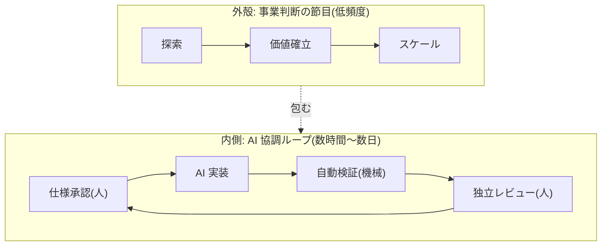

> マシンは人間より速い。それでも、決められた場所では必ず人間が触る。

F1 のピット作業は、18〜20 名が2秒以下で終えます。タイヤ一本に3名が付き、作業を最小単位まで分解して専任を置く「超専門化」でこの速さを出しています。レースそのものは止まりません。決められた場所でだけ人の手が入ります。

AI が実装を主導する開発でも、この形は変わらないというのが本書の主張です。**ピットイン方式**と呼んでいます。

この章だけで要点は伝わるように書きました。引っかかったところがあれば、その論点の付録へ進んでください。

---

## この本が想定している読者

| 何を感じているか | どこを読むか |
| --- | --- |
| AIDLC のような理想論は現場では成立しないと思う | [第2章](why-it-looks-idealistic) |
| AI で開発が変わるのは分かるが、何がどう変わるのかピンと来ない | [第3章](what-actually-changes) |
| 日本の会社の稟議やレビュー文化では無理だと思う | [第4章](japanese-organizations) |
| 導入すると何が壊れるのか知りたい | [第5章](five-gaps) |
| 具体的な手順に落ちたものが見たい | [第6章](the-structure) |
| 「ルールを作っても形骸化する」を何度も見てきた | [第7章](against-formalization) |
| 個人開発でも使えるのか知りたい | [第8章](solo-developer) |

---

## 1. なぜ「理想論」に見えるのか

生成AIを前提とした開発プロセスは、しばしばこう語られます。

> AI が自律的に開発し、人間は意思決定だけを行う。

この語り方が理想論に聞こえるのは、書き手が現実を知らないからではありません。**AI が解こうとしている問題と、実際に残る問題が食い違っている**ためです。

| AI が解こうとしていること | 人間と組織に残ること |
| --- | --- |
| 実装コストのゼロ化 | 何を作るかの価値判断 |
| 生成の高速化 | 要求の言語化 |
| 自己検証 | 検証したことの説明責任 |
| | 決定権限の一意性 |
| | 暗黙知の表出化 |

左の列が進むほど、右の列がボトルネックとして目立ちます。**AI が賢くなっても、右の列は自動的には解けません**。

「理想論だ」という直感は、この非対称性を正しく捉えています。理想論の主張が間違っているのではなく、**理想論が触れていない部分が実務の大半を占める**というのが実態に近い。

:::message
「AI さえ賢くなれば全部解決する」という主張を否定するために、AI の能力を低く見積もる必要はありません。能力の議論と、組織の議論は別の軸にあります。
:::

→ 詳しくは [第2章 なぜ「AIDLC は理想論」に見えるのか](why-it-looks-idealistic)

---

## 2. 本当に変わるのは何か

変わるのは、**開発者の作業の重心**です。

| 従来の作業 | AI が実装を主導する場合 |
| --- | --- |
| 実装コードを1行ずつ書く | AI へ委譲する |
| 仕様を頭の中に保持する | 検証可能な受入基準として外へ出す |
| 生成された変更を全行読む | 検証の順序に従い、範囲を絞って読む |
| 動作確認を手作業で繰り返す | 自動検証へ移し、人は不合格時の判断に集中する |
| 設計判断を暗黙に処理する | 判断記録として残す |

**委譲するのは実装であって、判断ではありません。**

とくに3行目が効いてきます。エージェントは人が読める速度を超えて変更を生成します。規模の大きな差分に対する逐行確認は、時間の制約のもとで**実質的な承認操作へ縮退します**。「全部読んでから承認する」という前提が、静かに崩れる。

だから「読む量を増やす」方向ではなく、**確認する観点を数え上げられる形にする**方向へ設計を変える必要があります。

→ [第3章 本当に変わるのは何か](what-actually-changes)

---

## 3. 律速点は人の検証帯域になる

理想像は「人は決めるだけ」と語りますが、技術の現実はむしろ逆です。

生成が速く自律的になるほど、**人間の検証帯域が最大の律速点**になります。だからこそ AIDLC と仕様駆動開発は、人間の承認ゲートを明示的に置きます。GitHub が「自分の PR を承認できない」設計を持っているのも同じ理由です。

この連鎖を止める方法は2つしかありません。

1. **判定の場を増やさない**(承認者を増やしても質は上がらない)
2. **1回の判定対象を小さくする**

判断の質は、読んだ行数ではなく**確認した観点の数**で決まります。

---

## 4. 日本の組織はむしろ有利になりうる

意外に聞こえるかもしれませんが、**独立した第三者レビューを制度化してきた日本の品質保証文化は、この構造に向いています**。

- 出荷判定を開発ラインの外に置く
- 作った本人以外が確認する
- 判定を記録として残す

いずれも、AI が実装を主導する構成でそのまま必要になるものです。

一方で、不利な点もはっきりしています。

| 有利 | 不利 |
| --- | --- |
| 第三者レビューの制度がある | 稟議が責任を分散させる |
| 記録を残す文化がある | 決定権が職位で決まる |
| 品質保証部門が独立している | 合議が判定の速度を落とす |

**有利な点は生かし、不利な点だけを変える**——これが現実的な設計だと考えています。実際、ピットイン方式が既存制度に対して変更を求めるのは2点だけです。技術判断を事業決裁から分離すること、そしてゲートの判定を単独判定にすることです。

→ 詳しくは [第4章 なぜ日本の組織は有利になりうるのか](japanese-organizations)

---

## 5. 何が壊れるのか

導入で問題になるのは、AI の賢さではなく組織側の前提です。5つあります。

| # | ギャップ | 何が起きるか |
| --- | --- | --- |
| G1 | 明文化の壁 | 暗黙知が AI へ渡らず、生成物が的を外す |
| G2 | 責任主体の欠落 | AI の生成物に責任者がいない状態が生まれる |
| G3 | 職位ゲートと専門性の乖離 | 技術判断を技術が分からない人が決裁する |
| G4 | ロールの曖昧さ・兼務 | 作成者が自分の成果物をレビューする構造ができる |
| G5 | 承認滞留 | AI が3時間で書き、承認に3週間かかる |

**技術のギャップは時間が解きます。組織のギャップは待っても埋まりません。**

→ 詳しくは [第5章 何が壊れるのか](five-gaps)

---

## 6. ピットイン方式の骨格

二層構造です。外側はゆっくり、内側は速く回ります。

外側は既存の稟議・決裁制度をそのまま使います。**壊しません**。内側だけを AI の速度に合わせて作り替えます。

工程のゲートは8つです。

| ゲート | 判定するもの | 判定者 |
| --- | --- | --- |
| G-1 企画承認 | 投資判断 | 事業決裁者 |
| G-2 要件合意 | 受入基準が検証可能か | 価値責任者 |
| G-3 技術設計判断 | 設計の可逆性と整合 | 技術判断者 |
| G-4 機能仕様承認 | タスクの粒度と範囲 | 価値責任者 |
| **G-5 自動検証** | **8基準すべて機械判定** | 機械 |
| G-6 独立レビュー | 作成者以外が挙動を確認 | 独立レビュア |
| G-7 出荷判定 | 記録の完備 | 品質保証 |
| G-8 リリース決裁 | 事業リスクの受容 | 事業決裁者 |

3つの原則があります。

- **判定者は1人**。合議体にしない。事前の非同期コメントは歓迎するが、判定は単独で行う
- **作成者は承認しない**。同一成果物で作成指示者とレビュアを兼ねない
- **AI は結果責任を持てない**。AI はどこまでも実行(R)であり、責任(A)は必ず人間に紐づく

**G-4 と G-5 はどの構成でも省略できません**。それ以外はチーム規模・事業ステージに応じて簡略化または省略します。

→ 詳しくは [第6章 ピットイン方式の骨格](the-structure)

---

## 7. 形骸化をどう防ぐか

「ルールを作っても形骸化する」——これは正しい観察です。だから**形骸化する条件を先に特定して、そこを構造で塞ぐ**設計にしています。

| 防ぐもの | 手段 |
| --- | --- |
| 逐行確認が印を押す操作へ縮退する | 確認の範囲を有界にする(数え上げられるものだけ見る) |
| 指示ファイルが守られない | 指示ではなく実行環境の設定で遮断する |
| 自律レベルが上がりっぱなしになる | 引き上げは判定を要し、引き下げは自動で発火させる |
| テストを通すためにテストを書き換える | 自己修正ループの書き込み範囲からテストを外す |
| 測定が個人の評価に転用される | 測定の対象を工程に限り、個人の成績を算出しない |

とくに2行目が要点です。**指示ファイルの遵守は保証されません**。「〜してはならない」と書いた項目のうち、実行環境の設定で強制できるものは、必ずそちらへ降ろします。強制層に置けない項目は、遮断できたものとして数えません。

→ 詳しくは [第7章 形骸化をどう防ぐか](against-formalization)

---

## 8. 1人でも回るのか

正直に書きます。**1人 + AI では、独立レビュー(G-6)だけが原理的に埋まりません。**

G-6 の判定基準は5項目あり、そのうち4項目は自分で実行できます。埋まらないのは「作成を指示した本人でない」の1項目だけです。**作成時に抱えた思い込みを、抱えていない人が見ること**。1人ではこれが成立しません。

AI で埋めることもできません。同じモデルを使う限り、エージェントを分けても事前学習の知識という共通の原因が残ります。生成物の確認を生成器へ委ねる構成は、自動化バイアスによって見落としを増やす方向に働きます。

そこで、達成できないゲートを**省略ではなく「未達」として表示し続ける**設計にしました。

| 状態 | 意味 |
| --- | --- |
| 省略(omitted) | 規則により省略した。調整として成立している |
| **未達(unmet)** | **目的を達成する構成を示せていない** |

未達は消えません。埋めるか、体制を変えるかのいずれかです。

:::message
これは心地よい表示ではありません。それでも「宣言すれば済む」形にしませんでした。宣言が通過儀礼へ変わった瞬間、この仕組み全体が意味を失うからです。
:::

→ 詳しくは [第8章 1人でも回るのか](solo-developer)

---

## 9. 明日から何をするか

準拠テンプレートを用意しています。

https://github.com/Takenori-Kusaka/pit-in-template

1. GitHub の **Use this template** から新しいリポジトリを作る
2. Claude Code で開き `/process-init` を実行する
3. 5つの質問(人数・段階・品質要求・開発形態・最悪の場合の帰結)に答える

回答から、あなたの状況に合ったゲート構成・成果物・ブランチ保護が生成されます。専門用語では聞きません。

→ 詳しくは [第9章 明日から何をするか](getting-started)

---

## 補足: この標準の限界

本書が紹介するプロセスは**参照モデル**です。そのまま全組織に適用するものではありません。

- 閾値の多くは実測に基づく値ではない。自組織の値で置き換える前提
- 特定の業界規格への適合を証明するものではない
- 実運用のフィードバックはこれから集める段階

根拠の弱い記述には、識別子と見直し期限を付けて公開しています。**どこが確からしくて、どこが暫定なのかを読者が判断できる状態**を保つためです。

---

[次の章へ →](why-it-looks-idealistic)
