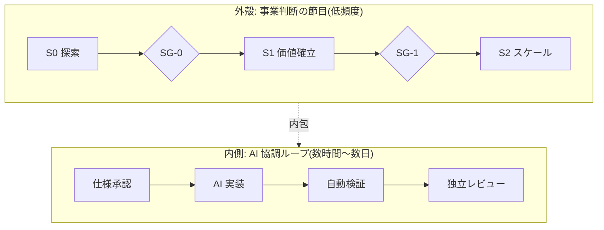

ここまでの論点を、具体的な構造に落とします。

---

## 二層構造

外側はゆっくり、内側は速く回ります。

**外側は既存の稟議・決裁制度をそのまま使います。**投資の是非、ステージ移行、リリースの決裁。ここは変えません。

**内側だけを AI の速度に合わせて作り替えます。**仕様承認 → AI 実装 → 自動検証 → 独立レビューが、機能単位で回ります。

この分離が、既存組織へ導入するための鍵です。「今の制度を壊しません」と言えることが、稟議を通す最大の材料になります。

---

## 8つの工程ゲート

| ゲート | 判定するもの | 判定者 | 期限の目安 |
| --- | --- | --- | --- |
| G-1 企画承認 | 投資対効果、リスクの受容方針 | 事業決裁者 | 既存の稟議どおり |
| G-2 要件合意 | 受入基準が検証可能な形式か | 価値責任者 | 48時間 |
| G-3 技術設計判断 | 設計の可逆性、非機能、代替案 | 技術判断者 | 48時間 |
| G-4 機能仕様承認 | タスクの粒度と範囲 | 価値責任者 | 24時間 |
| **G-5 自動検証** | **8基準すべて機械判定** | 機械 | 即時 |
| G-6 独立レビュー | 作成者以外が挙動を確認 | 独立レビュア | 2営業日 |
| G-7 出荷判定 | 記録の完備 | 品質保証 | 3営業日 |
| G-8 リリース決裁 | 事業リスクの受容 | 事業決裁者 | 48時間 |

**G-4 と G-5 は、どの事業ステージでも省略できません。**それ以外は規模・ステージに応じて簡略化または省略します。

### G-5 の8基準

ここだけは全部機械が判定します。人の判断を挟みません。

| # | 基準 | 初期値 |
| --- | --- | --- |
| 1 | 全テスト GREEN | 例外なし |
| 2 | 静的解析・脆弱性の重大指摘 | Critical / High が0件 |
| 3 | テストカバレッジ | 企画時に定めた基準以上 |
| 4 | 曖昧語チェック | 禁止語0件 |
| 5 | 依存関係のライセンス検査 | 禁止ライセンス0件 |
| 6 | 文脈ファイルの形式検査 | 参照切れ0件 |
| 7 | 秘匿情報の混入検査 | 0件。**台帳記録による通過を認めない唯一の基準** |
| 8 | 依存関係の追加・更新の識別 | 一覧を機械が出力する |

基準7だけ例外扱いなのは、秘匿情報が混入した場合、資格情報の無効化と再発行が必須になるからです。「記録して後で対応」が成立しません。

---

## 3つの原則

### 判定者は1人

合議体を判定の場にしません。事前の非同期コメント期間を置き、意見はそこで集約します。**判定は1人が単独で行います。**

「みんなで決める」は、決めない状態を作りやすい。誰が引き受けるのかを名前で固定します。

### 作成者は承認しない

同一成果物で、作成を指示した本人と独立レビュアを兼ねません。同一案件で、開発ラインと出荷判定者を兼ねません。

**これは規約に書くだけにせず、ブランチ保護の設定で強制します。**とくに `require_last_push_approval` を有効にします。これがないと、承認を得たあとに自分で push して内容を変えられます。

### AI は結果責任を持てない

RACI で表すと、AI の列に A(結果責任)は存在しません。AI はどれだけ実行(R)しても、結果責任は必ず人間に紐づきます。

これは「AI を信用していない」という話ではなく、**責任という概念が人間の制度の上にしか成立しない**という構造の話です。

---

## AI 自律レベル

AI にどこまで任せるかを、3つの変数で定義します。**番号だけで表しません。**

| レベル | 監視者 | フォールバック | 適用範囲 |
| --- | --- | --- | --- |
| L1 主導実装 | 人間が全ての変更を確認する | 人間 | 1機能単位。開発環境 |
| L2 仕様駆動の並行実行 | 人間が統合点を確認する | 人間および自己修正ループ | 複数機能の並行実装。検証環境まで |
| L3 自己修復 | 機械が常時監視し、人間が事後に確認する | 自動的な切り戻し | 事前に登録した変更種別に限定 |

### 引き上げは判定、引き下げは自動

ここが設計の要点です。

**引き上げ**は判定を要します。連続運用期間、差し戻し率、変更失敗率、是正事象の件数などの条件をすべて満たしたときに、申請して判定を受けます。

**引き下げ**は判定を待ちません。検知した時点で**自動的に発火します**。

| 検知する状態 | 措置 |
| --- | --- |
| 自動承認の比率が急上昇した | 1段階引き下げる |
| AI が起因の重大事象が発生した | 1段階引き下げる |
| **差し戻し率が0%のまま推移した** | **形骸化の疑いとして引き下げる** |
| コア機能の理解保持者が1名になった | 該当機能を L1 へ引き下げる |

:::message
差し戻し率0%を「うまくいっている」と読まないのが要点です。**監督の劣化は静かに進み、申告されません。**だから引き下げは自動にします。
:::

---

## 規模に応じて変わるもの

参照モデルをそのまま全組織へ適用しません。5つの軸で調整します。

| 軸 | 選択肢 | 何に効くか |
| --- | --- | --- |
| A. チーム規模 | 1〜2名 / 3〜9名 / 10名以上 | 兼務の許容、独立レビューの方式 |
| B. 事業ステージ | 探索 / 価値確立 / スケール | ゲートの厳格さ、負債の扱い |
| C. 期待品質・規制 | 標準 / 高 / 規制業 | 出荷判定の厳格さ、記録の粒度 |
| D. 開発形態 | 内製 / 受託(発注側) / 受託(受注側) | 契約ゲートの位置、検収の扱い |
| E. 安全重要度 | CL0 〜 CL3 | 安全成果物の要否、自律レベルの上限 |

たとえば PoC(2名・探索段階・標準品質・内製・CL0)では、G-4 と G-5 だけ残して他を省略します。代わりに CI の基準を厳格化します。

**ただし調整は宣言を伴います。**標準から外した項目を、理由とともに残します。宣言のない省略は、後から妥当性を検証できません。

そして、どの組み合わせでも外せないものが6つあります。

1. 結果責任を2人以上にしない
2. AI を結果責任にしない
3. 差し戻し基準のないゲートを作らない
4. 安全重要度が最上位の安全関連部で、自律レベルを L1 より上げない
5. 安全重要度が高い場合に、リスクアセスメントと検証記録を省略しない
6. 標準から外した項目を、宣言せずに運用しない

---

## この章のまとめ

- 二層構造。外側の事業ゲートは変えず、内側の開発ループだけ作り替える
- 8つのゲート。G-4 と G-5 は省略できない
- 判定者は1人、作成者は承認しない、AI は結果責任を持てない
- 自律レベルは「引き上げは判定、引き下げは自動」という非対称を持つ
- 規模に応じた調整は可能だが、宣言を伴う。外せない下限が6つある

---

[← 前の章](five-gaps) ／ [次の章 →](against-formalization)
