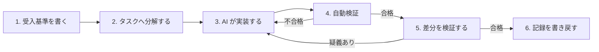

「AI で開発が変わる」と言われても、具体的に自分の1日がどう変わるのかは見えにくいものです。この章では、変わるものと変わらないものを線引きします。

---

## 変わるのは作業の重心

AI が実装を主導する前提では、開発者の作業の重心が移動します。

| 従来の作業 | 変化後 |
| --- | --- |
| 実装コードを1行ずつ記述する | AI エージェントへ委譲する |
| 仕様を作業者の記憶に保持する | 検証可能な受入基準として外部化する |
| 生成された変更を全行読む | 検証の順序に従い、範囲を絞って読む |
| 動作確認を手作業で繰り返す | 自動検証へ移し、人は不合格時の判断に集中する |
| 設計判断を暗黙に処理する | 判断記録として残す |

**委譲するのは実装であり、判断ではありません。** 何を作るか、どこまでを正しいとするかを決める作業は、移譲の対象になりません。

---

## 1機能あたりのサイクル

具体的な回り方はこうです。



工程3と工程4の往復は、エージェントが自律的に回します。人が関与するのは工程1・2・5・6です。

---

## 一番大きく変わるのは「読み方」

従来のレビューは「差分を全部読んで承認する」でした。これが成立しなくなります。

エージェントは人間が読める速度を超えて変更を生成します。規模の大きな差分に対する逐行確認は、時間の制約のもとで**実質的な承認操作へ縮退します**。読んだつもりで印を押す状態です。

そこで、読み方そのものを変えます。

### 検証の順序

**上から順に確認し、不合格が出た時点で以降を見ずに差し戻します。**

| 順 | 見るもの | 確認する内容 |
| --- | --- | --- |
| 1 | 受入基準とテストの対応 | 受入基準ごとに、違反すると失敗するテストが1つ以上あるか |
| 2 | 外部インタフェースの差分 | API・データ構造・権限・設定の変更が仕様の範囲に収まっているか |
| 3 | 差分の性質 | 追加か、移動か、複製か。既存の実装を再発明していないか |
| 4 | 実行トレース | 遮断が働いた記録と、機械判定が付けたラベル |
| 5 | 実装コード | **順1〜4で疑義が生じた箇所に限定して**読む |

順1〜4は、いずれも確認の範囲が**有界**です。受入基準の数、外部インタフェースの変更数、実行したツールの数は、すべて数え上げられます。

順5だけが範囲の定まらない作業です。だからこそ最後に置き、対象を限定します。

:::message
判断の質は、読んだ行数ではなく**確認した観点の数**で決まります。承認者の人数を増やしても、この効果は代替できません。
:::

### テストで担保できないもの

テストは、書かれた基準しか守りません。**基準そのものの欠落はテストでは検出できません。**

順1で受入基準を数え上げるのは、この欠落を人が確認するためです。「全部 GREEN だから大丈夫」は、書き忘れた基準については何も言っていません。

---

## 変わらないもの

次の判断は、AI の自律レベルにかかわらず人が担います。

| 判断の種類 | 内容 | 誰が |
| --- | --- | --- |
| 価値判断 | 何を作るか、どの順序で作るか | 価値責任者 |
| 技術判断 | どの設計を採るか、何を捨てるか | 技術判断者 |
| 理解の確認 | 成果物が仕様どおりに動くか | 独立レビュア |
| 記録の確認 | 判断と検証の記録が完備しているか | 出荷判定者 |

加えて、レベルによらない不変条件が4つあります。

1. 結果責任は人間に紐づく。AI は実行のみを担う
2. 本番環境への反映の承認は、人間が記名で行う
3. 認証・認可・個人データ・外部との契約に関わる変更は、人間が判断する
4. **適用範囲の拡大そのものを、AI が決定してはならない**

4つ目が地味に重要です。「うまくいっているから範囲を広げよう」という判断を AI にさせない、という規定です。

---

## 受入基準の書き方が要になる

作業の重心が移った結果、**受入基準を書く技術**が最も効く場所になりました。

エージェントが停滞する原因の多くは、能力の不足ではなく**完了条件の不在**です。完了の条件を曖昧さなく書けない機能は、書けるところまで分解してから渡します。

禁止する語があります。

```
適切に / 柔軟に / 可能な限り / 〜など / 必要に応じて / 基本的に
```

「適切にエラーを表示する」は基準になりません。「入力が空の場合、システムは項目名を含むエラーメッセージを当該項目の直下に表示しなければならない」なら基準になります。

これらの語は CI で機械的に検出し、通過させない構成にします。**人が毎回指摘することは、機械が指摘できます。**

---

## AI に草案を書かせてよいか

書かせてよいです。ただし**そのまま承認してはなりません**。基準の確定は価値判断だからです。

草案を受け取ったら、次を自分に問います。

- この基準を満たしても、作りたかったものにならない場合はあるか
- 書いていない前提はあるか
- スコープ外に入れるべきものはあるか

同じ理由で、**独立レビューの挙動要約を AI に生成させてはなりません**。要約は理解の証拠であり、生成物は証拠になりません。この欄は文書の体裁を整えるためのものではなく、承認者が対象を理解したことの記録です。

---

## この章のまとめ

- 変わるのは作業の重心。「書く」から「判定する」へ
- 逐行確認は成立しなくなる。確認の範囲を有界にする設計へ移る
- 変わらないのは、価値判断・技術判断・理解の確認・記録の確認
- 受入基準を書く技術が最も効く場所になる

---

[← 前の章](why-it-looks-idealistic) ／ [次の章 →](japanese-organizations)
