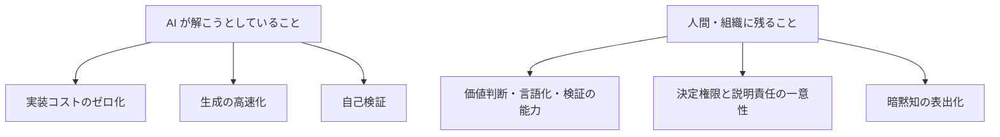
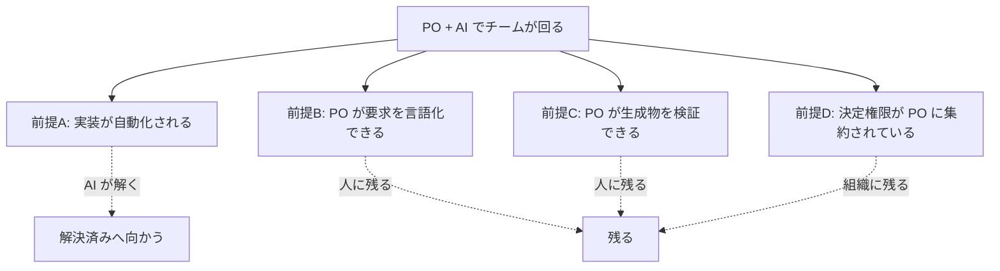

「AI が自律的に開発し、人間は意思決定だけを行う」という語り方に、違和感を持つ人は多いと思います。この章では、その違和感の正体を構造として説明します。

**結論を先に書くと、理想論の主張が間違っているのではありません。理想論が触れていない部分が、実務の大半を占めているのです。**

---

## 理想像が置いている前提

生成AIを前提とした開発プロセスは、いくつかの前提を暗黙に置いています。整理すると3層に分かれます。

| 層 | 前提 |
| --- | --- |
| **個人(P)** | 価値判断ができる。要求を言語化できる。生成物を検証できる |
| **組織(O)** | 決定権限が一意である。説明責任の所在が明確である |
| **知識(K)** | 暗黙知が表出化されている。文脈が機械可読な形で存在する |

理想像はこの3層が満たされた状態から話を始めます。そして「AI が賢くなれば実装は自動化される」と続けます。

ここに非対称があります。

**AI が進歩すると、左側は速くなります。右側は変わりません。**

そして左側が速くなるほど、右側がボトルネックとして目立つようになります。理想論を読んで「そんなにうまくいかない」と感じるのは、この右側の重さを実感として知っているからです。

---

## 3つの角度から見た同じ構造

この非対称性は、AI 開発を語る複数の文脈で別々の形で現れます。

### 角度1: エージェントの現在地

自律型エージェントのベンチマークは着実に伸びています。一方で、実務のタスクに対する到達度との差は縮まっていません。

差が残る理由は能力そのものではなく、**実務のタスクが「何が正解か」を含んでいない**ことにあります。ベンチマークには正解があります。実務には、正解を決める人が必要です。

### 角度2: プロダクトオーナー中心のチーム編成

「PO と AI だけでチームが回る」という編成論があります。これは前提の依存ツリーを持っています。

**AI が解くのは前提Aだけです。**B・C・D は人と組織の側に残ります。編成論が成立しないのではなく、成立させるために B・C・D をどう満たすかが本題になる、ということです。

### 角度3: コンテキストエンジニアリング

「暗黙知を AI に渡せば解決する」という主張があります。これも半分は正しく、半分は問題をずらしています。

暗黙知を渡すには、まず暗黙知を**言葉にする**必要があります。この変換労働は人間に残ります。しかも、書いた本人にとっては自明なので、書く動機が生まれにくい。

「明文化の壁」と呼んでいるものは、技術の問題ではなく**動機と作業量の問題**です。

---

## では理想論は無意味なのか

そうではありません。理想像は**到達点の方向**を正しく示しています。問題は距離の見積もりです。

本書の立場はこうです。

:::message
介入すべきは「AI が賢くなるのを待つこと」ではありません。**個人・組織・知識の前提を、実在する組織文化の中で成立させる仕組みを設計すること**です。
:::

つまり、理想論を否定するのでも、そのまま信じるのでもなく、**理想論が飛ばした部分に手を入れる**という立場です。

---

## 「AI に任せて誰も分からなくなる」という不安

理想論への違和感には、もう1つの成分があります。**技術の空洞化**への不安です。

従来、外注に出した部分は「社外に理解者がいる」状態でした。契約が続く限り、誰かが分かっている。

AI へ委譲した部分は違います。**理解している人間が社内・社外のどこにもいない状態**が生まれます。

これは事業継続性の問題です。だからピットイン方式では、独立レビューの目的を「バグを見つけること」だけに置いていません。**人間側の理解を維持すること**を明示的な目的に含めています。

- どの機能をコアとするか(人が理解を維持し続ける対象)を宣言する
- コア機能の理解保持者の人数を数える
- 理解保持者が1名になったら、その機能の AI 自律レベルを自動的に引き下げる

「AI に任せると分からなくなる」は、正しい不安です。だから**分からなくなる速度を測って、閾値で止める**という設計にしています。

---

## この章のまとめ

- 理想論が理想論に見えるのは、AI が解く問題と残る問題が食い違うため
- AI が進むほど、人と組織の側がボトルネックとして目立つ
- 残るのは、価値判断・言語化・検証の能力、決定権限の一意性、暗黙知の表出化
- 「AI に任せると誰も分からなくなる」は正しい不安。測って止める設計で扱う

---

[← 前の章](summary) ／ [次の章 →](what-actually-changes)
