### 概要：本書のコア・テーゼ

本書は、1,200年の文明史分析と最先端のシステム工学を融合させ、一元的な「集中型インフラ社会OS」が直面している設計限界と、それに対する局所自律・広域互助の「連邦型コモンズ（Nested Commons）」への転換プロセスを記述したシステム設計図です。

長大な全60章に及ぶ知の対話をシームレスに理解するため、本章（第0章）では視覚的なダイアグラム（Mermaid）とマトリクスを用いて、未来予測のロードマップおよびインフラ破綻の特性要因分析のサマリを提示します。

---

### 🗺️ 1. 未来予測の時系列ロードマップ

1970年から2055年にかけての人類社会OSの変遷、移行摩擦、およびその先の自律社会へのロードマップを以下のダイアグラムに示します。

---

### 🐟 2. 集中型社会OS・インフラ破綻の特性要因図（フィッシュボーン）

なぜ、私たちが当然視してきた「一元管理型のインフラ」は、極限状態においてカスケード崩壊するのでしょうか。その物理的、地政学的、技術的、および制度的な要因（ボトルネック）を分析した特性要因図を提示します。

```mermaid
flowchart TD
    %% Main Spine
    P[集中型インフラ社会OSの機能停止・破綻]

    %% Main Branches pointing down to spine
    B1[1. 物理・環境的要因] --> P
    B2[2. 地政学・サイバーの脅威] --> P
    B3[3. 認知的飽和・認識論危機] --> P
    B4[4. 制度的・反応レイテンシ] --> P

    %% Sub-branches pointing to Main Branches
    P1[沿岸部発電所・変電所の過度な集中立地] --> B1
    P2[基幹インフラ系統の単一障害点 SPOF] --> B1
    P3[気候激甚化に伴う送配電網の物理切断] --> B1

    G1[1対100の低コスト特攻ドローン飽和攻撃] --> B2
    G2[制御システムへのゼロデイサイバー攻撃] --> B2
    G3[電磁波・電子戦による広域通信回線遮断] --> B2

    C1[生成AIによるフェイク・人工データの氾濫] --> B3
    C2[脳のキャパシティを超える高次情報飽和] --> B3
    C3[事実合意OSの解体とAI部族主義の台頭] --> B3

    I1[民主的な合意形成プロセスの線形時間] --> B4
    I2[維持保守コスト高騰に伴う地方インフラ後退] --> B4
    I3[人間の裁量を排除したアルゴリズム自動統治] --> B4

    %% Styling
    style P fill:#991b1b,stroke:#f87171,stroke-width:3px,color:#fff
    style B1 fill:#1f2937,stroke:#374151,color:#fff
    style B2 fill:#1f2937,stroke:#374151,color:#fff
    style B3 fill:#1f2937,stroke:#374151,color:#fff
    style B4 fill:#1f2937,stroke:#374151,color:#fff
```

---

### 📝 3. 本書のコア・アプローチ（4大生存スタック）

本書は、これらの破綻要因を乗り越え、持続可能なレジリエンスを実社会に実装するための「4つの自律分散技術スタック」を提示し、実証します。

1. **分散型のエネルギー（第51章〜第52章）**:
   単一の系統に全面的に依存せず、産業用蓄電池（PowerX Mega Power）や太陽光発電をローカルに配備し、仮想発電所（VPP）ソフトウェアを介して多層的にネスト（統合）された、各個撃破されない地域給電ネットワーク[[11]](61_bibliography#11)[[14]](61_bibliography#14)。
2. **分散型水循環（第53章〜第55章）**:
   大規模な水道配管網から独立し、水質監視センサーとAI自動制御によって現場でクローズドループろ過を繰り返すオフグリッド水システム（WOTA BOX）。および、自治体間を相互接続して保守部品や技術を融通し合う広域互助プラットフォーム（JWAD）の構築[[12]](61_bibliography#12)[[13]](61_bibliography#13)。
3. 不壊のエッジデータ基盤は、第56章から第58章で詳細に解説されています。
スタンドアロンな状況決定支援は、RAG（検索拡張生成）によって実現されます。このRAGシステムは、以下の要素を統合しています。システムには、NixOSが採用されています。このOSは、電源喪失やクラッシュ時にもシステムファイルの不整合を防止する、ステートレスな不壊OSです。データ管理には、ローカルなSQLiteデータベースが用いられます。また、ローカルSLM（Phi/Llama）も利用されます。このSLMは、エッジ端末上で機能します。広域通信（WAN）が切断された状況でも、100%の機能を発揮します。
4. **物理オフライン通信路（第59章）**:
   携帯キャリアの電波や光ファイバーが途絶した被災・有事環境下において、免許不要の特定小電力の無線機やLoRaを用いて、近隣拠点間でバケツリレー式に非同期テキストデータを伝播させる、草の根のP2Pメッシュネットワーク通信。
