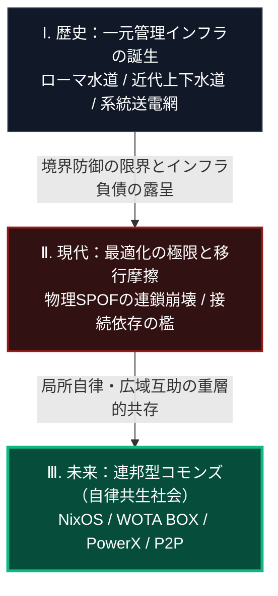
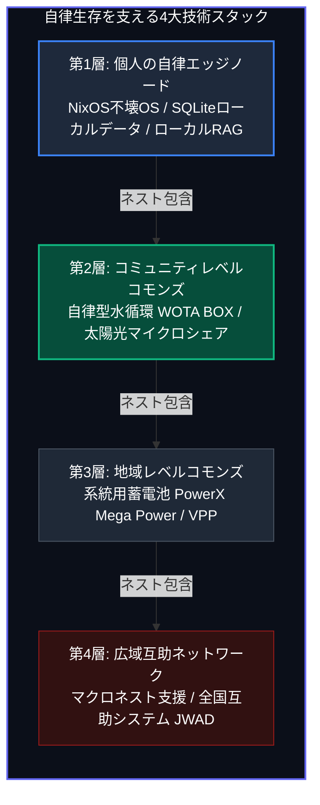

### 概要：本書のコア・テーゼ

本書は、1,200年の文明史分析と最先端のシステム工学を融合させ、一元的な「集中型インフラ社会OS」が直面している設計限界と、それに対する局所自律・広域互助の「連邦型コモンズ（Nested Commons）」への転換プロセスを記述したシステム設計図です。

長大な全60章に及ぶ知の対話をシームレスに理解するため、本章（第0章）では、スマートフォンの縦スクロール閲覧に100%適合した2つの構造図を提示し、それぞれの図が意図する歴史的、地政学的、技術的、および社会心理的な設計パラダイムを詳細に解説します。

---

### 🗺️ 1. 歴史から未来への社会OSの垂直変遷（時系列ロードマップ）

最初に対面すべきは、人類社会が歩んできたインフラOSの歴史的必然性と、これからの50年で迎えるシステム的な変遷プロセスです。

#### 【図の設計意図および解説：単線的崩壊論からの脱却】

上図は、人類の社会インフラOSがたどる過去・現在・未来の3段階の垂直フローを示しています。

1.  **歴史（集権型インフラの成立）**:
    人類は都市化と産業化の過程で、効率を最大化するためにあらゆる生存基盤（水道・電力・データ）を巨大な一元管理システムへと集約してきました。これは「規模の経済」に基づく極めて合理的な発展でしたが、同時に「すべてのノードが中央に全面的に依存する」という脆弱性の初期設定を完了させました。
2.  **現代（最適化の極限と摩擦）**:
    21世紀の現在、気候変動による激甚災害や非対称なサイバー・物理有事は、これまでの「頑強な外壁で中を守る（境界防御）」というインフラ前提を完全に無効化しています。中央が1箇所破壊されるだけで社会全体がカスケード（連鎖）的に完全機能停止する、単一障害点（SPOF）の恐怖が顕在化している過渡期です。
3.  **未来（連邦型コモンズとしての重層共存）**:
    直面する有事に対し、本書が提示する自律共生社会は「資本主義や国家インフラが数年で突発的に完全消滅する」ような、極端で結論ありきの終末論（ハルマゲドン・ドグマ）を唱えません。
既存の巨大な中央系統のインフラは、膨大な維持コストを伴います。しかし、今後数十年にわたり機能し続けるでしょう。
真の課題は、中央系統をすべて代替・廃止することではありません。
むしろ、多重防衛体制の配備が重要です。
この体制では、中央インフラの上に「**自律分散型のインフラ**」をハイブリッドな方式で重ね書きします。
これにより、重層的な共存が実現されます。
この自律分散型のインフラは、中央が切断された有事の際にも機能します。
局所的に残存するリソース、例えば太陽光、自家用バッテリー、ローカルデータなどを活用し、しなやかに縮退運転が可能です。

---

### 📦 2. アトムとビットの多層入れ子（ネスト）構造（4大生存技術スタック）

次に、この自律共生社会を物理的・デジタル的に実装するための、4つの技術スタックの多層入れ子（ネスト）構造を提示します。

#### 【図の設計意図および解説：孤立サバイバルを排した連邦型システム】

上図は、個人の端末レベル（第1層）から全国規模のネットワーク（第4層）にいたるまで、システムが「多層的な入れ子（マトリョーシカ構造）」として強固に折り重なっている実装トポロジーを示しています。

1.  **第1層（個人エッジノード：デジタル主権の確立）**:
生存を支える最深のbedrock（土台）です。
本システムは、「スタンドアロン型データ・意思決定基盤」と称されます。
この基盤は、複数の要素技術を統合して構築されます。
まず、電源喪失時やシステムクラッシュ時におけるファイル不整合の発生を抑制します。
これは、堅牢な不変OSであるNixOSの特性です。
次に、外部接続が不要な、スタンドアロンで動くローカルのデータベースを組み込みます。
具体的には、SQLiteを採用します。
さらに、広域回線（WAN）の完全な遮断時においても、稼働を継続します。
これは、ローカルSLM（Phi/Llama）によって実現されます。
これらの技術を統合し、安定したデータ・意思決定基盤の確立を目指します。
2.  **第2層（コミュニティレベル：アトムの自律循環）**:
第1層のデジタル主権を土台として、物理生存のライフライン（アトム）を局所循環させます。大規模な配管インフラから独立したオフグリッド型の水システムとして、WOTA BOXがあります。このシステムは、水質監視センサーとAI自動制御により、排水を98%以上クローズドループで再生し、再利用します。また、隣接する拠点間での太陽光電力の融通も実現されます。これは、近隣ブロックレベルで自律的に動作します。
3.  **第3層（地域レベルコモンズ：局所系統の最適化）**:
    コミュニティごとの小さな循環ノードを、より大きな中規模系統へとネスト（接続）させます。産業用蓄電池（PowerX Mega Power）や太陽光発電をローカルに配備し、仮想発電所（VPP）ソフトウェアを介して地域電力を動的に融通し、系統電線が切断された場合でも地域給電を維持します。
4.  **第4層（広域互助ネットワーク：連邦型コモンズの完成）**:
    これらすべての自律ノードを多層的に束ねる、全国規模の疎結合な互助コモンズです。ノーベル経済学賞エリノア・オストロムの「コモンズのガバナンス設計原則」に基づき、個々に孤立したスタンドアロンなサバイバル（各個撃破）を完全に排除します。
    自治体間や地域コミュニティ間を相互接続し、有事の際にも保守部品や専門技術をダイナミックに融通し合う広域互助プラットフォーム（JWAD：Japan Water Aid Coalition）を構築し、システムがマクロな環境限界に対して動的に適応し続ける「不壊の連邦分散レジリエンス国家」を完成させます。
