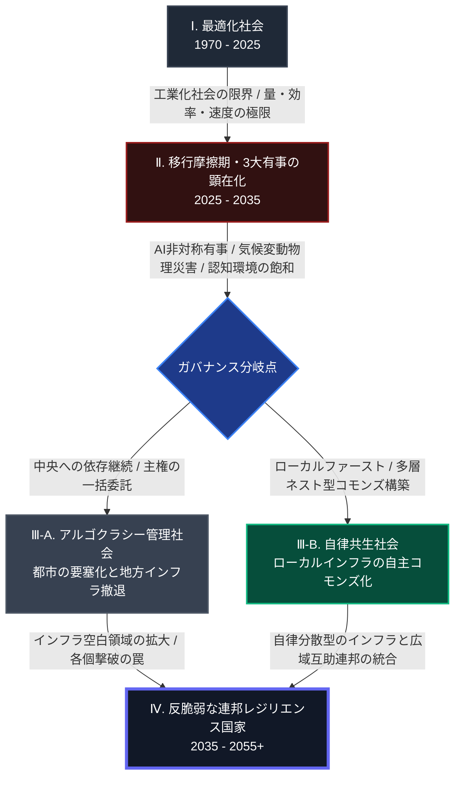
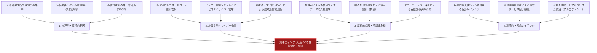

### 概要：本書のコア・テーゼ

本書は、1,200年の文明史分析と最先端のシステム工学を融合させ、一元的な「集中型インフラ社会OS」が直面している設計限界と、それに対する局所自律・広域互助の「連邦型コモンズ（Nested Commons）」への転換プロセスを記述したシステム設計図です。

長大な全60章に及ぶ知の対話をシームレスに理解するため、本章（第0章）では視覚的なダイアグラム（Mermaid）とマトリクスを用いて、未来予測のロードマップおよびインフラ破綻の特性要因分析のサマリを提示します。

---

### 🗺️ 1. 未来予測の時系列ロードマップ

1970年から2055年にかけての人類社会OSの変遷、移行摩擦、およびその先の自律社会へのロードマップを以下のダイアグラムに示します。

---

### 🐟 2. 集中型社会OS・インフラ破綻の特性要因図（フィッシュボーン）

なぜ、私たちが当然視してきた「一元管理型のインフラ」は、極限状態においてカスケード崩壊するのでしょうか。その物理的、地政学的、技術的、および制度的な要因（ボトルネック）を分析した特性要因図を提示します。

---

### 📝 3. 本書のコア・アプローチ（4大生存スタック）

本書は、これらの破綻要因を乗り越え、持続可能なレジリエンスを実社会に実装するための「4つの自律分散技術スタック」を提示し、実証します。

1. **分散型のエネルギー（第51章〜第52章）**:
   単一の系統に全面的に依存せず、産業用蓄電池（PowerX Mega Power）や太陽光発電をローカルに配備し、仮想発電所（VPP）ソフトウェアを介して多層的にネスト（統合）された、各個撃破されない地域給電ネットワーク[[11]](06_bibliography#11)[[14]](06_bibliography#14)。
2. **分散型水循環（第53章〜第55章）**:
   大規模な水道配管網から独立し、水質監視センサーとAI自動制御によって現場でクローズドループろ過を繰り返すオフグリッド水システム（WOTA BOX）。および、自治体間を相互接続して保守部品や技術を融通し合う広域互助プラットフォーム（JWAD）の構築[[12]](06_bibliography#12)[[13]](06_bibliography#13)。
3. **不壊のエッジデータ基盤（第56章〜第58章）**:
   電源喪失やクラッシュ時にもシステムファイルの不整合を起こさないステートレスな不壊OS（NixOS）、ローカルなSQLiteデータベース、および広域通信（WAN）切断下でもエッジ端末上で100%機能するローカルSLM（Phi/Llama）を用いたRAG（検索拡張生成）による、スタンドアロンな状況決定支援。
4. **物理オフライン通信路（第59章）**:
   携帯キャリアの電波や光ファイバーが途絶した被災・有事環境下において、免許不要の特定小電力の無線機やLoRaを用いて、近隣拠点間でバケツリレー式に非同期テキストデータを伝播させる、草の根のP2Pメッシュネットワーク通信。
