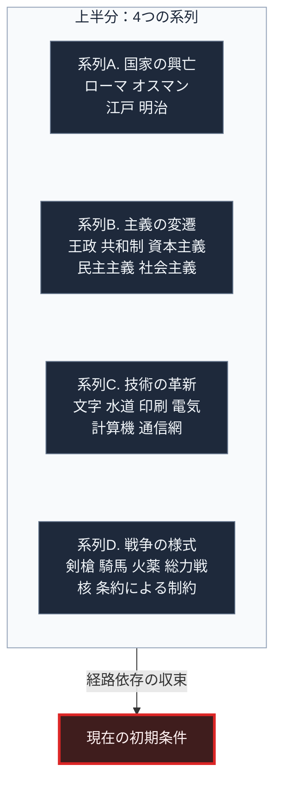
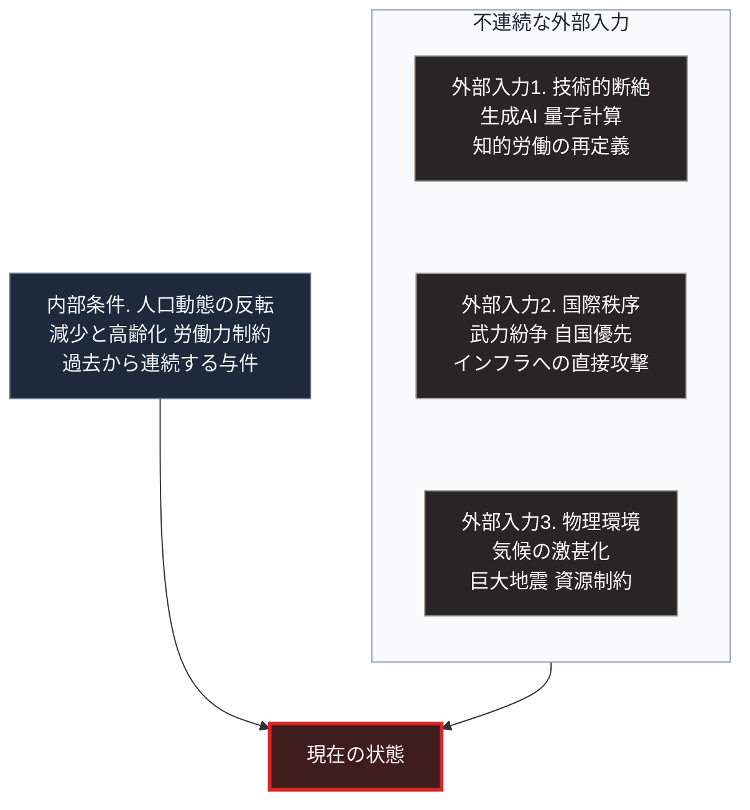
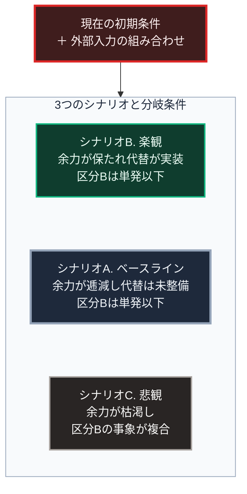

### 本章の位置づけ

本章は、本書全体の構造を4枚の図として提示します。各図には、その図が何を表現し、どう読むべきかの解説を併記します。本章を読めば、以降のどの章がこの構造のどこに位置するのかを把握できます。

---

### 図1. 砂時計アーキテクチャ ―― 本書の全体構造

未来を推論するための構造を、砂時計として設計しました。

#### 図1の解説：なぜ砂時計なのか

この図が表現しているのは、情報量の変化です。上半分の逆三角形は過去、中央の赤い枠は現在、下半分の三角形は未来を表します。左右から現在へ向かう矢印が外部入力と内部条件です。

上部の「過去」は、扱う事象の数が最も多い領域です。ローマ帝国の統治機構、オスマン帝国のミレット制、江戸幕府の幕藩体制、資本主義と民主主義の成立、活版印刷から計算機にいたる技術革新、そして戦争様式の変遷。これらは互いに独立した事象ではありません。すべてが経路依存の関係で連なり、現在という1点に流れ込みます。

中央の「現在」は、面積を持ちません。過去のあらゆる帰結が、ここで1つの状態として確定しています。同時に、この1点には外部から新しい入力が加わり続けます。この二重性が、現在という時点の性質です。

下部の「未来」は、再び情報量が増大する領域です。ただし、その広がり方に制限がないわけではありません。現在という1点が持つ初期条件によって、到達可能な範囲は制約されます。未来予測とは、この制約された分岐空間の形状を推定する作業にほかなりません。

したがって本書は、上から下へ読むように構成されています。過去の整理を省略して未来だけを論じることは、初期条件を欠いた状態で微分方程式を解こうとする行為に相当します。

---

### 図2. 上半分の内訳 ―― 過去を構成する4つの系列

砂時計の上半分は、独立して追跡すべき4つの系列に分解されます。

#### 図2の解説：4系列に分ける理由

歴史を単一の年表として扱うと、因果関係が見えなくなります。そこで本書は、性質の異なる4つの系列に分離します。図では、枠内で縦に並ぶ4つの系列が、1本の矢印で下の「現在の初期条件」へ収束します。

**系列A（国家の興亡）** が扱うのは、統治機構という組織体の寿命です。ローマ帝国、オスマン帝国、江戸幕府は、いずれも成立期の求心力、成熟期の制度化、後期の機能不全という経過をたどりました。ここから抽出したいのは、次の2点です。腐敗がどの段階で不可逆になるのか。そして、限界点の接近を示す観測可能な指標は何か。

**系列B（主義の変遷）** が扱うのは、統治の正統性を支える思想の系譜です。とりわけ資本主義については、貨幣が実体的な価値を持たないにもかかわらず、あらゆる価値を交換可能にする汎用的な共通言語として機能し続けている理由を検討します。これは、資本主義が容易に代替されない構造的な理由の中核にあたります。

**系列C（科学技術の革新）** が扱うのは、技術が社会構造を変える機序です。重要なのは発明そのものではありません。ある技術が普及する過程で、旧来の方式に依存していた職能がどう扱われたか。その社会的な摩擦の反復パターンです。

**系列D（戦争の様式）** が扱うのは、国家が武力行使という選択肢を採る条件です。戦争の形態は、剣と槍による白兵戦から騎馬戦へ、さらに火器の時代へと移りました。その後、国民国家による総力戦を経て、核抑止と条約による制約の段階へ変化しました。あわせて、国家間の摩擦がどの種類に達した段階で武力行使へ移行したのか、その閾値を整理します。

この4系列は、いずれも第Ⅰ部で事実のみを用いて記述されます。解釈は各章末尾に隔離されます。

---

### 図3. くびれの構造 ―― 現在に加わる外部入力

砂時計のくびれには、過去からの流入とは別に、外部から入力が加わります。

#### 図3の解説：外部入力と内部条件の区別

この図が区別しているのは、「過去から連続的に流れ込むもの」と「外部から不連続に加わるもの」です。枠内で縦に並ぶ3つが外部入力です。枠の外に置いた人口動態は、過去から連続する内部条件として、別の矢印で現在へ加わります。

第Ⅰ部で扱う事例においては、組織の崩壊はこの2つの重なりによって発生しています。内部が腐敗して対応能力を失っている状態に、大きな外部衝撃が加わる。その結果として破綻が起こります。腐敗だけでは崩壊しません。外部衝撃だけでも、健全な組織であれば吸収されます。

したがって、現在の日本や国際秩序について「どの外部要因によって機能不全に至りうるか。その接近を示す指標は何か」を評価するには、内部条件（第Ⅱ部前半）と外部入力（第Ⅱ部後半）の両方について、公的資料に基づく別個の整理が必要です。

第Ⅱ部では、まず日本、アメリカ、EU、中国について、それぞれの体制、運営方式、直面する課題を各国政府の公式資料から整理します。人口動態の反転は、過去から連続する内部条件としてここで扱います。図3で人口動態を外部入力と区別して描いたのは、この理由によります。そのうえで、生成AIと量子計算という技術的断絶、進行中の武力紛争、気候と災害という外部入力を検討します。

---

### 図4. 下半分の構造 ―― 未来の分岐と3つのシナリオ

現在という1点から、未来は複数の経路へ分岐します。

#### 図4の解説：単一予測ではなく分岐として扱う理由

未来を単一の予測として提示することは、方法論的に誤りです。20年という時間軸では、複数の独立した変数が相互作用します。その組み合わせの数は、単一の帰結に収束させられるほど少なくありません。

そこで本書は、3つのシナリオを併置します。図では、現在の初期条件から1本の矢印で枠へ入ります。枠内で縦に並ぶ3つのシナリオのどれへ至るかは、各ノードに記した分岐条件が決めます。重要なのは、シナリオの内容そのものよりも、 **分岐条件** です。すなわち「何が観測されたら、どのシナリオへの移行が進行中だと判断できるか」という早期警戒指標です。第Ⅲ部の最終章では、この指標を一覧として提示します。

なお、本書は3つのシナリオに確率を割り当てません。代わりに、分岐条件と早期警戒指標を示します。地震のように公的機関が根拠つきの確率を公表している事象については、その数値を手法上の前提とともに参照します。図中の「余力」と「区分B」は、第Ⅲ部-3および第Ⅲ部-10で定義する用語です。

---

### 本書の読み方

本書は、次の順序で読むことを前提に構成されています。

第Ⅰ部（過去）では、事実の記述と解釈とが分離されています。事実だけを追いたい読者は、各章の本文のみを読み進めてください。各章の「図の読み方」は、図の構造説明であり、著者による整理を含みます。現代との関連を確認したい読者は、各章末尾の「現代社会構造への射程と本質」を参照してください。

第Ⅱ部（現在）では、各国の現状と外部入力を扱います。ここでの記述は、原則としてすべて公的資料に基づきます。

第Ⅲ部（未来）以降が、推論の領域です。ここからは、前提と推論経路が明示されます。読者が異なる前提を採るなら、異なる結論に到達するはずです。本書は、その差異を検証可能にすることを意図しています。

すべての事実記述には、その文末に一次資料への直接リンクが配置されています。記述の妥当性に疑問を持った場合は、その場でリンクをたどり、原典を確認してください。
