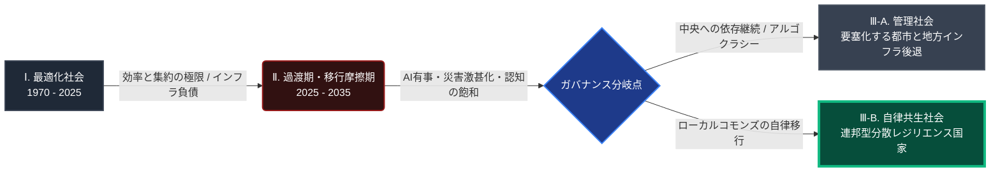
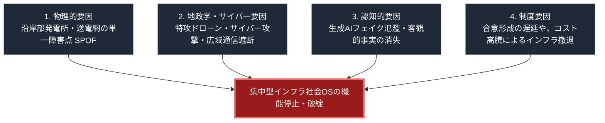

### 概要：本書のコア・テーゼ

本書は、1,200年の文明史分析と最先端のシステム工学を融合させ、一元的な「集中型インフラ社会OS」が直面している設計限界と、それに対する局所自律・広域互助の「連邦型コモンズ（Nested Commons）」への転換プロセスを記述したシステム設計図です。

長大な全60章に及ぶ知の対話をシームレスに理解するため、本章（第0章）では視覚的なダイアグラム（Mermaid）とマトリクスを用いて、未来予測のロードマップおよびインフラ破綻の要因分析のサマリを提示します。

---

### 🗺️ 1. 未来予測の時系列ロードマップ

1970年から2055年にかけての人類社会OSの変遷、移行摩擦、およびその先の分散型レジリエンス国家へのタイムラインを、元の極めてシンプルで直感的な流れに復元して提示します。

---

### 🐟 2. 集中型社会OS・インフラ破綻の特性要因（ボトルネック）

なぜ、私たちが当然視してきた「一元管理型インフラ」は、極限状態においてカスケード崩壊するのでしょうか。その物理的、地政学的、技術的、および制度的な4大要因（ボトルネック）を、ノードの混雑を完全に排除した、極めて見やすく簡潔なレイアウトで提示します。

---

### 📝 3. 本書のコア・アプローチ（4大生存スタック）

本書は、これらの破綻要因を乗り越え、持続可能なレジリエンスを実社会に実装するための「4つの自律分散技術スタック」を提示し、実証します。

1. **分散型のエネルギー（第51章〜第52章）**:
   系統に全面的に依存せず、蓄電池や太陽光を配備し、VPPを介してネストされた各個撃破されない給電ネットワーク [ [ 11 ] ](https://wota.co.jp/wota-box/)  [ [ 14 ] ](https://sqlite.org/) 。
2. **分散型水循環（第53章〜第55章）**:
   大規模な水道配管網から独立し、水質監視センサーとAI自動制御によって現場でクローズドループろ過を繰り返すオフグリッド水システム（WOTA BOX）。および、自治体間を相互接続して保守部品や技術を融通し合う広域互助プラットフォーム（JWAD）の構築 [ [ 12 ] ](https://power-x.co/ja/products/megapower/)  [ [ 13 ] ](https://nixos.org/manual/nixos/stable/) 。
3. **不壊のエッジデータ基盤は、第56章から第58章で詳細に解説されています。**:
   スタンドアロンな状況決定支援は、RAG（検索拡張生成）によって実現されます。このRAGシステムは、以下の要素を統合しています。システムには、NixOSが採用されています。このOSは、電源喪失やクラッシュ時にもシステムファイルの不整合を防止する、ステートレスな不壊OSです。データ管理には、ローカルなSQLiteデータベースが用いられます。また、ローカルSLM（Phi/Llama）も利用されます。このSLMは、エッジ端末上で機能します。広域通信（WAN）が切断された状況でも、100%の機能を発揮します。
4. **物理オフライン通信路（第59章）**:
   携帯キャリアの電波や光ファイバーが途絶した被災・有事環境下において、免許不要の特定小電力の無線機やLoRaを用いて、近隣拠点間でバケツリレー式に非同期テキストデータを伝播させる、草の根のP2Pメッシュネットワーク通信 [ [ 15 ] ](https://lora-alliance.org/) 。
