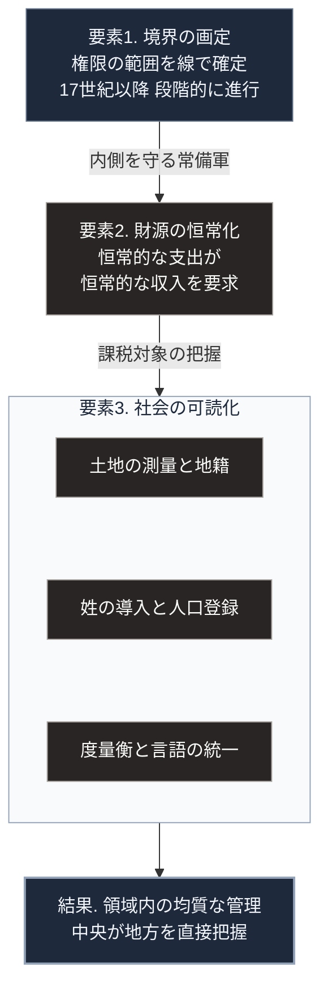

### 序論：本章が扱う範囲

本章は、国境線によって区切られた領域を単位とする統治形態が、どのような経緯で成立したかを記述します。

本文は事実の記述に限定します。現代との関連については、章末の独立したセクションで扱います。

本章では、通説として広く流布している理解と、近年の研究がそれに加えた修正の双方を記述します。

### 1. 講和以前の統治構造

中世ヨーロッパにおいて、統治の権限は複数の主体に分散していました。

同一の土地と住民に対して、ローマ教皇、神聖ローマ皇帝、地域の封建領主、そして自治都市が、それぞれ異なる種類の権限を主張しました。ある領主が別の領主の封臣であると同時に、第三の主体に対しても義務を負うという構成が一般的でした。

権限の及ぶ範囲は、線として画定されていませんでした。ある地点における課税権と、裁判権と、軍事的な保護の義務が、それぞれ異なる主体に属することがありました。

### 2. 三十年戦争

1618年、神聖ローマ帝国内の宗教的および政治的な対立を発端として、戦争が始まりました。この戦争には、スペイン、デンマーク、スウェーデン、フランスが順次介入し、1648年まで継続します。

戦闘、飢餓、疫病により、中部ヨーロッパの一部地域では人口が大幅に減少しました。減少の推計には幅がありますが、地域によっては3分の1に達したとする研究があります。

### 3. 1648年の講和条約

1648年、ミュンスターとオスナブリュックにおいて講和条約が締結されました。この2つの条約を合わせてウェストファリア条約と呼びます。条約の原文は公開されています [ [ 180 ] ](https://avalon.law.yale.edu/17th_century/westphal.asp) 。

条約が定めた主要な事項は、次のとおりです。

第一に、領邦の統治者へ自領における宗派の決定権を認めたこと。

第二に、帝国内の領邦へ他国と条約を結ぶ権限を認めたこと。ただし、皇帝および帝国と敵対しない範囲に限定されます。

第三に、領域と権利の帰属を、個別に確定したことです。

### 4. 通説と、その修正

20世紀の国際関係論において、この条約は「主権国家体系の起点」として記述されてきました。その記述によれば、条約は次の3原則を確立したとされます。領域内における統治者の排他的な権限。他国の内政への不干渉。そして線として画定された国境です。

しかし、2001年に公表された研究は、この理解に修正を加えています [ [ 181 ] ](https://doi.org/10.1162/00208180151140577) 。

同研究の指摘は次のとおりです。条約の原文には、主権や内政不干渉を一般原則として宣言した条項は存在しません。条約が扱ったのは、帝国内部の宗派と領地の具体的な調整です。「ウェストファリア体制」という枠組みは、19世紀以降の国際関係論において遡及的に構成されたものです。

政治学者スティーヴン・クラズナーも、主権という概念が実際の国際関係において一貫して適用されてきたわけではないと論じています [ [ 182 ] ](https://openlibrary.org/works/OL15105347W) 。

したがって本書は、次のように記述します。1648年の条約が単独で主権国家体系を確立したのではありません。17世紀から19世紀にかけて進行した複数の変化が、結果として領域を単位とする統治形態を定着させました。

### 5. 領域国家の形成を駆動した要因

歴史社会学者チャールズ・ティリーは、ヨーロッパにおける国家形成を、軍事的な必要と資本の調達との相互作用として分析しました [ [ 183 ] ](https://openlibrary.org/works/OL2680223W) 。

その分析によれば、常備軍の維持には恒常的な財源が必要です。財源の調達には、課税の対象となる人と土地を把握する必要があります。把握のためには、測量、登録、そして単位の統一が必要になります。

この一連の要請が、領域を明確に画定し、その内部を均質に管理する統治機構を生みました。[第Ⅰ部D-2](war-technology-evolution)で記述する火薬と常備軍の関係、すなわち火器の普及が徴税機構の整備を要求したという過程も、この文脈に位置します。

### 6. 統治のための可読化

人類学者ジェームズ・スコットは、近代国家が統治の前提として社会を「読み取り可能」にしてきた過程を分析しました [ [ 17 ] ](https://openlibrary.org/works/OL26241985W) 。

その分析が対象とするのは、次のような施策です。土地の測量と地籍の作成。世襲的な姓の導入。度量衡の統一。言語の標準化。そして人口の登録です。

これらはいずれも、中央が地方を把握し、課税し徴兵するための前提でした。スコットの指摘によれば、この可読化は地域固有の慣行を捨象することによって成立します。

### 🗺️ 図：領域国家の成立を支えた3要素

領域を単位とする統治が成立するために、何が必要であったかを示します。

#### 図の読み方

この図は上から下へ1本の鎖として読みます。最上段の要素1から矢印をたどり、最下段の「結果」に至る順序が、領域国家が成立した順序です。

矢印に添えた語は、次の要素を必要とした理由です。境界を引くと内側を守る常備軍が必要になり、常備軍は恒常的な財源を必要とし、財源は課税対象の把握を必要とします。

3段目の枠は、要素3である「社会の可読化」の中身を3つに分けて縦に並べたものです。測量と地籍、姓と人口登録、度量衡と言語の統一は、いずれも中央が地方を把握するための手段でした。

この鎖の帰結が、最下段の「領域内の均質な管理」です。[第Ⅰ部A-6](meiji-centralization)で記述する明治日本の中央集権化は、この鎖を約20年で実行した事例にあたります。

なお、この図は近代国家の成立を否定的に描くものではありません。この構造によって統治の予測可能性が高まり、恣意的な徴発が減少し、広域の公共財を供給できるようになりました。[第Ⅰ部B-2](capitalism-history)で述べる市場の拡大も、この構造を前提とします。

---

### 現代社会構造への射程と本質（本章のまとめ）

本セクションは、著者による解釈です。前節までの事実記述とは区別して読んでください。

1.  **現代社会構造の原点**

    現代の国家が持つ2つの特徴、すなわち領域内における排他的な権限と、全国一律の行政サービスは、いずれも本章で記述した連鎖に起源を持ちます。

    とりわけ重要なのは、この構造が防衛の要請から生まれたという点です。境界を守るために財源が必要となり、財源のために把握が必要となり、把握のために標準化が進みました。全国一律の制度は、公平性の理念から導かれたのではなく、徴税と徴兵の実務から導かれました。

2.  **歴史的事実の本質**

    本章から抽出できるのは、統治の形態が理念ではなく実務的な制約から決まるという点です。

    もう1つの論点は、通説の扱いに関するものです。「ウェストファリア体制」という枠組みが後代の構成物であるという指摘は、歴史的事実の記述において、通説と原典との照合が不可欠であることを示しています。本書が各記述に原典への直接リンクを付す理由の1つが、ここにあります。

3.  **現代社会の現状と課題**

    領域を単位とする統治は、境界の内側を管理できることを前提とします。この前提は、複数の方向から圧力を受けています。

    第一に、情報の流通は境界に従いません。第二に、[第Ⅱ部B](report-ukraine-war)で記述するとおり、供給基盤への攻撃は境界の内側で影響を生じさせます。第三に、気候と感染症は境界を認識しません。

    これらの圧力に対して、領域国家の枠組みがどこまで有効かという問いは、[第Ⅲ部](future-method)および[第Ⅳ部](implication-state)の議論に接続します。
