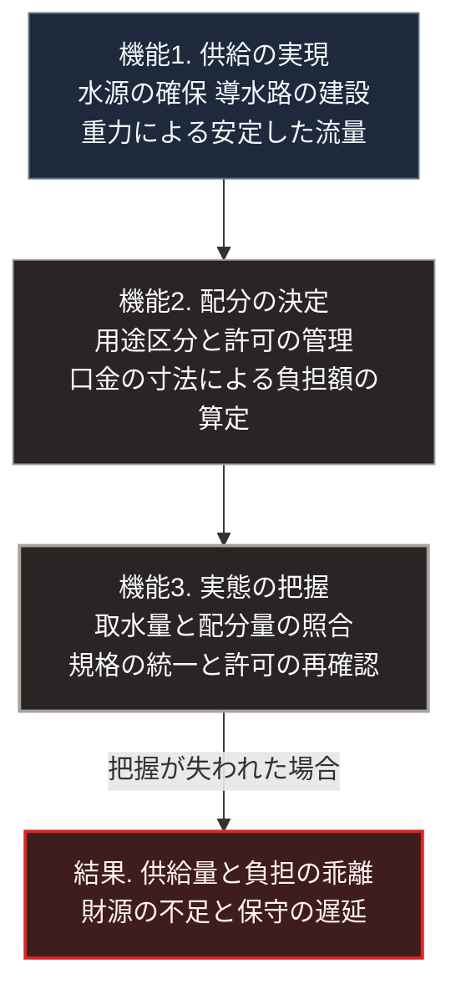

### 序論：本章が扱う範囲

本章は、ローマにおける水道の技術と、その運用および管理の実態を記述します。

本章の主要な情報源は、1世紀末に水道管理の責任者を務めたフロンティヌスによる記録です。同記録は、当時の管理体制を当事者の視点から記述した一次資料であり、全文が公開されています [ [ 4 ] ](https://archive.org/details/twobooksonwater00frongoog) 。

本文は事実の記述に限定します。解釈は章末で扱います。

### 1. 水道の技術

ローマ市への給水は、市外の水源から導水路によって行われました。

導水の原理は重力です。動力は用いられません。水源から市内までの区間に、緩やかで一定の勾配を維持することによって、水が流れ続ける構造です。

地形への対応として、次の工法が用いられました。丘陵を貫通する隧道。そして、谷を渡る石造のアーチ橋です。密閉管路で谷を渡る逆サイフォンは属州の水道に見られますが、フロンティヌスが記録するローマ市の水道において主要な工法ではありません。

導水路の大部分は地下に敷設されました。地上のアーチ構造は、谷を渡る区間に限られます。

### 2. 水道の数と規模

フロンティヌスの記録によれば、彼が着任した時点でローマ市には9本の水道がありました。最古のものは紀元前312年に建設が開始されたアッピア水道です。

同記録は、各水道について、水源、延長、地下区間と地上区間の内訳、そして供給量を記述しています。供給量は、クイナリアと呼ばれる断面積の単位によって表記されました。

### 3. 水の配分

同記録によれば、水道から供給された水は、複数の用途に配分されました。

配分の区分は、皇帝の名義によるもの、私人への給水、公共の用途の3つです。公共の用途には、兵営、公共の建造物、公共の泉と水盤、興行のための施設が含まれます。

私人への給水は、皇帝の許可として個人に付与され、一定の負担を伴いました。許可は名義人に帰属し、分岐部に取り付ける口金の寸法に応じて負担が定まりました。

### 4. 管理上の課題 ―― 記録された不正

フロンティヌスの記録は、当時発生していた不正について具体的に記述しています。これは、本章において最も重要な部分です。

記録されている不正には、次の類型が含まれます。

**許可された寸法を超える口金の使用**：私人が、許可された寸法より大きい口金を取り付け、負担額に見合わない量の水を取得する行為です。

**導水路への無断の穿孔**：導水路の途中に穴を開け、そこから分岐管を引く行為です。

**管理人による関与**：水道の保守にあたる作業員が、報酬を受け取って上記の行為を黙認、あるいは実施していたことが記述されています。

**許可の名義と実態の乖離**：給水の許可が、その土地の所有者が変わった後も引き継がれ、実際の使用者と記録上の使用者とが一致しない状態です。

同記録によれば、水源から取水された量と、配分先の合計量との間には大きな差がありました。フロンティヌスは、この差の相当部分が上記の不正に由来すると論じています。

### 5. 実施された対策

同記録は、フロンティヌスが実施した対策についても記述しています。

**寸法の標準化**：分岐に用いる口金の寸法を、25種類の規格として定めました。規格外の口金は、許可の対象外となります。

**測定に基づく照合**：取水量と配分量を実測し、その差を算出する方式を導入しました。差が大きい区間について、原因を特定する手順です。

**許可の再確認**：既存の給水許可について、名義と実態の照合を実施しました。

**管理体制の一元化**：保守にあたる作業員の指揮系統を整理し、私人からの独立性を高めました。

### 🗺️ 図：集約供給が要求する3つの機能

水道の運用が、建設以外に何を必要としたかを示します。

#### 図の読み方

この図が示すのは、集約型の供給インフラが、建設だけでは成立しないという点です。

機能1は、技術の問題です。フロンティヌスの記録が示すとおり、ローマの水道はこの点で高い水準に達していました。

機能2は、制度の問題です。誰にどれだけ供給し、その対価をどう定めるか。この規則がなければ、供給は無秩序になります。

機能3が、本章において最も重要です。制度が存在しても、実態がそれに従っているかを把握できなければ、制度は機能しません。

フロンティヌスの記録が価値を持つのは、この機能3の不全を当事者が具体的に記述している点にあります。口金の寸法の偽装、導水路への穿孔、そして管理人の関与。これらはいずれも、規則の不在ではなく、規則の遵守を確認する手段の不在から生じました。

彼が実施した対策も、規則の追加ではありません。寸法の規格化と、取水量と配分量の照合。いずれも、実態を把握可能にする措置です。

第Ⅰ部A-1で参照したスコットの議論、すなわち統治が社会の可読化を要求するという指摘は [ [ 17 ] ](https://openlibrary.org/works/OL26241985W) 、この事例に先行して当てはまります。インフラの管理もまた、対象を測定可能にすることを要求します。

---

### 現代社会構造への射程と本質（本章のまとめ）

本セクションは、著者による解釈です。前節までの事実記述とは区別して読んでください。

1.  **現代社会構造の原点**

    現代の上水道、電力、通信は、いずれもローマの水道と同じ構造を持ちます。すなわち、集約された供給源から、分岐を経て個別の利用者へ届ける構造です。

    そして現代のこれらのインフラも、機能3、すなわち実態の把握を必要とします。各戸の計量器、系統の潮流監視、通信の帯域計測は、いずれもこの機能にあたります。

2.  **歴史的事実の本質**

    本章から抽出できる論点は2つあります。

    第一に、集約型インフラの持続可能性を規定するのは、技術ではなく管理であるという点です。ローマの水道は技術的に優れていましたが、フロンティヌスが記述した不正は、その技術とは無関係に発生しました。

    第二に、集約型インフラにおいては、供給の可否を決定する主体が存在するという点です。ローマの場合、その主体は水道管理の責任者と、許可を与える権限を持つ者でした。

    この第二の論点は、集約型と分散型の差異の核心にあります。分散型の供給においては、供給の可否を決定する単一の主体が存在しません。これは利点であると同時に、調整の困難さでもあります。

3.  **現代社会の現状と課題**

    第Ⅱ部A-2で述べるとおり、人口密度の低下は集約型インフラの維持費用を1人あたりで上昇させます。

    このとき機能3の費用も問題となります。管路の延長が変わらないまま利用者だけが減れば、漏水の検知と補修に要する費用は、利用者1人あたりで増加します。

    第Ⅴ部では、この条件下における供給方式を検討します。そこでの論点は、機能3をどう実装するかです。集約型では中央が測定します。分散型では、測定と判断を誰が担うのかが設計上の課題となります。
