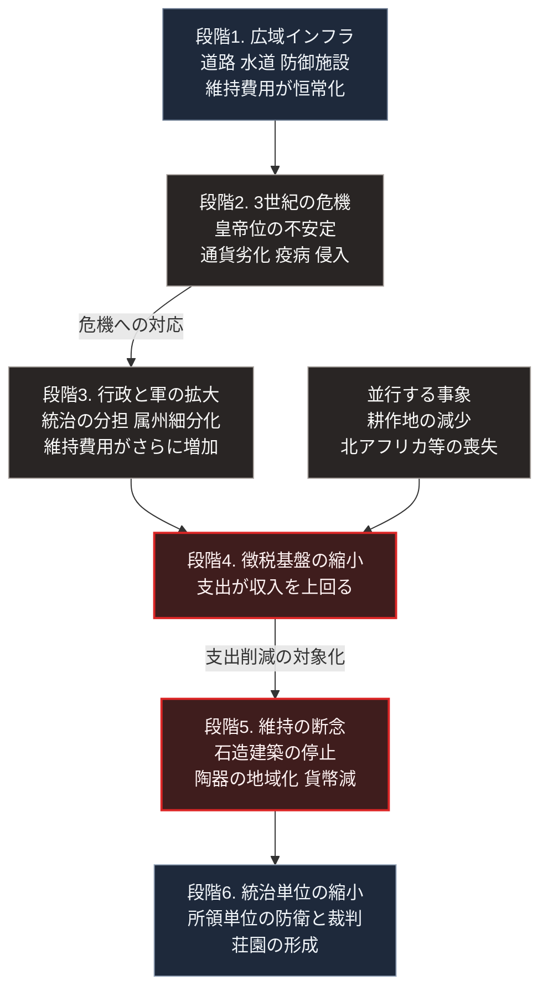

### 序論：本章が扱う範囲

本章は、ローマ帝国において、統治機構の財政基盤がどのように劣化し、公共インフラの維持がどのように断念されたかを記述します。

本文は事実の記述に限定します。現代との関連については、章末の独立したセクションで扱います。

なお、ローマ帝国の衰亡の原因については、学説上の対立が継続しています。本章では、複数の説が共通して認める事実と、説によって解釈が分かれる論点とを区別して記述します。

### 1. 帝国の最大版図とインフラ

紀元前27年のアウグストゥスによる統治開始から、2世紀後半まで、帝国は比較的安定した時期を経ました。

この時期、帝国は広範なインフラを整備しました。舗装道路網、水道、公共浴場、そして国境地帯の防御施設です。

水道については、1世紀末に水道長官を務めたフロンティヌスが、ローマ市の水道について記録を残しています [ [ 4 ] ](https://archive.org/details/twobooksonwater00frongoog) 。同記録は、各水道の水源、延長、そして水の配分先を記述しており、当時の管理体制を伝える一次資料です。

これらのインフラは、いずれも継続的な維持費用を必要としました。

### 2. 3世紀の危機

235年から284年にかけて、帝国は複合的な危機に直面しました。この時期は「3世紀の危機」と呼ばれます [ [ 184 ] ](https://openlibrary.org/works/OL16928780W) 。

観測される事象は、次のとおりです。

**皇帝位の不安定化**：この約50年間に、20名を超える皇帝が即位し、その多くが在位中に殺害または戦死しました。

**通貨の劣化**：主要な銀貨であるデナリウスおよびアントニニアヌスの銀含有量が、段階的に低下しました。3世紀後半には、銀の含有率が数パーセントの水準まで下がっています。

**疫病**：250年代に大規模な疫病が記録されています。

**外部からの侵入**：ライン川およびドナウ川の国境を越えた侵入と、東方における軍事的な圧力が増加しました。

### 3. 財政と行政の再編

284年に即位したディオクレティアヌスは、統治機構の再編を実施しました。

主要な施策は、次のとおりです。統治を複数の皇帝で分担する体制の導入。属州の細分化と行政単位の増加。軍の規模拡大。そして税制の改編です。

税制については、土地の面積と質、および労働力の数を基準として賦課額を算定する方式が導入されました。この方式は、定期的な査定を必要とします。

301年には、物価と賃金の上限を定める勅令が発布されました。

312年頃、コンスタンティヌスは新たな金貨を導入し、貨幣制度の安定を図りました。

これらの施策は、行政機構と軍の規模を拡大させました。その維持費用は、税として徴収されます。

### 4. 徴税基盤の縮小

4世紀から5世紀にかけて、帝国の徴税基盤は縮小しました。

要因として複数の説が提示されていますが、次の事象については記録が一致しています。

第一に、国境地帯における戦闘と侵入により、耕作されない土地が増加したこと。

第二に、有力者が私的な保護関係を形成し、その庇護下に入った農民が中央への納税から離脱する事例が生じたこと。

第三に、西方において、帝国の実効支配の及ばない領域が拡大したこと。とりわけ5世紀前半、北アフリカ、イベリア半島、ガリアの一部が、帝国の徴税範囲から外れました。北アフリカは、当時の帝国において主要な穀物供給地であり、財政上の比重が大きい地域でした。

### 5. インフラ維持の断念

徴税基盤の縮小は、インフラの維持に直接影響しました。

道路の補修、水道の清掃と修理、そして防御施設の維持は、いずれも継続的な支出を要します。財源が縮小した局面において、これらの支出は削減の対象となりました。

考古学者ブライアン・ウォード＝パーキンスは、発掘資料に基づき、5世紀から6世紀にかけて西方の各地で観測された変化を次のように整理しています。大規模な石造建築の新設が停止したこと。広域に流通していた規格化された陶器が姿を消し、地域内で生産された粗製品に置き換わったこと。そして貨幣の流通量が減少したことです [ [ 260 ] ](https://openlibrary.org/works/OL18269494W) 。

これらの変化は、広域の分業と交換が縮小したことを示します。

### 6. 支配の再編

西方において、帝国の統治機構は段階的に機能を失いました。

378年、アドリアノープルにおいて帝国軍が大敗しました。410年、ローマ市が略奪されます。476年、西方の皇帝ロムルス・アウグストゥルスが廃位されました。

歴史家ピーター・ヘザーは、この過程における外部からの圧力の役割を重視しています [ [ 28 ] ](https://openlibrary.org/works/OL3242717W) 。その分析によれば、4世紀後半に中央アジアからの集団移動が生じ、それに押される形でゴート系の集団が帝国領内へ移動したことが、連鎖の起点となりました。

一方、エドワード・ギボンは18世紀の著作において、内部要因を重視した記述を残しています [ [ 23 ] ](https://www.gutenberg.org/ebooks/25717) 。

これら2つの立場は、現在も学説上の対立として継続しています。本書は、いずれかを支持する立場を採りません。

### 7. 地方単位への再編

中央の統治機構が機能を失った地域において、統治の単位は縮小しました。

大土地所有者が、自らの所領において防衛と裁判を担う構成が広がります。農民は、その保護を受ける代わりに、生産物の一部と労役を提供しました。

この構成が、中世ヨーロッパにおける荘園の原型となります。

### 🗺️ 図：財政とインフラの連鎖

徴税基盤の縮小が、どの経路でインフラの断念に至ったかを示します。

#### 図の読み方

この図は上から下へ時系列として読みます。段階1から段階6まで、矢印の向きが時間の向きです。

3段目だけは2つの箱が横に並びます。左の「段階3」は危機への対応として行政と軍を拡大した内部の選択で、右の「並行する事象」は耕作地の減少と属州の喪失という外部の変化です。

この2つの箱から出る矢印は、4段目の「徴税基盤の縮小」に合流します。支出を増やす選択と収入を減らす変化が同時に進行し、支出が収入を上回る状態に至ったことを、この合流が表します。

左の箱には注意すべき点があります。危機への対応として実施された再編は、当時としては合理的な選択でした。しかし第Ⅰ部A-8で参照するテインターの枠組みが示すとおり、追加された複雑性はそれ自体が維持費用となります。

4段目から5段目へ向かう矢印の「支出削減の対象化」が、本章の主題です。財源が縮小した局面で、補修と清掃の支出が削減の対象になりました。

5段目の箱に記した3つの変化は、いずれも広域の分業と交換が縮小したことを示します。第Ⅰ部B-2で述べるとおり、分業の程度は市場の規模に制約されます。

最下段の「統治単位の縮小」は、この条件下における適応です。広域の供給が期待できない状況で、生存に必要な機能を局所で完結させる構成が広がりました。ただし、以前の生活水準まで保たれたわけではありません。

---

### 現代社会構造への射程と本質（本章のまとめ）

本セクションは、著者による解釈です。前節までの事実記述とは区別して読んでください。

1.  **現代社会構造の原点**

    現代の公共インフラは、広域の税収を財源として整備され、維持されています。この構成は、ローマの事例と同型です。

    重要なのは、この構成が財源の継続を前提としているという点です。インフラの規模は、整備時点の財政能力に応じて決まります。財政能力が低下しても、インフラの物理的な規模は自動的には縮小しません。維持費用は残り続けます。

2.  **歴史的事実の本質**

    本章から抽出できる論点は3つあります。

    第一に、インフラの崩壊は破壊ではなく維持の断念として進行するという点です。ある年に補修を見送ることは、その年には問題を生じません。この判断が累積したとき、機能が失われます。

    第二に、危機への対応として追加された複雑性が、それ自体の維持費用を通じて次の危機への余力を減らすという点です。

    第三に、広域の交換が縮小すると分業も縮小し、生産される財の質と種類が低下するという点です。この連鎖は、考古学的な証拠によって裏づけられています。

3.  **現代社会の現状と課題**

    第Ⅱ部A-2で述べるとおり、人口密度の低下は利用者1人あたりのインフラ維持費用を上昇させます。この状況において、更新の見送りという判断が累積しうる構造は、本章の事例と共通します。

    第Ⅲ部-9で述べるベースラインの経過は、まさにこの構造の現代版です。ただし1つの差異があります。ローマの事例では、局所完結型への移行は無計画に進行しました。現代においては、この移行を設計として実施する選択肢があります。第Ⅴ部で扱うのは、その設計です。
