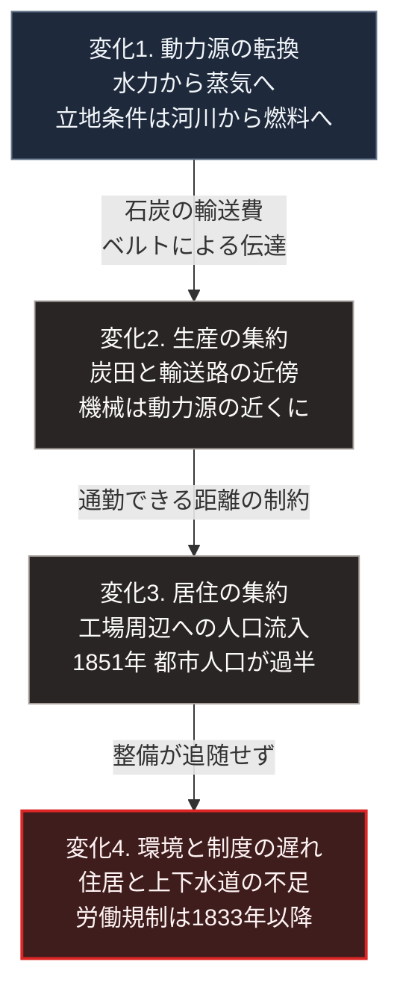

### 序論：本章が扱う範囲

本章は、18世紀後半から19世紀にかけてのイギリスにおいて、生産方式の変化が立地と居住の分布をどう変えたかを記述します。

本文は事実の記述に限定します。解釈は章末で扱います。

### 1. 動力源の変化

18世紀初頭、鉱山の排水用に蒸気を利用した機関が実用化されました。1712年にニューコメンが実用機を稼働させています。

1769年、ジェームズ・ワットは凝縮器を分離する方式の特許を取得しました。この改良により、燃料消費量が大幅に低下します。1780年代には、往復運動を回転運動へ変換する機構が加わり、機関の用途が排水から動力供給へ拡大しました。

### 2. 生産方式の変化

繊維産業において、紡績と織布の機械化が進行しました。

1764年頃に多軸紡績機、1769年に水力紡績機、1779年にミュール紡績機が導入されます。1785年には力織機が特許を取得しました。

これらの機械は、当初は水力によって駆動されました。水力を用いる場合、立地は河川の落差が得られる場所に制約されます。

蒸気機関の導入により、この制約が緩和されました。動力源が水流から燃料へ移ったため、立地の条件は石炭の入手可能性へ移行します。

### 3. 立地の集約

蒸気機関の導入は、生産の立地に2つの変化をもたらしました。

第一に、炭田および石炭の輸送路の近傍が有利になりました。当時の輸送手段では、石炭の輸送費が製造原価に占める比重が大きかったためです。

第二に、1つの動力源から複数の機械へ動力を分配する構造が採られました。当時の伝達方式は、機関から主軸を回し、そこからベルトで各機械へ動力を送るものです。この方式では、機械を主軸の近傍に配置する必要があります。

この2つの条件により、生産は特定の地点に集約されました。

経済史家ジョエル・モキイアは、この時期の技術変化を、個別の発明ではなく、発明を継続的に生み出す条件の成立として分析しています [ [ 33 ] ](https://openlibrary.org/works/OL4776874W) 。

### 4. 居住の集約

生産が集約されると、労働者の居住も集約されます。当時の移動手段では、通勤可能な距離が限られていたためです。

イギリスの都市人口比率は、この期間に大きく変化しました。国勢調査が始まった1801年から1851年までの間に、都市に居住する人口の比率が上昇し、1851年の国勢調査において都市人口が農村人口を上回りました [ [ 185 ] ](https://www.visionofbritain.org.uk/census/) 。

ロンドンの人口は、1801年の約100万人から1851年には200万人を超えました [ [ 185 ] ](https://www.visionofbritain.org.uk/census/) 。マンチェスター、リヴァプール、バーミンガムなどの工業都市も、同期間に急速に人口を増加させています。

### 5. 都市の環境と制度の対応

急速な人口集中に対し、住居、上下水道、廃棄物処理の整備は追随しませんでした。

この時期の都市における居住環境については、複数の同時代の調査記録が残されています。過密な住居、共同の便所、そして未整備の排水路が記録されています。

制度の対応は段階的に進みました。工場における労働について、1833年の法律は年少者の労働時間を制限し、検査官の制度を設けました。1847年の法律は、女性と年少者の労働時間を1日10時間に制限しています。

公衆衛生については、次章で扱います。

### 6. 賃金と生産性の推移

この時期における労働者の生活水準については、長期の研究があります。

[第Ⅰ部C-12](technology-displacement-history)で参照するとおり、経済史家ロバート・アレンの分析によれば、1790年代から1840年代にかけて、労働生産性は上昇した一方、実質賃金はほぼ横ばいで推移しました [ [ 116 ] ](https://doi.org/10.1016/j.eeh.2009.04.004) 。実質賃金の明確な上昇が観測されるのは、1840年代以降です。

同時代の記述としては、1867年に公刊されたマルクスの著作が、工場労働の実態に関する議会報告や検査官報告を多数引用しています [ [ 22 ] ](https://www.marxists.org/archive/marx/works/1867-c1/) 。

### 🗺️ 図：動力源の変化が立地と居住を決めた経路

技術の変化が、どの経路で人の分布を変えたかを示します。

#### 図の読み方

この図は上から下へ1本の鎖として読みます。4つの箱が変化の段階で、矢印に添えた語がその段階へ進んだ物理的な理由です。都市化が政策や理念によってではなく、動力の伝達方式という技術的な制約から生じたという点を示します。

1段目から2段目へ向かう矢印に記した2つの理由のうち、決定的だったのは動力伝達が機械的であったことです。主軸とベルトによる伝達では、動力源から離れた場所へ動力を送れません。したがって、機械は物理的に近接して配置されました。

3段目は、その帰結です。機械が集約されれば、それを操作する人も集約されます。当時の移動手段では、居住地は職場の近傍に限られました。

[第Ⅰ部C-1](innovation-overview)で参照したデイヴィッドの分析が指摘したのは、この制約が電力の導入によって解除されたという点です。各機械に個別の電動機を配置できるようになると、機械の配置は動力伝達ではなく作業の流れによって決まります。この変化は次々章で扱います。

最下段は、集約の速度に対して整備の速度が追随しなかった結果です。ここで注意すべきは、これが技術の欠陥ではなく、制度の応答速度の問題であるという点です。第Ⅰ部C-1で整理した4段階モデルにおける、効果3から効果4への移行の遅れに相当します。

---

### 現代社会構造への射程と本質（本章のまとめ）

本セクションは、著者による解釈です。前節までの事実記述とは区別して読んでください。

1.  **現代社会構造の原点**

    現代の都市の分布は、この時期に形成された分布を基礎としています。工業都市として成立した都市の多くは、産業構造が変化した後も都市として存続しました。

    重要なのは、その立地の根拠が既に失われている場合があるという点です。炭田の近傍という立地条件は、エネルギー源が変わった時点で意味を失いました。しかし都市は、既に建設されたインフラと集積した人口によって、そこに残ります。

2.  **歴史的事実の本質**

    本章から抽出できる論点は2つあります。

    第一に、人の分布を決めたのが技術的な制約であったという点です。動力を遠くへ送れないという制約が、人を1か所に集めました。

    第二に、制約が解除された後も、分布はすぐには変わらないという点です。建物、道路、上下水道は、一度敷設されると移動できません。

3.  **現代社会の現状と課題**

    現在、動力と情報はいずれも遠隔へ送れます。産業革命期の制約は、技術的には解除されています。

    それにもかかわらず人口の都市集中が継続しているのは、別の要因によります。雇用の集積、教育と医療の利用可能性、そして対面の交流が持つ価値です。

    [第Ⅲ部](future-method)および[第Ⅴ部](42_taoist-wu-wei-non-action)では、この点を扱います。集中の理由が技術的制約でないならば、分散の可否も技術のみでは決まりません。何が集中を維持しているのかを特定しなければ、分散型の設計は成立しません。
