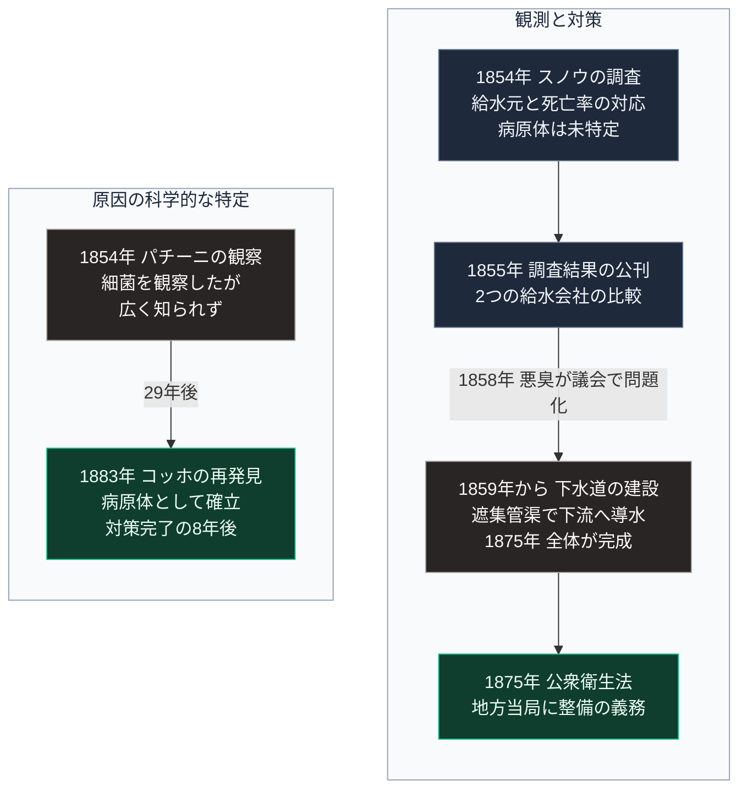

### 序論：本章が扱う範囲

本章は、19世紀ロンドンにおけるコレラの流行と、それに対する調査、そして下水道の建設までの経過を記述します。

本文は事実の記述に限定します。解釈は章末で扱います。

### 1. 流行の経過

イギリスにおけるコレラの流行は、19世紀に複数回発生しました。1831年から1832年、1848年から1849年、1853年から1854年、そして1866年です。

当時の主要な疾病観は、腐敗した物質から発生する空気が病気を引き起こすというものでした。この見解に基づく対策は、悪臭の除去に重点を置きました。

### 2. スノウの調査

医師ジョン・スノウは、コレラが水を介して伝播するという仮説を提示し、これを検証しました。その結果は1855年に公刊されています [ [ 27 ] ](https://archive.org/details/b28985266) 。

同書に記録されている調査は、主に2つです。

**第一の調査：ブロード街の事例**

1854年8月末から9月にかけて、ロンドンのソーホー地区で集中的な発生が起こりました。

スノウは、死亡者の居住地を地図上に記録し、給水設備との位置関係を検討しました。その結果、特定の共同ポンプの周辺に発生が集中していることを確認します。

同書はまた、位置関係と一致しない事例についても検討しています。ポンプから離れた場所の発生については、その水を運んで飲用していたことを確認しました。ポンプの近くで発生がなかった事例、たとえば醸造所の労働者については、別の水源を用いていたことを記録しています。

1854年9月8日、当該ポンプの取っ手が取り外されました。

**第二の調査：給水会社による比較**

同書が記述するもう1つの調査は、より広範なものです。

ロンドン南部の一部地域では、2つの給水会社が同一の地区に給水していました。両社の給水を受ける世帯は、同じ通りに混在していました。

一方の会社は、汚染の少ない上流に取水口を移していました。他方は、下流に取水口を置いたままでした。

スノウは、各世帯の給水元を戸別に確認し、死亡率を比較しました。同書によれば、下流から取水する会社の給水を受けた世帯の死亡率は、上流に移した会社の給水を受けた世帯より大幅に高い値を示しました。

この比較は、居住地、職業、生活水準といった条件を実質的に一定に保った状態での比較にあたります。

### 3. 制度の対応

1858年の夏、テムズ川の汚染による悪臭が問題となりました。この事態は、議会において下水道整備の議論を促しました。

同年、大都市圏の下水道整備に関する法律が成立します。工事は、大都市圏の土木事業を担当する機関のもとで進められました。

技術者ジョゼフ・バザルジェットの設計による整備は、テムズ川に平行する遮集管渠を敷設し、河川へ直接流入していた下水を下流の放流地点へ導くものです。主要な遮集管渠は1859年から1865年にかけて建設され、テムズ川沿いの低位管渠を含む全体は1875年に完成しました [ [ 254 ] ](https://www.ice.org.uk/what-is-civil-engineering/what-do-civil-engineers-do/london-sewer-system) 。

1875年、公衆衛生に関する法律が成立し、地方当局に対して下水道の整備または修繕の義務が課されました [ [ 186 ] ](https://www.legislation.gov.uk/ukpga/Vict/38-39/55/contents) 。

### 4. 原因の科学的な特定

コレラの原因となる細菌は、1854年にイタリアのフィリッポ・パチーニによって観察されていましたが、当時は広く知られませんでした。1883年、ロベルト・コッホが再発見し、これが病原体として確立します。

すなわち、原因菌の特定は、スノウの調査とロンドンの下水道建設の後に行われました。

### 🗺️ 図：原因の特定と対策の順序

何が分かる前に何が実施されたかを示します。

#### 図の読み方

この図は、左右2つの枠をそれぞれ上から下へ時系列として読みます。左の枠が観測と対策の系列、右の枠が原因の科学的な特定の系列です。両方の枠は同じ1854年から始まります。

左の枠の最下段は1875年で、右の枠の最下段は1883年です。左の系列が右の系列より先に完了していることが、この図の要点です。有効な対策が、原因の完全な理解に先行しました。

左の枠の1段目にあるスノウの調査は、病原体を特定していません。特定したのは、給水元と死亡率との対応関係です。2段目の第二の調査は、方法論として重要です。同一地区に2つの給水会社が混在していたという偶然の条件が、他の要因を一定に保った比較を可能にしました。

左の枠の2段目から3段目へ向かう矢印には、下水道整備が決定された直接の契機を記しました。統計的な証拠ではなく、議会周辺における悪臭です。それでも、実施された対策は結果として有効でした。

ここから抽出できるのは、次の点です。対策の有効性は、その対策が採用された理由の正しさとは独立しています。誤った理解に基づく対策が有効な場合もあり、正しい理解に基づく対策が無効な場合もあります。

同時に、留意すべき点もあります。原因を理解せずに実施された対策は、条件が変わったときに調整できません。汚水を下流へ導くという方式は、放流先が十分に希釈できる場合に有効です。この前提が変われば、方式の見直しが必要になります。

---

### 現代社会構造への射程と本質（本章のまとめ）

本セクションは、著者による解釈です。前節までの事実記述とは区別して読んでください。

1.  **現代社会構造の原点**

    現代の上下水道は、この時期に確立した方式を継承しています。すなわち、清浄な水を集約的に供給し、汚水を集約的に収集して処理する方式です。

    この方式は、水系感染症の抑制において高い効果を示しました。同時に、大規模な管路網と処理施設を必要とします。第Ⅱ部A-2で述べるとおり、この管路網の維持費用は、利用者数が減少しても比例して減少しません。

2.  **歴史的事実の本質**

    本章から抽出できる論点は3つあります。

    第一に、原因の理解と有効な対策とは、必ずしも同じ順序で得られないという点です。

    第二に、比較の条件が揃った観測は、因果の推定において決定的な役割を果たすという点です。スノウの第二の調査が説得力を持つのは、条件が実質的に一定に保たれていたためです。

    第三に、集約型の衛生インフラが、公衆衛生における最大の成果の1つであるという点です。本書は分散型の設計を扱いますが、それは集約型の成果を否定するものではありません。

3.  **現代社会の現状と課題**

    現在の課題は、この方式の有効性ではなく、その維持です。管路の更新時期を迎える設備が増加する一方、利用者密度は低下しています。

    第Ⅴ部では、この条件下における衛生の確保を検討します。そこでの要件は、集約型の代替ではなく、集約型が維持されない区域における下限の確保です。本章で確認したとおり、水系感染症の抑制は近代における最大の成果の1つであり、この水準を下回ることは許容されません。
