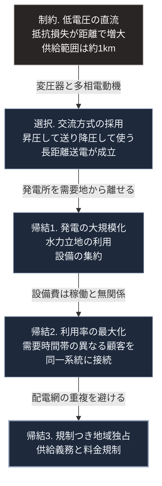

### 序論：本章が扱う範囲

本章は、19世紀末から20世紀初頭にかけて、電力の供給がどのような技術的選択を経て事業として成立したかを記述します。

本文は事実の記述に限定します。解釈は章末で扱います。

なお、この時期については、後年の通俗的な記述と史実との間に差異が生じている論点が複数あります。本章では、確認可能な事実に限定して記述し、争点となっている論点については、その旨を明示します。

### 1. 直流による供給の開始

1882年、ニューヨークのパール街に発電所が設置され、周辺地区への電力供給が開始されました。方式は直流であり、供給電圧は低い水準に設定されていました。

この方式の技術的な制約は、供給範囲にありました。低い電圧で送電する場合、導体の抵抗による損失が距離に応じて増大します。したがって、発電所から供給できる範囲は、数百メートルから1キロメートル程度に限られました [ [ 38 ] ](https://openlibrary.org/works/OL2738212W) 。

この制約は、需要密度の高い都市中心部では問題になりません。一方、需要が分散した地域への供給は、経済的に成立しませんでした。

### 2. 交流方式の技術的な基盤

交流方式が実用化されるためには、電圧を変換する装置が必要でした。

1880年代前半、複数の技術者が変圧器の開発を進めました。1885年には、ブダペストの技術者集団が、並列接続に適した構成の変圧器を実用化しています。1886年、アメリカにおいて交流による配電の実証が行われました。

交流方式の利点は、送電時に電圧を高め、需要地で降圧できる点にあります。同じ電力を送る場合、電圧を高めれば電流が減り、導体の抵抗による損失が減少します。これにより、長距離の送電が経済的に成立します。

一方、当初の交流方式には課題がありました。実用的な交流電動機が存在しなかったことです。

1887年から1888年にかけて、ニコラ・テスラは多相交流を用いる誘導電動機に関する特許を取得しました。この方式は、同年にウェスティングハウス社が実施権を取得します。これにより、交流方式による動力供給が可能になりました。

### 3. 方式をめぐる競争

1880年代後半から1890年代にかけて、直流方式と交流方式の間で競争が生じました。

直流方式を推進する側は、交流の高電圧に伴う危険性を主張しました。この主張を印象づけるための公開実験の記録が残っています。1890年には、交流を用いた死刑執行の方法が初めて実施されています。

技術的な帰結は、交流方式の採用でした。1893年のシカゴ万国博覧会における電力供給、および1895年から1896年にかけて稼働したナイアガラの水力発電と、そこから約35キロメートル離れたバッファローへの送電が、交流方式によって実施されました [ [ 38 ] ](https://openlibrary.org/works/OL2738212W) 。

歴史家トマス・ヒューズは、この時期の電力系統の形成を、技術、経済、制度が相互に規定し合う過程として分析しています [ [ 38 ] ](https://openlibrary.org/works/OL2738212W) 。

### 4. 事業モデルの確立

送電方式が確定した後、電力供給を事業として成立させるための構造が形成されました。

この構造を明示的に論じたのが、シカゴで電力事業を経営したサミュエル・インサルです。彼の論考は公刊されています [ [ 24 ] ](https://archive.org/details/centralstatione00insugoog) 。

その論旨は、次の3点に整理できます。

**第一に、設備利用率の重要性**：発電設備の費用は、稼働の有無にかかわらず発生します。したがって、設備をどれだけ稼働させたかが、単位あたりの原価を規定します。需要の時間帯が異なる複数の顧客を同一の系統に接続すれば、設備の利用率が向上します。

**第二に、計量に基づく課金**：需要家ごとの使用量を計測し、それに応じて課金する仕組みです。あわせて、最大需要に応じた基本料金と、使用量に比例する従量料金とを組み合わせる方式が導入されました。

**第三に、規制のもとでの独占**：同一地域に複数の配電網を敷設することは、設備の重複を生みます。インサルは、供給区域における独占を認める代わりに、料金と供給義務について公的な規制を受け入れる構成を主張しました。

この構成は、その後の電力事業の標準的な形態となりました。

### 5. 無線による送電の構想

ニコラ・テスラは、電力を導体によらず伝送する構想を持ち、1901年にニューヨーク州ロングアイランドで施設の建設を開始しました。この施設はウォーデンクリフと呼ばれます。

この計画には、J・P・モルガンが資金を提供しました。ただし、資金提供の対象は無線通信に関するものでした。

1901年12月、グリエルモ・マルコーニが大西洋を越える無線信号の送受信に成功したと発表します。テスラは追加の資金提供を求めましたが、認められませんでした。1906年に工事は中断し、施設は完成しませんでした。

**この経緯についての注記**

この計画の中止について、「課金の仕組みを作れないことを理由に資金提供が打ち切られた」という説明が広く流布しています。

本書は、この説明を事実として記述しません。テスラとモルガンの間で交わされた合意の対象は無線通信であり、その範囲を超える計画への追加投資が行われなかったという経緯は確認できます。一方、意思決定の動機については、確認可能な一次資料に基づく記述が困難です。

なお、大電力の無線伝送については、その後の研究においても実用的な効率が得られていません。この点は、資金提供の有無とは独立した技術的な制約です。

### 🗺️ 図：技術的制約が事業構造を決めた経路

送電方式の選択が、どの経路で事業の形を決めたかを示します。

#### 図の読み方

この図は上から下へ1本の鎖として読みます。最上段が物理的な制約、2段目がそれへの技術的な回答、3段目以降がその回答から順に導かれた事業上の帰結です。矢印に添えた語が、次の段へ進む理由です。

出発点は、抵抗による損失という物理的な制約です。この制約が、2段目の交流方式の採用を導きました。

交流方式の採用は、発電所の立地を需要地から解放しました。これにより3段目のとおり発電は大規模化し、水力など特定の立地条件を要する電源が利用可能になります。

4段目の帰結2は、設備の費用構造から導かれます。発電設備の費用は、その大部分が初期投資です。稼働率が低ければ、単位あたりの原価は上昇します。したがって、可能な限り多くの需要を同一の設備に接続することが、原価の低減につながります。

最下段の帰結3は、配電網の重複を避けるという要請から導かれます。同一の道路に2社が電線を敷設することは、設備費用の二重負担を生みます。この構造は、自然独占と呼ばれる状態にあたります。

この鎖の全体が、最上段の物理的な制約から出発している点が重要です。事業者の意図や当時の思想が起点にあるのではありません。

同時に、逆の含意もあります。最上段の制約が変われば、その下の帰結も変わりうるということです。第Ⅴ部では、この点を検討します。

---

### 現代社会構造への射程と本質（本章のまとめ）

本セクションは、著者による解釈です。前節までの事実記述とは区別して読んでください。

1.  **現代社会構造の原点**

    現在の電力供給の構造、すなわち大規模な発電設備、広域の送電網、そして供給区域における事業者の位置づけは、いずれも本章で記述した連鎖に由来します。

    この構造は、20世紀を通じて有効に機能しました。設備の利用率を高め、単位あたりの原価を下げるという設計は、電力の普及に決定的な役割を果たしました。

2.  **歴史的事実の本質**

    本章から抽出できる論点は2つあります。

    第一に、インフラの事業構造が、技術的な制約から演繹的に導かれるという点です。誰かが独占を意図したのではなく、費用構造がその形を要求しました。

    第二に、後年に流布した説明と、確認可能な事実とを区別する必要があるという点です。テスラの計画に関する通俗的な説明は、その一例です。

3.  **現代社会の現状と課題**

    現在、本章で述べた制約のいくつかは変化しています。

    太陽光発電と蓄電池は、小規模でも単位あたりの費用が極端に不利にならない特性を持ちます。これは、大規模化による原価低減という前提を部分的に変化させます。

    ただし、送電損失に関する物理的な制約は変わっていません。また、需要と供給を一致させ続ける必要があるという電力系統の性質も変わりません。

    第Ⅴ部では、変化した制約と変化していない制約とを区別したうえで、局所的な供給がどこまで成立するかを検討します。
