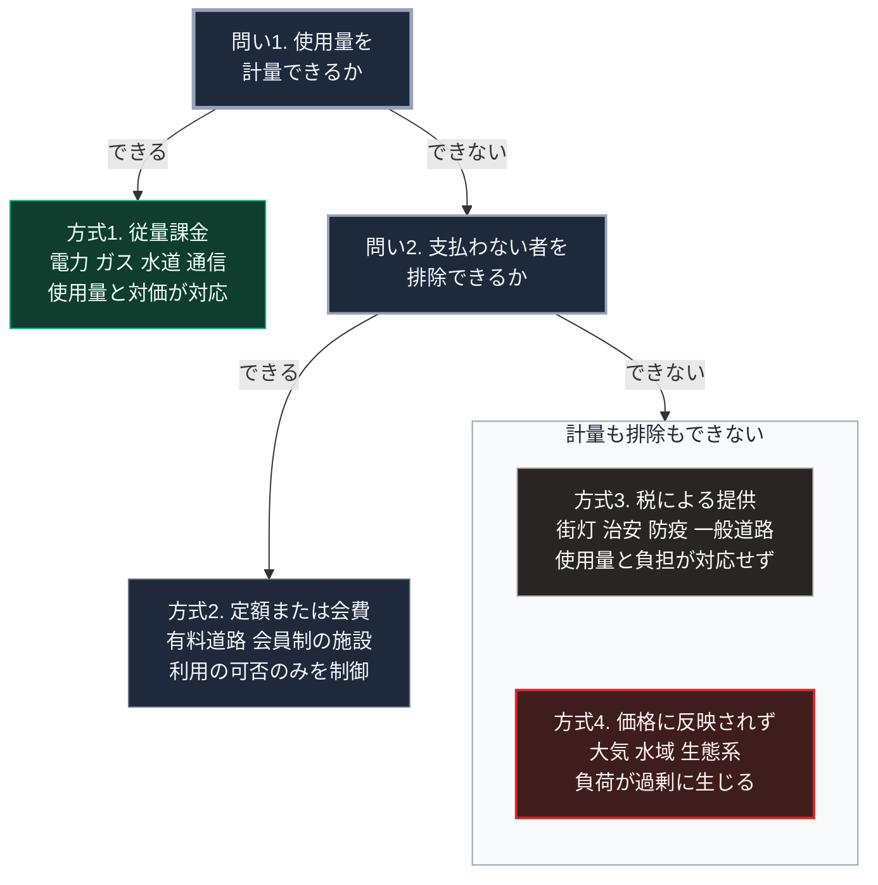

### 序論：本章が扱う範囲

本章は、供給されるものを計量する技術が、事業の形と社会の構造にどう作用したかを記述します。

この主題を独立した章として扱う理由は2つあります。

第一に、計量が可能かどうかが、あるものが商品として取引されるかどうかを規定するためです。計量できないものには、使用量に応じた対価を設定できません。

第二に、計量された指標が、その後の最適化の対象となるためです。何を測るかという選択が、何が改善されるかを決めます。

本文は事実の記述に限定します。解釈は章末で扱います。

### 1. 計量技術の成立

**ガス**：19世紀初頭、都市ガスの供給が始まりました。1815年頃、体積を計測する装置が実用化されます。これにより、使用量に応じた課金が可能になりました。

**電力**：初期の直流供給では、電気分解を利用した積算計器が用いられましたが、交流には適用できませんでした。交流に対応する実用的な計量装置が必要とされます。

1888年、交流に対応した誘導型の電力量計が開発されました。これにより、交流方式においても使用量に応じた課金が可能になります。

**水道**：水道の計量についても、19世紀を通じて装置が実用化されました。ただし、水道においては、計量に基づく従量課金と、定額課金とが長く併存しました。

### 2. 計量が可能になったことの帰結

前章で述べたとおり、サミュエル・インサルは、設備の利用率を高めることが原価の低減につながると論じました [ [ 24 ] ](https://archive.org/details/centralstatione00insugoog) 。

この論理を実際の料金体系として実装するには、計量が前提となります。

具体的には、次の2種類の計測が必要です。第一に、一定期間の使用量の合計。第二に、その期間における最大の使用速度です。

前者に応じた従量料金と、後者に応じた基本料金とを組み合わせることで、設備の費用と燃料の費用とを、それぞれ対応する需要家へ配分できます。

歴史家トマス・ヒューズが分析したとおり、電力系統の形成においては、技術、経済、制度が相互に規定し合いました [ [ 38 ] ](https://openlibrary.org/works/OL2738212W) 。計量技術は、この相互作用における結節点にあたります。

### 3. 計量できないものの扱い

一方、計量が困難なものについては、異なる方式が用いられました。

**道路**：一般の道路について、通行量に応じた課金は、長らく技術的に困難でした。したがって道路は、税による整備と無償の通行という方式で提供されました。有料道路は、通行地点が限定される区間に限られます。

**街灯、治安、防疫**：これらは、個別の利用量を計測できません。したがって、税による提供が標準となりました。

**大気と水域**：使用量が計測されないため、価格が設定されません。この結果、これらへの負荷は、事業者の費用計算に含まれませんでした。

この最後の点は、経済学において外部性として扱われます。汚染の費用が価格に反映されない場合、汚染は過剰に発生します。第Ⅰ部C-6で記述したテムズ川の汚染は、この構造の事例です。

### 4. 計量された指標が最適化の対象になること

計量には、もう1つの帰結があります。測定された指標が、行動の目標として用いられるようになるという点です。

経済学者チャールズ・グッドハートは、金融政策に関する論考において、次の趣旨を述べました [ [ 187 ] ](https://doi.org/10.1007/978-1-349-17295-5_4) 。ある統計的な規則性は、それを政策目標として用いた瞬間に、規則性としての性質を失う傾向がある、というものです。

この指摘は、後により一般的な形で参照されるようになりました。すなわち、ある指標が目標となったとき、その指標は良い指標ではなくなる、という定式です。

同種の指摘は、社会科学の評価研究においても提示されています [ [ 188 ] ](https://doi.org/10.1016/0149-7189%2879%2990048-X) 。

この論点は、第Ⅰ部B-5で記述した計画経済の観測と同じ方向を示します。生産の指標が物量で与えられた場合、生産単位は指標の達成を優先し、品質や需要への適合を軽視する傾向を示しました。

### 5. 計量の現代的な拡張

現代においては、計量の対象と精度が拡張しています。

電力については、一定間隔で使用量を記録し、通信によって送信する計器が導入されています。これにより、時間帯別の料金設定と、需要の抑制を要請する運用が可能になりました。

日本においては、電力の需給運用に関する広域的な調整を担う機関が設置されています [ [ 189 ] ](https://www.occto.or.jp/) 。

同時に、従来は計量されなかった領域についても、計測が可能になりつつあります。移動の経路、閲覧の履歴、作業の所要時間などです。

### 🗺️ 図：計量と排除の可否が決める4つの提供方式

計量と排除の可否によって、提供の方式がどう分かれるかを示します。この区別は、経済学において財を排除性と競合性の組み合わせで分類する枠組みに対応します [ [ 256 ] ](https://doi.org/10.2307/1925895) 。

#### 図の読み方

この図は、上から順に2つの問いに答えて枝を下る形をしています。各問いの箱から左へ出る矢印が「できる」場合、右へ出る矢印が「できない」場合です。提供の方式が思想ではなく、計量と排除の可否によって決まるという点を示します。

最初の問いで計量できると答えれば、左の方式1に至ります。使用量が計測でき、かつ支払わない者を排除できる場合で、電力、ガス、水道、通信がこれに該当します。

計量できない場合は、2つ目の問いに進みます。排除はできるなら左の方式2です。計量はできないが利用の可否は制御できる場合で、有料道路や会員制の施設がこれに当たります。

どちらもできない場合が、最下段の枠です。枠の中には性質の異なる2つの箱を縦に並べました。上の方式3は、便益を提供する側です。街灯を1人だけ消すことはできないため、費用は税として広く負担されます。

枠の下の方式4が、本書の議論において重要です。こちらは負荷を受ける側で、計量されないため価格が付きません。価格を通じた調整の対象にならないため、負荷は過剰に生じます。

第Ⅰ部B-3で整理したハイエクの議論に照らせば、この点は本質的です [ [ 83 ] ](https://www.aeaweb.org/aer/top20/35.4.519-530.pdf) 。価格機構が有効なのは、分散した局所知識を価格という1つの数値に圧縮できる範囲においてです。圧縮の対象とならない情報は、この機構の外側に残ります。

第4節で述べたグッドハートの指摘は、これに別の側面を加えます。計量された指標は最適化の対象となり、計量されない側面は軽視されます。したがって、計量の対象を選ぶ行為は、何を改善し何を放置するかを選ぶことに等しくなります。

---

### 現代社会構造への射程と本質（本章のまとめ）

本セクションは、著者による解釈です。前節までの事実記述とは区別して読んでください。

1.  **現代社会構造の原点**

    現在のインフラ料金の体系、すなわち基本料金と従量料金の組み合わせは、計量技術の成立を前提として設計されました。

    この体系は、費用の負担を利用の実態に対応させるという点で合理的です。同時に、この体系は、計量できる部分のみを対象とします。

2.  **歴史的事実の本質**

    本章から抽出できる論点は2つあります。

    第一に、あるものが商品として取引されるかどうかは、その性質ではなく計量の可否によって決まるという点です。

    第二に、計量された指標が目標として用いられると、その指標の意味が変質するという点です。この2つは、方向が逆です。計量できなければ扱えず、計量すれば歪みます。

3.  **現代社会の現状と課題**

    計量の技術は拡張を続けています。従来は計測されなかった領域が、計測の対象になりつつあります。

    この拡張は、2つの帰結を持ちます。一方で、外部性として扱われてきた負荷を価格に反映させる可能性が開けます。他方で、計量された指標が新たな最適化の目標となり、計量されない側面はさらに軽視されかねません。

    第Ⅲ部および第Ⅴ部では、この論点を扱います。とりわけ、災害時の相互扶助の能力や技能の継承は、計量が困難でありながら継続能力に直結します。これらをどう扱うかが設計上の課題です。
