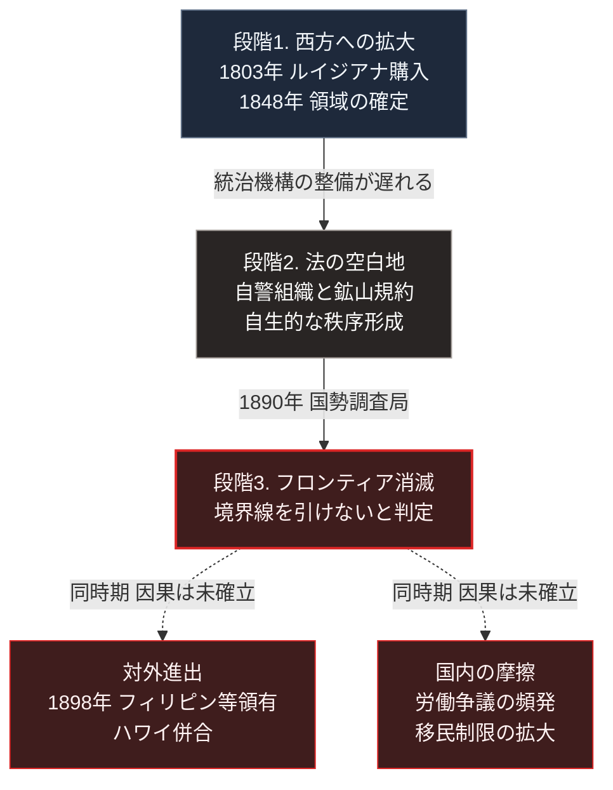

### 序論：本章が扱う範囲

本章は、19世紀のアメリカ合衆国における西部開拓と、1890年のフロンティア消滅宣言までの経過を記述します。あわせて、この過程を分析した歴史学の議論を整理します。

本文は事実の記述に限定します。現代との関連については、章末の独立したセクションで扱います。

### 1. 西方への拡大の経過

アメリカ合衆国は、独立後の1世紀を通じて領域を西方へ拡大しました。

1803年のルイジアナ購入により、ミシシッピ川以西の広大な領域が取得されました。1845年にはテキサスが併合され、1846年にオレゴン境界が確定します。1848年、対メキシコ戦争の講和により、現在の南西部にあたる領域が編入されました。

この拡大の過程で、先住諸民族は居住地からの移動を強制されました。1830年の法律に基づく強制移住はその代表的な事例です。

1862年のホームステッド法は、一定の条件を満たした入植者に対し、公有地を供与する制度を定めました。

### 2. 統治機構の追随の遅れ

領域の拡大速度に対し、連邦および州の統治機構の整備は遅れました。

裁判所、保安官、そして常設の法執行機関が設置されていない地域が、広範に存在しました。この状態において、入植者は自らの生命と財産の保護を自ら担いました。

この状況下で形成された慣行には、次のものが含まれます。武器の携行。住民による自警組織の編成。そして、正規の司法手続を経ない私的な処罰です。

鉱山地区においては、入植者が自ら規約を制定し、採掘権の範囲、紛争の処理手続、そして違反への制裁を定めた事例が記録されています。これらの規約は、後に州法および連邦法へ取り込まれました。

### 3. フロンティアの消滅宣言

1890年、国勢調査局は、居住地の分布において明確な境界線をもはや引くことができないと報告しました。これは、統計上の定義に基づく判断です [ [ 253 ] ](https://www.census.gov/history/www/programs/geography/frontier.html) 。

### 4. ターナーのフロンティア学説

1893年、歴史家フレデリック・ジャクソン・ターナーは、シカゴで開催された歴史学会において論文を発表しました [ [ 25 ] ](https://archive.org/details/significanceoffr00turnuoft) 。

同論文の主張は、次のとおりです。アメリカの制度と国民性を形成した主要な要因は、ヨーロッパから継承した制度ではなくフロンティアの存在であるとされます。自由に利用可能な土地が継続的に存在したことが、社会の流動性を高め、平等主義的な傾向と個人主義的な傾向を生んだと論じられました。

同論文はまた、1890年の報告に言及し、フロンティアの消滅がアメリカ史の第一期の終わりを画すると述べています。

この学説は、20世紀のアメリカ史研究において広く参照されました。同時に、複数の批判も提示されています。主要な批判点は、先住民の存在と強制移住を軽視していること、都市化と産業化の役割を過小に評価していること、そして地域による差異を捨象していることです。

### 5. 拡大の方向の転換

1890年以降、アメリカの対外的な活動の重点は変化しました。

1898年の対スペイン戦争を経て、フィリピン、グアム、プエルトリコが領有されます。同年、ハワイが併合されました。

同時期に、国内では労働争議が頻発し、移民の制限を求める運動が拡大しました。移民制限の立法は、1882年の中国人排斥法に始まります。これは特定の出身国からの移民を制限した最初の連邦法であり、フロンティアの消滅宣言に先行します。制限は1917年、1921年、1924年の移民法によって拡大されました。

### 🗺️ 図：拡大の終焉と、圧力の方向転換

外部への拡大が停止した後、社会内部で何が観測されたかを示します。

#### 図の読み方

この図は、上の3段を1本の鎖として読み、3段目から最下段の左右2つの箱へ破線で分かれる形をしています。実線の矢印と破線の矢印の違いが、この図の要点です。

上の2本の実線は、比較的直接的な関係です。統治機構の整備が領域の拡大に追随しなかったという事実から、法執行の不在が生じました。

2段目で観測された自生的な秩序形成は、本書の議論にとって重要です。中央の法執行が存在しない状態において、利用者集団が自ら規約を制定し、監視と制裁の仕組みを設けた事例が記録されています。この構造は、[第Ⅳ部-2](implication-community)で参照する共有資源の管理に関する研究が抽出した条件と部分的に重なります。

3段目から最下段へ向かう2本を破線にしたのは、因果が確立していないためです。ターナーの学説はこれを因果として提示しました。ただし前節で述べたとおり、この学説には複数の批判があります。

したがって本書は、最下段の左右2つの箱に記した事象、すなわち対外領有の拡大、労働争議の頻発、移民制限の立法を、事実として記述するにとどめます。それらがフロンティアの消滅によって引き起こされたという因果の主張は、確立した事実としては扱いません。

---

### 現代社会構造への射程と本質（本章のまとめ）

本セクションは、著者による解釈です。前節までの事実記述とは区別して読んでください。

1.  **現代社会構造の原点**

    アメリカの制度が持つ2つの特徴、すなわち武器の携行を当然視する社会慣行と、州および地方への権限分散は、いずれも本章で記述した時期に形成されました。武器保有に関する法制度そのものは1791年に成立した合衆国憲法の修正第2条に遡りますが、その運用と正当化にフロンティアの経験が影響したと本書は解釈します。

    武器保有については、法執行が及ばない地域における自衛の慣行が背景にあります。権限分散については、中央の統治が及ばない範囲で自生的な秩序を形成した経験が、連邦制の運用に影響しました。

    現在のアメリカを理解するうえで重要なのは、これらが理念の産物ではなく、統治機構の追随が遅れたという実務的な条件の産物であるという点です。

2.  **歴史的事実の本質**

    本章から抽出できる論点は2つあります。

    第一に、中央の法執行が不在の状態において、利用者集団が自ら規則を制定し運用しうるという点です。鉱山規約の事例は、その具体例です。ただしこれは、無秩序が自動的に秩序へ転化することを意味しません。規約が機能したのは、集団の規模が限定され、成員が相互に認知可能であり、違反への制裁が実効的であった場合です。

    第二に、外部への拡大が停止した局面で、社会内部の摩擦が顕在化したという時系列上の対応です。前節で述べたとおり、この対応関係を因果として断定する根拠はありません。ただし、拡大の余地が失われた時期と、内部の対立が激化した時期とが重なっている事実は記録されています。

3.  **現代社会の現状と課題**

    第一の論点は、[第Ⅳ部-2](implication-community)および[第Ⅴ部](42_taoist-wu-wei-non-action)に接続します。集約型インフラが維持されない区域において、利用者集団による共同管理が成立しうるかという問いです。本章の事例は、成立の条件として集団規模の限定と制裁の実効性を示唆します。

    第二の論点は、[第Ⅲ部](future-method)の議論に接続します。日本において、人口の減少と経済規模の縮小は、拡大の余地の喪失に相当します。この局面において内部の分配をめぐる対立が顕在化しうるかどうかは、[第Ⅲ部-9](scenario-pessimistic)で扱う悲観シナリオの一要素です。

    ただし、繰り返し述べたとおり、これは歴史的事実からの類推であり、確立した因果ではありません。読者は、この推論を検証可能な仮説として扱ってください。
