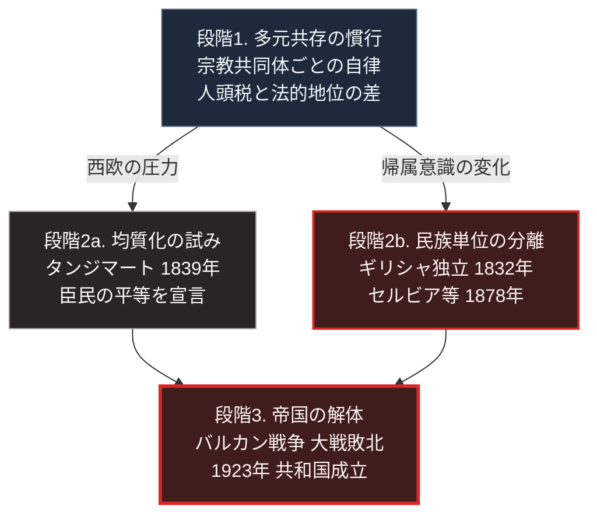

### 序論：本章が扱う範囲

本章は、オスマン帝国における非ムスリム共同体の統治方式と、人材登用の制度、そして19世紀以降の改革と解体の経過を記述します。

本文は事実の記述に限定します。現代との関連については、章末の独立したセクションで扱います。

なお本章の記述にあたっては、近年の研究が従来の理解を修正している点についても明示します。

### 1. 帝国の成立と拡大

オスマン家による国家は、13世紀末にアナトリア西部で成立しました。14世紀にはバルカン半島へ進出し、1453年にコンスタンティノープルを攻略します。

16世紀には、アナトリア、バルカン半島、シリア、エジプト、そして北アフリカ沿岸に及ぶ領域を支配しました。この領域には、イスラム教徒、正教徒、アルメニア使徒教会の信徒、ユダヤ教徒など、複数の宗教共同体が居住していました [ [ 178 ] ](https://openlibrary.org/works/OL8203300W) 。

### 2. 非ムスリム共同体の統治

オスマン帝国は、支配下の非ムスリム住民に対して、宗教の維持を認めました。

各共同体は、宗教指導者を通じて、内部の事項について一定の裁量を持ちました。具体的には、婚姻、離婚、相続に関する事項、宗教施設の運営、そして共同体内部の紛争処理です。

これらの共同体には、人頭税の納付が課されました。また、公職への就任、証言の効力、服装などについて、イスラム教徒との差異が制度上存在しました。

**近年の研究による修正**

この統治方式は、20世紀の研究において「ミレット制」という体系的な制度として記述されてきました。

しかし1982年に公刊された研究論集は、この理解に修正を加えています [ [ 32 ] ](https://openlibrary.org/works/OL18885186W) 。

同論集に収録された論考は、次の点を指摘しています。帝国の初期から統一的な「ミレット制度」が存在したという理解は、19世紀以降に遡及して構成されたものだという指摘です。実際には、共同体ごと、地域ごと、時期ごとに扱いが異なり、体系的な制度としての統一性は後代の整理に由来します。

したがって本書は、この統治方式を「制度」としてではなく、「非ムスリム共同体に一定の自律を認める慣行の集合」として記述します。

### 3. 人材登用の制度

オスマン帝国は、バルカン半島などのキリスト教徒の家庭から少年を徴用し、イスラム教へ改宗させたうえで教育し、軍事および行政の要員として登用する仕組みを持ちました。徴用はデヴシルメと呼ばれます。

この仕組みによって登用された者は、出身共同体との関係を断たれ、スルタンの直属となりました。歩兵常備軍であるイェニチェリと、宮廷官僚の一部が、この経路によって供給されました。

この仕組みは、14世紀後半から17世紀にかけて機能しました。その後、徴用の対象が縮小し、イェニチェリの構成員資格が世襲化していきます。18世紀までに、イェニチェリは軍事的な機能よりも、既得の権益を保持する集団としての性格を強めました [ [ 179 ] ](https://openlibrary.org/works/OL11787971W) 。

1826年、マフムト2世はイェニチェリを武力で解体しました。

### 4. 19世紀の改革

19世紀を通じて、オスマン帝国は行政と軍事の改革を実施しました。この一連の改革はタンジマートと呼ばれます。

1839年のギュルハネ勅令は、臣民の生命、名誉、財産の保障と、宗教にかかわらない課税の平等を宣言しました。

1856年の改革勅令は、非ムスリム臣民とムスリム臣民の法的な平等をさらに明示しました。

1876年には憲法が公布され、議会が開設されます。ただし1878年に憲法は停止され、議会も閉鎖されました。1908年の政変により、憲法は復活します。

これらの改革の意図は、宗教や民族の別によらない共通の臣民資格を確立し、帝国の統合を維持することにありました。

### 5. ナショナリズムの拡大と領域の縮小

同時期、帝国内の諸集団において、民族を単位とする独立の運動が拡大しました。

1821年に始まったギリシャの独立運動は、1832年に独立国家の承認へ至りました。セルビア、ルーマニア、モンテネグロは1878年のベルリン条約で独立が承認されます。ブルガリアは同条約で自治公国となり、1908年に独立を宣言しました。

1912年から1913年のバルカン戦争により、帝国はヨーロッパ側の領域の大半を失いました。

第一次世界大戦において、帝国は同盟国側で参戦し、敗戦します。1922年にスルタン制が廃止され、1923年にトルコ共和国が成立しました。

### 🗺️ 図：統治方式の転換と、解体の経過

多元共存から均質化への転換が、どの経過をたどったかを示します。

#### 図の読み方

この図は、上段の1つの箱が中段で2列に分かれ、下段で再び1つに合流する形をしています。

中段の左右は、同じ時期に並行して進んだ2つの動きです。左の「均質化の試み」は帝国の側からの改革で、宗教による差異を撤廃し共通の臣民資格を確立しようとしました。右の「民族単位の分離」は諸集団の側からの運動で、民族を単位とする独立を求めました。

左右の箱の間に矢印を引いていない点が、この図の要点です。改革が分離を促進したという解釈は提示されていますが、本書はこれを確立した因果として扱いません。同時期には西欧諸国の干渉や教育の普及など、複数の要因が並行して作用していました。

本書が事実として記述するのは、次の点にとどまります。宗教を単位とする統治から共通の臣民資格へ転換しようとした時期と、民族を単位とする分離運動が拡大した時期とが重なっているという時系列上の対応です。

下段の合流は、2つの動きの帰結が同じ地点に至ったことを表します。[第Ⅰ部A-8](dynastic-cycle-and-corruption)で整理する枠組みに照らせば、この経過は正統性の供給源の転換として理解できます。宗教共同体を通じた間接的な関係を臣民資格という直接的な関係へ置き換えようとした局面で、民族への帰属が第三の供給源として台頭しました。

---

### 現代社会構造への射程と本質（本章のまとめ）

本セクションは、著者による解釈です。前節までの事実記述とは区別して読んでください。

1.  **現代社会構造の原点**

    現代の国民国家が前提とする「1つの国家、1つの国民、共通の法」という構成は、19世紀のヨーロッパで確立し、世界へ広がりました。オスマン帝国のタンジマートは、この構成を導入しようとした試みの1つです。

    重要なのは、この構成が普遍的に優れているから採用されたのではないという点です。当時の国際環境において、この構成を持つ国家が交渉と軍事の両面で優位を示したため、他の国家もこれに追随しました。[第Ⅰ部A-6](meiji-centralization)で記述する明治日本の中央集権化も、同じ文脈に位置します。

2.  **歴史的事実の本質**

    本章から抽出できる論点は2つあります。

    第一に、多元的な統治方式が長期にわたり機能しうるという点です。ただし本章で述べたとおり、この方式は体系的な制度ではなく、共同体ごと地域ごとに異なる慣行の集合でした。この不統一性は、欠陥であると同時に、環境への適応の余地でもありました。

    第二に、統治の正統性を別の供給源へ切り替えようとする局面は、最も不安定です。旧来の供給源が弱まり、新しい供給源はまだ確立していない期間において、第三の供給源が台頭する余地を生みます。

3.  **現代社会の現状と課題**

    第一の論点は、[第Ⅴ部](42_taoist-wu-wei-non-action)の設計に接続します。局所の裁量を残したまま全体の整合性を確保する構成は、統一的な規則によらずとも成立しうる、ということです。ただし、その成立には条件があります。条件については、[第Ⅳ部-2](implication-community)で参照する共有資源の管理に関する研究を用いて検討します。

    第二の論点は、[第Ⅲ部](future-method)の議論に接続します。現代の統治において正統性を供給しているのは、選挙による同意と手続の遵守です。[第Ⅳ部-1](implication-state)で述べるとおり、この供給源に変化が生じうる状況にあります。本章の事例が示すのは、この転換期が構造的に不安定であるということです。
