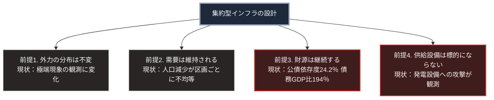

### 序論：本章が扱う範囲

本章は、日本の集約型インフラが設計時に置いていた前提を整理し、それぞれの前提が現在どのような状態にあるかを確認します。

本章は、第Ⅱ部A-4で扱う更新期の問題と、第Ⅱ部D-7で扱う気候の変化とを接続する位置にあります。本文は、前提の整理と、公表資料に基づく現状の確認に限定します。評価は章末で扱います。

### 1. 設計前提の整理

第Ⅰ部Cで記述したとおり、集約型のインフラは19世紀から20世紀にかけて成立しました。その設計は、明示的または暗黙的に、次の前提を置いています。

**前提1：外力の分布が変わらないこと**。治水、排水、送電の各設備は、過去の観測統計に基づく外力を想定して設計されます。

この前提は、各分野の設計基準に明示されています。国土交通省の河川に関する技術基準は、計画の対象とする降雨の規模を、降雨量の年超過確率によって評価すると定めています [ [ 287 ] ](https://www.mlit.go.jp/river/shishin_guideline/gijutsu/gijutsukijunn/keikaku/pdf/keikaku_kihon_all_2025.pdf) 。電気設備の技術基準を定める省令は、架空電線路の支持物について、10分間平均で風速40メートル毎秒の風圧荷重を考慮するよう定めています [ [ 288 ] ](https://laws.e-gov.go.jp/law/409M50000400052) 。下水道については、国土交通省のガイドラインが、従来の計画では5年から10年に1回の規模の降雨を一律の整備水準としてきたと記述しています [ [ 289 ] ](https://www.mlit.go.jp/mizukokudo/sewerage/content/001728942.pdf) 。

**前提2：需要が維持または拡大すること**。設備の規模は、整備時点で見込まれた需要に対応しています。利用者1人あたりの費用は、需要が維持される限りにおいて設計値に収まります。

**前提3：財源が継続すること**。設備の維持と更新は、税収または料金収入が継続することを前提とします。

**前提4：供給設備が攻撃の対象とならないこと**。第Ⅰ部D-4で記述したとおり、生活基盤への攻撃を制限する規範が成文化されており、設計はこれを前提としてきました。

### 2. 各前提の現状

**前提1について**。第Ⅱ部D-7で整理するとおり、気象庁は極端な気象現象の長期的な観測結果を公表しており、外力の分布に変化が観測されています [ [ 210 ] ](https://www.data.jma.go.jp/cpdinfo/extreme/extreme_p.html) 。

**前提2について**。第Ⅱ部A-2で示したとおり、総人口は減少局面にあり、第Ⅱ部A-5で示すとおり、その減少は区画ごとに不均等です。

**前提3について**。第Ⅱ部A-1で示したとおり、2026年度の公債依存度は24.2%であり、国と地方の長期債務残高は国内総生産の約194%です [ [ 127 ] ](https://www.mof.go.jp/policy/budget/fiscal_condition/related_data/202604.html) 。

**前提4について**。第Ⅱ部B-1で記述するとおり、進行中の武力紛争において、発電設備と送電網を攻撃対象とする事例が観測されています [ [ 148 ] ](https://www.iea.org/reports/ukraines-energy-security-and-the-coming-winter) 。

### 3. 前提の変化が意味すること

4つの前提は、いずれも設計時には妥当でした。したがって、現在の状況は設計の誤りではありません。設計の前提と実際の条件との乖離です。

第Ⅰ部A-6で整理した枠組みに照らすと、この乖離は余力の逓減として作用します。前提1と前提4は外力の側を、前提2と前提3は対応能力の側を変化させます。両者が同時に進行すると、同じ規模の事象に対して、以前は吸収できたものが吸収できなくなります。

### 🗺️ 図：4つの前提と、その現状

#### 図の読み方

この図は、4つの前提が独立に変化していることを示しています。

前提1と前提4は、外力の側の変化です。設備に加わる負荷が、設計時の想定を超える頻度で生じうる状態です。

前提2と前提3は、対応の側の変化です。負荷に対処するための資源、すなわち利用者と財源が縮小しています。

4つの前提のうち、いずれか1つが変化しただけであれば、他の前提の余裕によって吸収できます。4つが同時に変化している点が、現在の状況の性質です。

第Ⅲ部-4で定義する区分A、すなわち進行中の変化は、前提1から前提3に対応します。気候の変化は、第Ⅱ部D-7で述べるとおり、進行中の変化として扱われます。不連続な事象である区分Bは、前提4の供給設備への攻撃と、極端な気象現象の個別の発生に対応します。第Ⅲ部の3つのシナリオは、この対応関係のうえに構築されています。

---

### 現代社会構造への射程と本質（本章のまとめ）

本セクションは、著者による解釈です。前節までの記述とは区別して読んでください。

1.  **現代社会構造の原点**

    4つの前提は、第Ⅰ部A-5で記述した明治期の制度設計と、第Ⅰ部Cで記述した技術の経緯とに由来します。人口と経済が拡大し、気候が安定し、国際法が供給設備を保護するという条件のもとで、集約は合理的な選択でした。

2.  **歴史的事実の本質**

    本章から抽出できるのは、次の点です。設計の妥当性は前提の妥当性に依存し、前提は時間とともに変化します。第Ⅰ部A-2で記述したローマの事例においても、水道の設計は徴税基盤が維持されるという前提を置いていました。

3.  **現代社会の現状と課題**

    前提の変化に対する対応は2つに分かれます。前提を回復する方向と、前提に依存しない構成を追加する方向です。

    前者は、第Ⅱ部A-4で記述する予防保全への転換や、第Ⅱ部A-5で記述する居住の誘導にあたります。後者が、第Ⅴ部で扱う設計です。両者は代替関係ではなく、併用されます。
