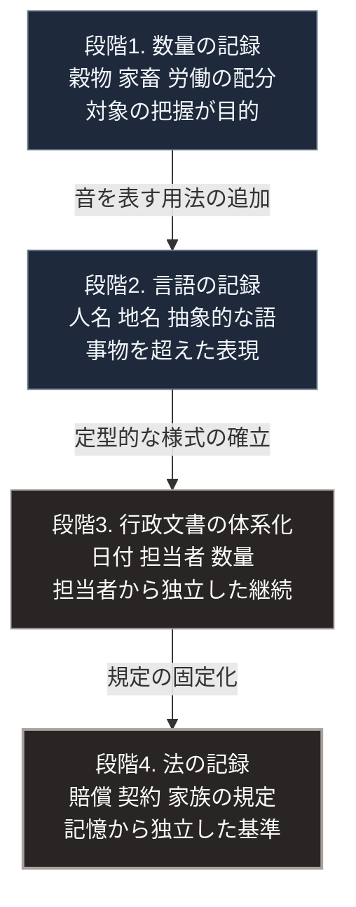

### 序論：本章が扱う範囲

本章は、文字がどのような目的で成立し、どのような記録に用いられたかを記述します。

この主題を扱う理由は、文字の成立が最初の「認知の外部化」にあたるためです。[第Ⅰ部C-1](innovation-overview)で示した転換点の一覧において、文字は記録の区分に位置づけられます。

本文は事実の記述に限定します。解釈は章末で扱います。

### 1. 最古の文字資料

現在確認されている最古の文字資料は、メソポタミア南部のウルクから出土した粘土板です。年代は紀元前3400年から紀元前3000年頃とされます [ [ 190 ] ](https://cdli.mpiwg-berlin.mpg.de/) 。

これらの粘土板に記されているのは、数量の記録です。具体的には、穀物、家畜、繊維製品、そして労働の配分に関する記録が含まれます。

これらの資料は、複数の研究機関によってデジタル化され、公開されています [ [ 190 ] ](https://cdli.mpiwg-berlin.mpg.de/) 。

### 2. 記録の起源に関する仮説

文字の成立に先立つ段階として、粘土製の小型の器物が用いられていたことが知られています。これらは、形状によって異なる品目と数量を表したと考えられています。

これらの器物を粘土の容器へ封入し、その表面に内容を示す印を押した事例が出土しています。この方式から、容器を省略して粘土板の表面に直接印を記す方式へ移行したという仮説が提示されています。

この仮説については、研究者間で議論が継続しています。ただし、最初期の記録が数量の管理を目的としていたという点については、出土資料の内容から広く支持されています。

### 3. 表記体系の発達

初期の記号は、品目と数量を示すものでした。

その後、記号が音を表す用法が加わります。これにより、人名、地名、そして具体的な事物に対応しない語を記録できるようになりました。

紀元前3千年紀を通じて、この体系は発達しました。行政文書、書簡、契約、文学作品の記録へと用途が広がります。

シュメール語の文学作品については、その多くがデジタル化され、翻訳とともに公開されています [ [ 191 ] ](https://etcsl.orinst.ox.ac.uk/) 。

### 4. 行政文書の規模

紀元前21世紀のウル第三王朝期からは、大量の行政文書が出土しています。

これらの文書が記録しているのは、次のような事項です。神殿および王室の所有する家畜の増減。労働者への配給。穀物の収穫と貯蔵。そして各地からの貢納です。

記録は、日付、担当者、そして数量を含む定型的な形式を持ちます。

### 5. 法の記録

紀元前18世紀、バビロンの王ハンムラビの名を冠した法文が石柱に刻まれました。この石柱は現存し、公開されています [ [ 192 ] ](https://collections.louvre.fr/en/ark:/53355/cl010174436) 。

同法文は、身分に応じた賠償額、契約の履行、そして家族に関する規定を含みます。

法を文字として固定した結果、規定の内容は記録者の記憶から独立しました。

### 6. 他地域における成立

文字の成立は、メソポタミアに限られません。

エジプトでは、紀元前3千年紀初頭までに体系的な表記が成立しました。中国では、紀元前13世紀頃の甲骨に刻まれた文字が確認されています。中央アメリカにおいても、独立に文字体系が成立しました。

これらの地域においても、初期の記録の多くは、行政、儀礼、そして年代の記録に関するものです。

### 🗺️ 図：記録の目的の変遷

文字が何を記録するために用いられ、何を可能にしたかを示します。

#### 図の読み方

この図は上から下へ時系列として読みます。4つの箱は文字の用途が広がった段階で、矢印に添えた語はその段階へ移る契機です。各箱の2行目が記録の対象、3行目がその記録によって可能になったことです。

この図が示す最も重要な点は、最上段にあります。文字は、思想を記録するために始まったのではありません。最初期の資料が記録しているのは、誰が何をどれだけ持ち、誰に何をどれだけ渡したかという数量です。

この事実は、[第Ⅰ部A-1](01_sovereign-state-os)で参照したスコットの議論と対応します [ [ 17 ] ](https://openlibrary.org/works/OL26241985W) 。統治は、対象を把握可能にすることを要求します。文字は、その最初の手段でした。

3段目の箱で生じた変化も重要です。定型的な様式が確立すると、記録は特定の担当者の記憶や判断から独立します。前任者が去っても、記録が残っていれば業務は継続します。

これは、組織が個人の寿命を超えて持続するための条件です。[第Ⅰ部A-6](meiji-centralization)で記述した明治期の中央集権化においても、戸籍と地籍という記録の整備が、機能の集約の前提となりました。

最下段は、この性質を規範の領域へ拡張したものです。法を文字として固定すれば、その内容は判断する者の記憶に依存しません。

なお、これらの段階は、いずれも文字を読み書きできる者とできない者との差を生みます。記録が統治の手段である以上、記録を扱える者は、そうでない者に対して情報上の優位を持ちます。

---

### 現代社会構造への射程と本質（本章のまとめ）

本セクションは、著者による解釈です。前節までの事実記述とは区別して読んでください。

1.  **現代社会構造の原点**

    現代の行政と企業が用いる記録の体系は、この段階3に直接の起源を持ちます。日付、担当者、金額、そして数量を定型的な様式で記録する方式は、5000年前の粘土板と同じ構造です。

    この方式の目的も変わっていません。担当者が交代しても業務が継続すること。そして、実態を上位が把握できることです。

2.  **歴史的事実の本質**

    本章から抽出できる論点は2つあります。

    第一に、認知の外部化が、思想の伝達ではなく数量の管理から始まったという点です。記録技術の起源は、統治と会計にあります。

    第二に、記録が組織の持続を可能にすると同時に、記録の様式に載らない情報を捨象するという点です。[第Ⅰ部B-3](capitalism-why-irreplaceable)で参照したハイエクの議論、すなわち集計になじまない局所知識が集約の過程で失われるという指摘は、記録の様式そのものに内在する制約でもあります。

3.  **現代社会の現状と課題**

    現在、記録の対象と量は拡大を続けています。従来は記録されなかった行動が、記録の対象になりつつあります。

    この拡大が意味するのは、把握可能な範囲の拡大です。同時に、[第Ⅰ部C-8](07_politics-of-metering)で述べるとおり、記録された指標が最適化の目標となる場合、記録されない側面は軽視されます。

    [第Ⅲ部](future-method)および[第Ⅴ部](42_taoist-wu-wei-non-action)では、この論点を扱います。とりわけ、記録の様式を誰が決めるのか、そして記録された内容を誰が保持するのかが、設計上の課題となります。
