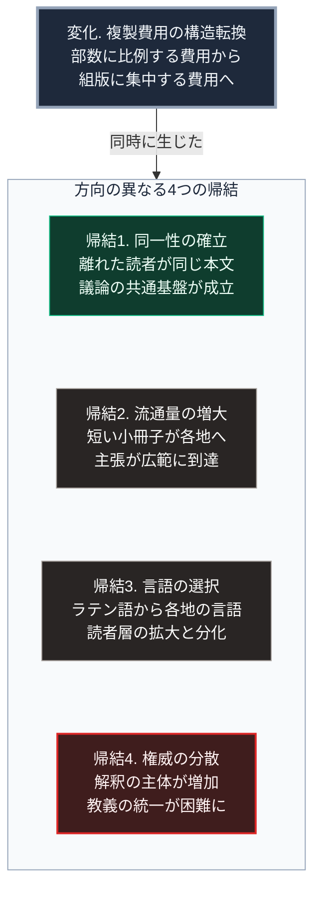

### 序論：本章が扱う範囲

本章は、15世紀ヨーロッパにおける活版印刷の成立と、それに続く16世紀の宗教改革の経過を記述します。

本文は事実の記述に限定します。解釈は章末で扱います。

### 1. 印刷技術の成立

15世紀半ば、マインツにおいてヨハネス・グーテンベルクが活版印刷を実用化しました。

この技術の要素は、次の3つです。第一に、金属製の可動活字を鋳造する技法。第二に、活字に適した油性のインク。第三に、圧力を加えて紙へ転写する印刷機です。

1450年代に、ラテン語聖書が印刷されました。

### 2. 普及の速度

印刷所は、15世紀後半にヨーロッパ各地へ広がりました。1500年までに、200を超える都市に印刷所が設置されたとされます [ [ 193 ] ](https://data.cerl.org/istc/_search) 。

同時期までに印刷された書物は、インキュナブラと呼ばれます。現存するインキュナブラの目録は、複数の機関によって整備されています [ [ 193 ] ](https://data.cerl.org/istc/_search) 。

### 3. 複製費用の変化

印刷以前、書物の複製は筆写によって行われました。筆写には、1冊あたり数か月から数年を要します。

印刷においては、活字を組む工程に費用と時間がかかります。しかし、組版が完成した後は、同一の内容を反復して印刷できます。

この構造の変化は、費用の性質を変えました。筆写では、費用は部数に比例します。印刷では、費用の大部分が最初の組版に集中し、部数が増えるほど1部あたりの費用は低下します。

### 4. 宗教改革の経過

1517年、ヴィッテンベルクの神学者マルティン・ルターが、贖宥状に関する95か条の提題を公表しました。

その後の数年間に、ルターの著作は多数印刷され、各地に流通しました。とりわけドイツ語による短い小冊子が広く流通しています。

1521年、ルターは帝国議会において自説の撤回を求められ、これを拒否しました。

1522年、ルターは新約聖書のドイツ語訳を刊行しました。

宗教改革は、教義上の対立にとどまらず、政治的な対立と結合しました。1555年のアウクスブルクの和議は、領邦の統治者が自領の宗派を決定する原則を定めます。この対立は、[第Ⅰ部A-1](01_sovereign-state-os)で記述した三十年戦争へと連なりました。

### 5. 印刷が果たした役割に関する分析

歴史家エリザベス・アイゼンステインは、印刷が知識の生産と流通に及ぼした影響を分析しました [ [ 19 ] ](https://openlibrary.org/works/OL3610191W) 。

その分析が指摘する主要な点は、次のとおりです。

**同一性**：筆写では、複製のたびに誤りが混入します。印刷では、同一の版から刷られた書物は同一の内容を持ちます。これにより、離れた場所にいる読者が、同じ本文を参照して議論できるようになりました。

**保存**：複製の部数が増加した結果、ある版が失われても他の版が残る確率は高まりました。

**累積**：同一の本文を参照できる状態が、既存の記述への批判と修正を累積させました。この性質は、自然科学の発展において重要な役割を果たしたと同分析は論じています。

**参照の体系**：目次、索引、そしてページ番号といった参照の手段が、印刷を前提として整備されました。

### 🗺️ 図：複製費用の変化がもたらした4つの帰結

技術の変化が、何を経由して社会に作用したかを示します。

#### 図の読み方

この図は、最上段の1つの変化から、枠の中で縦に並べた4つの帰結が同時に生じたことを示します。枠内の4つの箱は順序を持たない並列の項目で、上下の位置は時間の前後を意味しません。

枠内の1段目（帰結1）と4段目（帰結4）は、一見すると逆方向です。帰結1は共通の基盤を作り、帰結4は権威を分散させます。色を変えているのは、この対照を示すためです。

しかし両者は矛盾しません。同一の本文を多数の人が参照できる状態は、その本文について各自が解釈することを可能にします。共通の基盤があるからこそ、解釈の差異が顕在化します。

3段目（帰結3）も重要です。ラテン語による出版から各地の言語による出版へ移行すると、読者層が拡大する一方、言語圏ごとに読者が分かれます。

[第Ⅰ部C-1](innovation-overview)で整理した4段階モデルに照らせば、この時期に生じたのは効果2から効果3への移行です。技術が組織を再設計し、それが職能の構成を変えました。写字生という職能は縮小し、印刷業者と組版工という職能が成立しました。

効果4、すなわち制度の変更については、より長い時間を要しました。出版の許可制、著作権の制度、そして検閲の仕組みが整備されるのは、16世紀から18世紀にかけてです。

---

### 現代社会構造への射程と本質（本章のまとめ）

本セクションは、著者による解釈です。前節までの事実記述とは区別して読んでください。

1.  **現代社会構造の原点**

    現代の出版、学術、そして報道の制度は、この時期に成立した構造を継承しています。

    とりわけ、同一の本文を参照して議論するという慣行は、学術における引用の制度の基礎にあります。本書が各記述に出典を示す形式も、この系譜に属します。

2.  **歴史的事実の本質**

    本章から抽出できる論点は2つあります。

    第一に、複製費用の低下が、共通基盤の成立と権威の分散という2つの帰結を同時に生んだという点です。この2つは対立するように見えますが、同じ原因から生じています。

    第二に、技術の帰結が、その技術を開発した者の意図とは独立に生じるという点です。印刷技術は、教義の統一を崩すために開発されたのではありません。

3.  **現代社会の現状と課題**

    現在、複製費用はさらに低下し、生成の費用も低下しています。

    ここで、印刷との差異が生じます。印刷においては、複製の費用が下がる一方、原本を作る費用は残りました。したがって、流通する内容の総量には制約がありました。

    生成の費用が低下した場合、この制約が緩みます。[第Ⅲ部-4](risk-ai-and-dependency)で述べるとおり、生成が安価で検証が高価であるとき、検証は現実的に実行されなくなります。

    したがって、印刷がもたらした帰結1、すなわち共通の本文を参照するという条件が、成立しにくくなる可能性があります。この論点は、[第Ⅲ部](future-method)で扱います。
