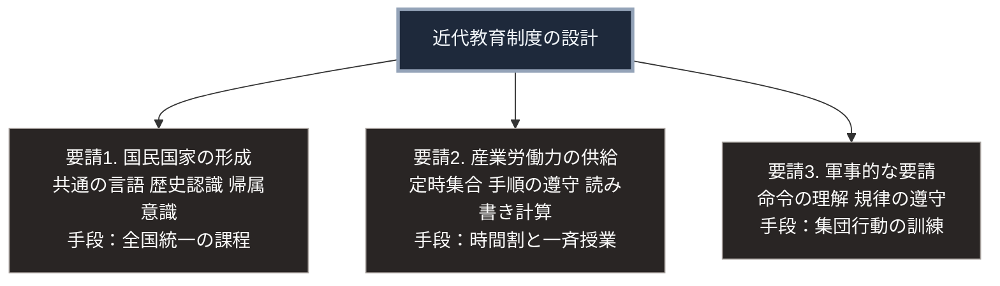

### 序論：本章が扱う範囲

本章は、義務教育を柱とする近代教育制度が、どのような目的で、どのような経緯で成立したかを記述します。

本文は事実の記述に限定します。制度の評価は、章末の解釈のセクションで扱います。

### 1. プロイセンにおける制度化

近代の義務教育制度の起源として、しばしばプロイセンの事例が挙げられます。

1717年、フリードリヒ・ヴィルヘルム1世は、領内の子どもの就学に関する命令を発しました。1763年には、一般地方学事通則が制定され、就学の年齢、期間、そして教育内容が規定されます。

1806年以降の軍事的な敗北を受けて、教育を含む諸制度の改革が実施されました。この改革において、初等教育、中等教育、そして大学の段階が体系として整理されます。中等教育を修了した資格が、大学入学の要件として制度化されました。

### 2. 各国における展開

**フランス**：1881年および1882年の法律により、初等教育の無償化、就学の義務化、そして公教育における宗教教育の分離が定められました。

**イギリス**：1870年の初等教育法により、就学の機会を保障する学校の設置が定められました [ [ 194 ] ](https://www.legislation.gov.uk/ukpga/1870/75/enacted) 。就学の義務化は、その後の法改正によって段階的に進みました。

**アメリカ**：州ごとに制度が定められました。マサチューセッツ州は1852年に就学を義務づけています。

**日本**：第Ⅰ部A-5で記述したとおり、1872年に学制が公布されました。1886年の小学校令により、義務教育の期間が定められます。就学率は、1900年代に90%を超えました [ [ 195 ] ](https://www.mext.go.jp/b_menu/hakusho/html/others/detail/1317552.htm) 。

### 3. 制度の共通する特徴

各国の制度は、細部において異なります。一方、次の特徴は広く共通しています。

**年齢による編成**：同一の年齢層を1つの集団として編成します。

**時間による区分**：1日を一定時間の単位に区切り、単位ごとに異なる科目を配置します。

**課程の標準化**：学習する内容と順序を、全国的に統一された基準として定めます。

**修了の認定**：一定の基準を満たしたことを、試験または在籍期間によって認定します。

**教員の資格化**：教える者に対して、資格の取得を要求します。

### 4. 制度化の目的

各国の制度化には、共通する複数の目的が指摘されています。

社会学者フランシスコ・ラミレスとジョン・ボリは、義務教育制度が19世紀のヨーロッパにおいて成立し、世界へ広がった過程を分析しました [ [ 196 ] ](https://doi.org/10.2307/2112615) 。

その分析によれば、制度化を促した主要な要因は、国民国家の形成にあります。共通の言語、共通の歴史認識、そして国家への帰属意識を、全住民に対して均質に形成することが、制度の目的の1つでした。

ラミレスとボリは、産業における労働力の要請によって義務教育の成立を説明する見解も検討しています。そのうえで、プロイセン、デンマーク、スウェーデンなどで産業化に先行して制度化が進んだ事実を根拠に、この見解を主要因とは認めませんでした [ [ 196 ] ](https://doi.org/10.2307/2112615) 。

同論文はまた、対外的な軍事的敗北が教育改革の契機となった事例を、国家間の競争の一部として位置づけています。1806年の敗戦後のプロイセン、1870年の敗戦後のフランスがその例です [ [ 196 ] ](https://doi.org/10.2307/2112615) 。

教育史家ジェームズ・ボーエンは、西洋における教育の変遷を、社会構造の変化との関係において整理しています [ [ 35 ] ](https://openlibrary.org/works/OL5016779W) 。

### 🗺️ 図：制度が満たそうとした3つの要請

義務教育の設計が、何に応えるものだったかを示します。

#### 図の読み方

この図が示すのは、近代教育制度の各要素が、当時の3つの要請に対応して設計されたという点です。

年齢による編成、時間による区分、そして課程の標準化は、いずれも教育学的な最適性から導かれたものではありません。多数の対象へ均質な内容を、限られた費用で供給するという要請から導かれました。

第Ⅰ部A-5で記述したとおり、明治期の中央集権化において、学制は4つの機能の集約の1つでした。人事、財政、武力、そして人材規格です。教育制度は、この第4の機能を担いました。

ここで重要なのは、この設計が当時の条件下では有効に機能したという点です。識字率の向上、平均的な学力の底上げ、そして出身にかかわらず一定の教育を受ける機会の提供は、いずれもこの制度によって実現されました。

同時に、設計が特定の要請に対応している以上、要請が変われば設計の適合性も変わります。第Ⅰ部C-1で整理した4段階モデルに照らせば、教育制度は効果4、すなわち制度の変更にあたります。効果4は最も変化が遅い層です。

---

### 現代社会構造への射程と本質（本章のまとめ）

本セクションは、著者による解釈です。前節までの事実記述とは区別して読んでください。

1.  **現代社会構造の原点**

    現在の学校の構造、すなわち年齢別の学級、時間割、全国共通の課程、そして修了の認定は、19世紀に確立した設計をほぼそのまま継承しています。

    この継承は、惰性によるものとは限りません。多数の対象へ均質な内容を限られた費用で供給するという要請は、現在も存在するためです。

2.  **歴史的事実の本質**

    本章から抽出できる論点は2つあります。

    第一に、教育制度の形を決めたのは、教育の理念ではなく供給の制約だという点です。年齢別の編成は、同じ内容を同時に多数へ伝える方法として合理的です。

    第二に、制度が対応した要請は、いずれも当時の産業と軍事の構造に固有のものだったという点です。定時に集合して手順に従う能力の重要性は、生産方式に依存します。

3.  **現代社会の現状と課題**

    第Ⅲ部-5で述べるとおり、生成AIの導入は、技能の習得過程に影響しうることが観測されています。初級の作業を反復することによって技能を習得する経路が変化する場合、教育制度が前提としてきた学習の順序も再検討の対象になります。

    ただし、第Ⅰ部C-1で整理したとおり、効果4は最も変化が遅い層です。したがって、産業側の変化と教育制度の変化との間には、相当の時間差が生じます。

    第Ⅲ部で提示する3つのシナリオにおいて、この時間差の長さは重要な分岐要素です。楽観シナリオは、この時間差が短縮される場合に該当します。
