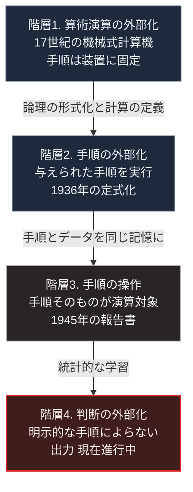

### 序論：本章が扱う範囲

本章は、計算と論理の操作が機械によって実行されるようになった経緯を記述します。

本文は事実の記述に限定します。解釈は章末で扱います。

### 1. 機械式計算機

17世紀、複数の技術者が歯車を用いた計算装置を製作しました。1642年頃にブレーズ・パスカルが加減算の装置を、1670年代にゴットフリート・ライプニッツが乗除算にも対応する装置を製作しています。

これらの装置が実行できるのは、算術演算に限られます。演算の手順そのものを装置に与えることはできませんでした。

19世紀、チャールズ・バベッジは、演算装置、記憶装置、入出力装置、そして手順の制御を含む機械を構想しました。この構想は解析機関と呼ばれます。バベッジの生前に完成することはありませんでした。

エイダ・ラブレスは、この機械に関する解説において、数値以外の対象を扱う可能性について記述しています。

### 2. 論理の数学的な形式化

1847年および1854年、ジョージ・ブールは、論理的な推論を代数的に扱う体系を提示しました。この体系では、命題の真と偽を2つの値として扱い、それらの結合を演算として表現します。

この形式化により、論理的な推論が記号の操作として表現可能になりました。

### 3. 計算可能性の定式化

1936年、アラン・チューリングは、計算という手続きを形式的に定義する論文を発表しました [ [ 21 ] ](https://www.cs.virginia.edu/~robins/Turing_Paper_1936.pdf) 。

同論文が提示したのは、有限の状態と、記号の読み書きが可能なテープからなる抽象的な機械です。この機械によって実行可能な手続きの範囲が、計算可能性の定義として用いられます。

同論文はまた、この機械の動作を記述したものを入力として受け取り、その動作を模倣する機械が構成可能であることを示しました。すなわち、単一の機械が、手順を与えられることで任意の計算をこなしうるという性質です。

### 4. 電子的な実装

1930年代後半から1940年代にかけて、論理演算を電気的に実装する研究が進みました。継電器および真空管の導通と遮断が、論理の2値に対応づけられます。

第二次世界大戦において、複数の計算機が開発されました。イギリスでは暗号解読のための装置が、アメリカでは弾道計算のための装置が構築されています。

1945年、ジョン・フォン・ノイマンの名で報告書が公表されました [ [ 20 ] ](https://archive.org/details/vnedvac) 。同報告書は、手順とデータを同一の記憶装置に格納する構成を記述しています。この構成により、手順そのものを演算の対象として扱うことが可能になりました。

### 5. 情報量の定量化

1948年、クロード・シャノンは、通信における情報量を定量的に扱う理論を提示しました [ [ 26 ] ](https://web.archive.org/web/19980715013143/http://cm.bell-labs.com/cm/ms/what/shannonday/shannon1948.pdf) 。

同論文は、情報の量を、送り手が選択しうる可能性の数から定義します。また、雑音のある通信路においても、一定の速度までは誤りを任意に小さくして伝送できることを示しました。

この理論は、通信、記録、そして圧縮の技術的な基礎となりました。

### 6. 素子の小型化

1947年に半導体を用いた増幅素子が、1958年から1959年にかけて複数の素子を1つの基板上に構成する技術が実現しました。

これにより、計算機の体積、消費電力、そして単位あたりの費用が継続的に低下しました。

### 🗺️ 図：外部化された機能の階層

計算機の成立によって、人間の担っていたどの機能が機械へ移ったかを示します。

#### 図の読み方

この図は上から下へ時系列として読みます。4つの箱は外部化が進んだ階層で、下の箱ほど人間の側に残っていた機能が機械へ移っています。矢印に添えた語が、次の階層へ進むことを可能にした技術です。

最上段の階層1では、装置が実行できる演算はあらかじめ固定されていました。加算機は加算しかできません。

2段目の階層2において、決定的な転換が生じました。機械に手順を与えることで、その機械が実行する内容を変えられるようになったためです。

3段目の階層3は、その手順自体を演算の対象とする構成です。手順とデータを同じ記憶装置に置くことで、機械が自らの動作を変更する手順を実行できるようになりました。

最下段の階層4は、現在進行中の変化です。ここで外部化されつつあるのは、明示的な手順として記述されていない判断です。色を変えているのは、この階層だけが完了していないためです。

第Ⅰ部C-1で整理した4段階モデルに照らせば、階層4は効果1、すなわち作業の代替の段階にあります。効果2にあたる組織の再設計は、領域によって進行の程度が異なります。

なお、この図は「人間の機能が機械に置き換わっていく」という単線的な過程を示すものではありません。階層1で外部化された暗算の能力は、その希少性を失いましたが、同時により大規模な計算が可能になり、新しい職能が生まれました。第Ⅰ部C-12で整理するとおり、置換と創出は同時に生じます。

---

### 現代社会構造への射程と本質（本章のまとめ）

本セクションは、著者による解釈です。前節までの事実記述とは区別して読んでください。

1.  **現代社会構造の原点**

    現代の情報基盤は、階層3で確立された構成をそのまま用いています。手順とデータを同一の記憶装置に置き、手順を書き換えることで機能を変えるという方式です。

    この方式が持つ性質は、汎用性です。同じ装置が、書き換えによって異なる用途に用いられます。この性質が、計算機の普及を可能にしました。

    同時に、この汎用性は、装置が何を実行しているかを外形から判断できないことを意味します。この点は、第Ⅱ部および第Ⅴ部で扱うセキュリティの議論に直結します。

2.  **歴史的事実の本質**

    本章から抽出できる論点は2つあります。

    第一に、外部化を進めたのは「何ができるか」ではなく「何を機械に指示できるか」の拡大だという点です。階層2の転換は、機械の性能ではなく、機械と人間の関係の変化でした。

    第二に、各階層において、外部化された機能の希少性が低下したという点です。同時に、その機能を用いて何をするかという判断の重要性は、相対的に高まりました。

3.  **現代社会の現状と課題**

    階層4において、外部化の対象は判断そのものへ移りつつあります。

    ここで生じる問題は、階層3までと性質が異なります。階層3までは、機械の実行する手順が明示されていました。したがって、出力が誤っていた場合、手順のどこに誤りがあるかを特定できます。

    階層4においては、手順が明示されていません。出力の妥当性を検証する手段が、手順の検査ではなく、出力そのものの評価に限られます。

    第Ⅲ部-4および第Ⅳ部-4で述べるとおり、この状況において問われるのは、判断を委ねるか自ら行うかの区別です。そして、その区別を可能にするのは、環境の側の設計です。第Ⅴ部で扱うのは、その設計にあたります。
