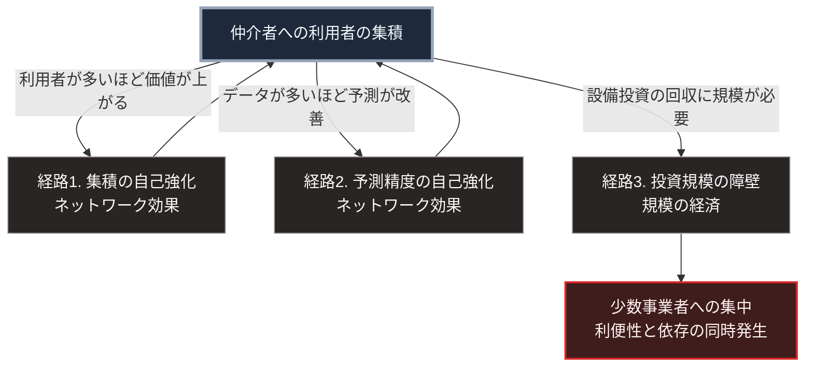

### 序論：本章が扱う範囲

本章は、インターネットの上で情報の流通と取引がどのように少数の事業者へ集中したかを、既存の分析に基づいて整理します。

第Ⅰ部C-11では、設計が規定しなかった層で集中が形成された経緯を記述しました。本章は、その集中が現在どのような経済的な構造を持つかを扱います。

本文は、分析が何を主張しているかの記述に限定します。評価は章末で扱います。

### 1. プラットフォームという形態

政治経済学者ニック・スルニチェクは、2016年の著作において、データの収集と仲介を基盤とする企業群を1つの類型として整理しました [ [ 18 ] ](https://openlibrary.org/works/OL20702518W) 。

同書の整理によれば、この類型は次の性質を持ちます。第一に、複数の利用者集団の間を仲介する位置を占めること。第二に、利用者が多いほど仲介の価値が高まること。第三に、仲介を通じて得られるデータが、事業の主要な資産となることです。

同書は、この類型を広告型、クラウド型、製造型、製品型、そして薄利型に分類しています。

### 2. 集中の機序

前節の性質から、集中は次の経路で生じます。

利用者が多い仲介者ほど、他の利用者にとって価値が高くなります。ある財の価値が、それを利用する人の数に依存して高まるこの性質を、ネットワーク効果と呼びます。この性質は、利用者の集積を自己強化します。

第Ⅱ部C-2で整理するとおり、データが多いほど予測は改善し、予測の改善が利用者を集めます [ [ 5 ] ](https://openlibrary.org/works/OL18201749W) 。

加えて、仲介の基盤には大規模な設備投資を要します。第Ⅱ部C-10で述べる半導体と同様に、投資額が大きいほど回収できる事業者は限られます。

これら3つの経路のうち、経路1と経路2は需要の側に生じるネットワーク効果です。経路3は、第Ⅰ部C-11で述べた供給の側の規模の経済の現れです。両者は、集中を生む点で同じ方向に作用しますが、機序は異なります。

### 3. 規制当局による現状の認定

この集中は、各国の規制当局によって制度上の対象として認定されています。

欧州委員会は2023年9月6日、デジタル市場法に基づき、Alphabet、Amazon、Apple、ByteDance、Meta、Microsoftの6社をゲートキーパーとして指定しました。指定の対象は、これら6社が提供する22の中核プラットフォームサービスです [ [ 401 ] ](https://digital-markets-act.ec.europa.eu/commission-designates-six-gatekeepers-under-digital-markets-act-2023-09-06_en) 。

日本では、スマートフォンにおいて利用される特定ソフトウェアに係る競争の促進に関する法律が2024年6月12日に成立しました。日本の競争当局である公取委は、2025年3月26日にApple、iTunes、Googleの3社を規制対象の事業者として指定しました。同法は2025年12月18日に全面施行されています [ [ 402 ] ](https://www.jftc.go.jp/msca/) 。

### 4. 市場の自律化という先行する分析

### 3. 市場の自律化という先行する分析

第Ⅰ部B-2で参照したカール・ポランニーは、19世紀における市場の性格変化を、市場が社会関係から分離し自律的な領域を形成する過程として分析しました [ [ 34 ] ](https://openlibrary.org/works/OL3617884W) 。

同書が擬制商品と呼んだ労働、土地、貨幣に加えて、現在は行動データが同種の位置を占めつつあります。行動データは、販売のために生産されたものではなく、生活の副産物です。それが商品として扱われる点で、ポランニーの分析が対象とした構造に対応します。

### 5. 集中が持つ2つの側面

集中は、利用者にとって利便性をもたらします。単一の仲介者に接続すれば、多数の相手と取引できます。第Ⅰ部B-2で述べた交換の障壁の低下が、ここでも生じています。

同時に、集中は依存を生みます。第Ⅱ部D-6で整理する機能の3類型に照らすと、仲介者に依存する機能は類型3、すなわち接続がなければ動作しない機能にあたります。仲介者の障害や方針変更が、多数の利用者に同時に影響します。

### 🗺️ 図：集中を自己強化する3つの経路

#### 図の読み方

この図は、集中が誰かの意図によってではなく、3つの自己強化的な経路によって生じることを示しています。

経路1と経路2は循環を構成します。利用者が集まるほど価値が上がり、価値が上がるほど利用者が集まります。経路3は、この循環に参入する障壁です。

Cとして示した帰結は、利便性と依存を同時に含みます。本書は、集中を否定するものではありません。第Ⅰ部C-11で述べたとおり、集中は設計が規定しなかった層で経済的な誘因に従って生じた構造であり、それ自体は分業の帰結です。

本書の論点は、依存の側にあります。第Ⅴ部で扱う局所の情報基盤は、集中を解体するのではなく、仲介者への接続が失われた期間に最小限の機能を維持するための構成です。

---

### 現代社会構造への射程と本質（本章のまとめ）

本セクションは、著者による解釈です。前節までの記述とは区別して読んでください。

1.  **現代社会構造の原点**

    プラットフォームという形態は、第Ⅰ部C-11で記述した層3と層4の集中の上に成立しました。通信経路の分散という設計思想と、情報の所在の集中という現実とが、同時に存在しています。

2.  **歴史的事実の本質**

    本章から抽出できるのは、次の点です。仲介の集中は、第Ⅰ部B-2で述べた貨幣の成立と同型の過程です。取引の障壁を下げる仕組みは、その仕組み自体への依存を生みます。

3.  **現代社会の現状と課題**

    第Ⅲ部-5で整理する依存対象の移行は、この構造の延長にあります。仲介者への依存が、判断を代行するシステムへの依存へ拡張される過程です。第Ⅳ部-4で述べる判断の配分という論点は、この過程に対する個人の側の応答です。
