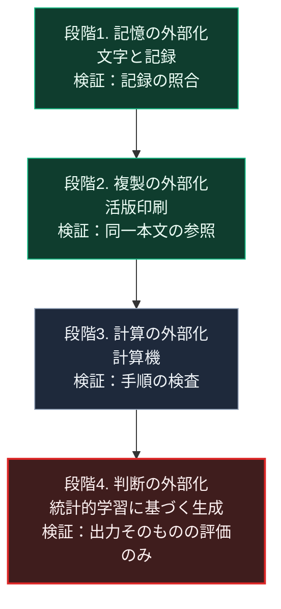

### 序論：本章が扱う範囲

本章は、人間の認知機能が外部の技術へ移されてきた経緯を、生成AIの登場を現段階として整理します。

第Ⅰ部C-2で記憶の外部化を、第Ⅰ部C-10で計算の外部化を記述しました。本章は、その系譜の上に、解釈と判断の外部化を位置づけます。

本文は、事実の記述と構造の整理に限定します。評価は章末で扱います。

### 1. 外部化の系譜

人間の認知機能の外部化は、次の段階を経てきました。

**記憶の外部化**。第Ⅰ部C-2で記述したとおり、文字は数量の記録から始まり、記録を担当者の記憶から独立させました。

**複製の外部化**。第Ⅰ部C-4で記述したとおり、活版印刷は同一の本文を多数の人が参照できる状態を作りました。

**計算の外部化**。第Ⅰ部C-10で記述したとおり、計算機は手順を与えられれば任意の計算をこなす機械として成立しました。

**判断の外部化**。現在進行中の段階です。明示的な手順によらず、統計的な学習に基づいて出力を生成する処理が、解釈と判断の一部を担いつつあります。

この段階の普及状況について、総務省は令和7年版の情報通信白書で調査結果を示しています。2024年度の調査において、何らかの生成AIサービスを使ったことがあると回答した日本の個人の割合は26.7%でした。前年度の調査では9.1%でした。同じ調査で、アメリカは68.8%、中国は81.2%、ドイツは59.2%です [ [ 405 ] ](https://www.soumu.go.jp/johotsusintokei/whitepaper/ja/r07/html/nd112210.html) 。

### 2. 現段階の性質

判断の外部化は、それ以前の段階と質的に異なる性質を持ちます。

第一に、処理の根拠が明示的な手順として記述されません。第Ⅰ部C-10で述べたとおり、出力の妥当性を手順の検査によって確認することは困難です。

第二に、出力が自然言語で提示されます。これにより、出力の利用に専門的な訓練を要しません。第Ⅰ部C-12で参照した観測によれば、導入の効果は経験の浅い作業者において大きく現れています [ [ 118 ] ](https://www.nber.org/papers/w31161) 。

第三に、生成の費用が低いことです。第Ⅱ部C-6で整理するとおり、これは情報環境における生成と検証の非対称を拡大します。

### 3. 情報量と伝達の観点

1948年にクロード・シャノンが提示した情報理論は、伝送の量を扱い、内容の妥当性を扱いません [ [ 26 ] ](https://web.archive.org/web/19980715013143/http://cm.bell-labs.com/cm/ms/what/shannonday/shannon1948.pdf) 。

判断の外部化において問題となるのは、伝送の量ではなく、内容の妥当性を誰がどう検証するかです。この点で、現段階の課題は情報理論の枠組みの外側にあります。

### 4. 統治との関係

第Ⅰ部A-1で参照したジェームズ・スコットは、統治が社会を把握可能な形へ整える過程を分析しました [ [ 17 ] ](https://openlibrary.org/works/OL26241985W) 。

判断の外部化は、この過程を2つの方向へ拡張します。第一に、把握の対象が行動と嗜好へ広がります。第二に、把握した情報に基づく判断そのものが、機械によって行われるようになります。第Ⅱ部C-13で扱う行政判断の自動化は、この延長にあります。

### 🗺️ 図：認知の外部化の4段階と、検証可能性

#### 図の読み方

この図は、各段階において何が検証の手段であったかを併記したものです。

段階1から段階3までは、外部化された機能の出力を、記録や手順に遡って検証できました。段階4において、この遡及が困難になります。

この差異が、本書の第Ⅲ部から第Ⅴ部に通じる論点を規定します。第Ⅲ部-5で整理する経路2、すなわち判断の主体を利用者側へ残す構成は、段階4でも検証可能性を保つための設計です。第Ⅴ部-17で扱う根拠つきの判断支援は、段階4の出力を段階1の記録へ接続することで、遡及を部分的に回復する構成です。

なお、本章は段階4を否定するものではありません。段階1から段階3と同様に、段階4も人間の能力を拡張します。本書の論点は、拡張に伴って失われる検証可能性を、設計によってどう補うかに限られます。

---

### 現代社会構造への射程と本質（本章のまとめ）

本セクションは、著者による解釈です。前節までの記述とは区別して読んでください。

1.  **現代社会構造の原点**

    認知の外部化は、第Ⅰ部C-1で整理した汎用技術の系譜そのものです。各段階は、前の段階の上に成立しています。文字がなければ印刷はなく、印刷がなければ大量の学習データはありません。

2.  **歴史的事実の本質**

    本章から抽出できるのは、次の点です。外部化の各段階は、能力の拡張と検証手段の変化を伴います。段階4の特徴は、能力の大きさではなく、検証手段が出力の評価のみへ限られる点です。

3.  **現代社会の現状と課題**

    第Ⅲ部の3つのシナリオは、段階4の普及を共通の前提とします。シナリオを分けるのは、検証可能性を保つ設計が普及するかどうかです。第Ⅲ部-12で整理する差分4の指標は、この点を測るものです。
