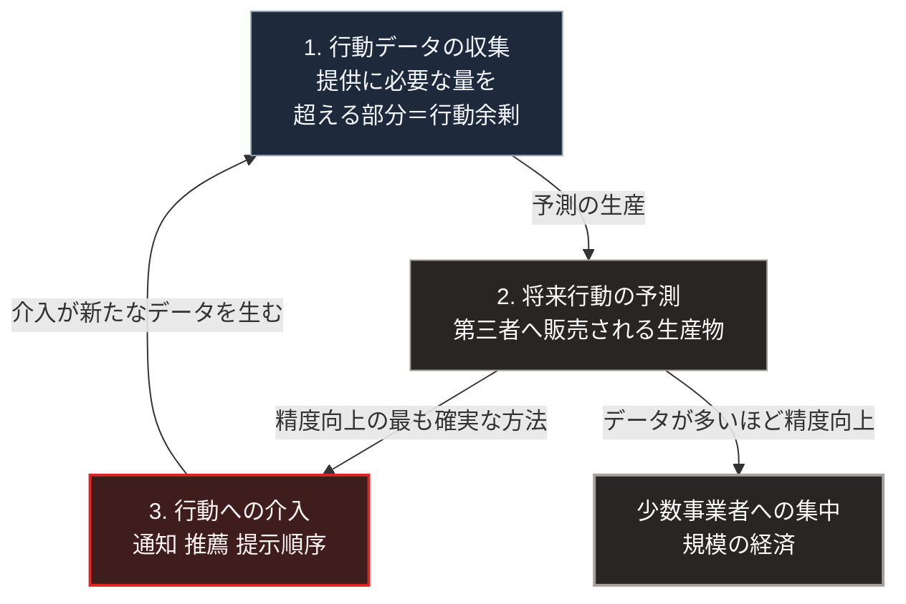

### 序論：本章が扱う範囲

本章は、利用者の行動データが取引の対象となる経済構造について、既存の分析を整理します。

本章が扱うのは、ショシャナ・ズボフによる分析です。本章は、その分析が何を主張しているかを記述し、その妥当性の評価は図の読み方および章末で扱います。

### 1. 分析の要点

ズボフは2019年の著作において、利用者の行動から得られるデータを原料とし、そこから将来の行動に関する予測を生産して取引する経済形態を分析しました [ [ 5 ] ](https://openlibrary.org/works/OL18201749W) 。

同書の主張は、次の4点に整理できます。

**第一に、原料の性質**。サービスの提供に必要な量を超えて収集された行動データが、別の目的に転用されます。同書はこれを行動の余剰と呼びます。

**第二に、生産物の性質**。行動データから生産されるのは、利用者の将来の行動に関する予測です。この予測は、広告主など第三者に販売されます。

**第三に、生産物の改善**。予測の精度を高める最も確実な方法は、行動そのものに介入することです。同書は、通知、推薦、そして選択肢の提示順序などを通じた介入を、この観点から記述します。

**第四に、規模の経済**。データが多いほど予測は改善し、予測が改善するほど利用者が集まります。この循環が、少数の事業者への集中を生みます。

### 2. [第Ⅰ部](01_sovereign-state-os)の枠組みとの対応

[第Ⅰ部C-11](internet-history)で記述したとおり、インターネットの設計は通信経路の分散を保証しましたが、情報の所在と探索については規定しませんでした。ズボフの分析が対象とするのは、まさにこの規定されなかった層です。

[第Ⅰ部C-8](07_politics-of-metering)で整理した計量の観点からは、次のように位置づけられます。従来は計量されなかった行動が計量の対象となり、それが商品となりました。同時に、計量された指標が最適化の目標となります。ここでの目標は、予測精度であり、利用者の利益ではありません。

[第Ⅰ部B-3](capitalism-why-irreplaceable)で整理したハイエクの議論との関係も重要です。ハイエクが集約不能とした局所知識のうち、行動に関する部分は、大規模な事業者によって集約されつつあります。

### 3. 分析に対する批判

ズボフの分析には批判も提示されています。主要な批判は次の2点です。

第一に、行動データの収集が実際に行動を変える程度について、実証的な裏づけが限定的であるという点です。作家のコリー・ドクトロウは2020年の論考において、行動への介入が主張されるほどの効果を持つという証拠は乏しく、問題の中心は独占にあると論じました [ [ 403 ] ](https://onezero.medium.com/how-to-destroy-surveillance-capitalism-8135e6744d59) 。

第二に、この経済形態を「資本主義の新段階」と位置づけることの妥当性です。エフゲニー・モロゾフは2019年の論考において、ズボフの分析が資本主義そのものの構造ではなく、特定の事業形態を対象にしていると批判しました [ [ 404 ] ](https://thebaffler.com/latest/capitalisms-new-clothes-morozov) 。

本書は、この論争のいずれかに与しません。本書が採用するのは、批判者の議論とも両立する範囲に限られます。すなわち、行動の計量と予測の商品化が、少数の事業者への集中を生む構造を持つという点のみです。

### 🗺️ 図：行動データが商品となる循環

#### 図の読み方

この図は、左側に1から3の番号を付けた3段の循環があり、その右側に循環から派生する1つの枠を置いた形をしています。最下段から最上段へ戻る矢印が、循環を閉じています。

循環の中で、本書にとって重要なのは3段目です。予測の精度を上げる方法として、行動への介入が選ばれます。この段階において、[第Ⅲ部-4](risk-ai-and-dependency)で述べる依存対象の移行が生じます。利用者は、自ら判断しているつもりで、提示された選択肢の中から選んでいます。

右側の枠は、[第Ⅰ部C-11](internet-history)で述べた集中の再形成に対応します。設計が規定しなかった層で、経済的な誘因に従って集中が生じます。

なお、この循環は事業者の意図の問題として記述されているのではありません。データが多いほど予測が改善するという性質と、予測が事業の財源であるという条件から、機械的に導かれる構造です。

---

### 現代社会構造への射程と本質（本章のまとめ）

本セクションは、著者による解釈です。前節までの記述とは区別して読んでください。

1.  **現代社会構造の原点**

    この経済形態は、[第Ⅰ部C-11](internet-history)で記述した層3と層4、すなわち情報の所在と探索が少数の事業者に集中した状態の上に成立しています。集中が先にあり、行動データの商品化がそれを強化しました。

2.  **歴史的事実の本質**

    本章から抽出できるのは、次の点です。計量の対象が拡大すると、計量されたものが最適化の目標になります。[第Ⅰ部C-8](07_politics-of-metering)で整理した一般則が、行動という領域へ適用された事例です。

    そして最適化の目標が予測精度である場合、利用者の利益との一致は保証されません。

3.  **現代社会の現状と課題**

    [第Ⅲ部-4](risk-ai-and-dependency)で述べるとおり、判断を委ねるか自ら行うかの区別は、環境の設計に依存します。本章で記述した循環は、その環境が判断を委ねる方向へ設計されていることを示します。

    [第Ⅴ部](42_taoist-wu-wei-non-action)で扱う局所の情報基盤は、この循環の外側に判断の主体を置く試みです。通信経路の分散ではなく、情報の所在と探索を利用者側に保持する構成です。
