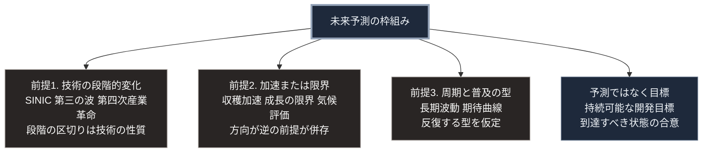

### 序論：本章が扱う範囲

本章は、20世紀以降に提示された主要な未来予測の枠組みを整理し、それぞれが何を前提とし、何を捉えているかを比較します。

本章の目的は、いずれかの枠組みを採用することではありません。第Ⅲ部-1で述べたとおり、単一の枠組みに依拠する予測は、精度において複数の枠組みを併用する予測に劣る傾向が観測されています。本章は、併用のための一覧です。

本文は、各枠組みが何を主張したかの記述に限定します。評価は章末で扱います。

### 1. 技術と社会の段階的な変化を扱う枠組み

**SINIC理論（1970年）**。オムロンの創業者である立石一真らは、科学、技術、社会が相互に作用して段階的に進化するという枠組みを提示しました [ [ 6 ] ](https://www.omron.com/jp/ja/about/corporate/vision/sinic/theory/) 。同理論は、工業化以降の社会を機械化、自動化、情報化の順に区分し、情報化社会の後に最適化社会、自律社会、自然社会が続くと記述しています。

**第三の波（1980年）**。アルビン・トフラーは、農業、工業に続く第三の変化として、情報化と脱集権化を論じました [ [ 41 ] ](https://openlibrary.org/works/OL2869042W) 。

**第四次産業革命（2016年）**。クラウス・シュワブは、物理、デジタル、生物の領域の融合を、新たな段階として位置づけました [ [ 42 ] ](https://openlibrary.org/works/OL20047602W) 。

これらの枠組みは、変化を段階として整理する点で共通します。段階の区切りは、主として技術の性質によって定められています。

### 2. 加速と限界を扱う枠組み

**収穫加速の法則（2005年）**。レイ・カーツワイルは、技術の進歩が指数関数的に加速するという前提のもとで、特定の到達点を推定しました [ [ 43 ] ](https://openlibrary.org/works/OL1958850W) 。

**成長の限界（1972年）**。ローマクラブの委託を受けた研究は、人口、資源、汚染の相互作用をシステム動力学として模擬し、成長が物理的な制約に直面する経路を示しました [ [ 39 ] ](https://openlibrary.org/works/OL3737039W) 。

**気候の評価報告（2021年以降）**。気候変動に関する政府間パネルは、複数の社会経済経路を仮定した推計を提示しています [ [ 45 ] ](https://www.ipcc.ch/report/ar6/wg1/chapter/chapter-4/) 。

前二者は、加速と限界という逆方向の前提を置いています。第三は、単一の予測ではなく複数の経路を併置する方法を採ります。

### 3. 周期と普及を扱う枠組み

**長期波動（1925年）**。ニコライ・コンドラチェフは、経済に数十年周期の変動が存在すると論じました [ [ 321 ] ](https://doi.org/10.2307/1928486) 。

**技術の期待曲線**。調査会社ガートナーは、新技術に対する期待が過熱と幻滅を経て安定する経過を、定型的な曲線として提示しています [ [ 46 ] ](https://www.gartner.com/en/documents/1414917) 。

**持続可能な開発目標（2015年）**。国際連合は、2030年を期限とする17の目標を採択しました [ [ 44 ] ](https://sdgs.un.org/goals) 。これは予測ではなく、到達すべき状態の合意です。

### 4. 枠組みの比較

各枠組みは、次の3点において異なります。

**前提の性質**。技術の進歩を前提とするもの、物理的制約を前提とするもの、周期性を前提とするものがあります。

**時間軸**。数年から数十年、あるいは数百年まで、対象とする期間が異なります。

**主張の種類**。予測、推計、そして目標の合意という、性質の異なる主張が含まれます。

第Ⅲ部-1で整理した確度の階層に照らせば、これらの枠組みの主張は主として階層2から階層4に属します。いずれも、階層1の確定事象ではありません。

### 5. 事後照合の状況

第Ⅲ部-1で参照した研究は、予測を事後に実績と照合する手続を有効なものとして挙げました。本章で整理した枠組みのうち、この照合が研究として実施されているものは限られます。

『成長の限界』については、研究者グレアム・ターナーが、1972年の標準シナリオを1970年から2000年までの実績と比較しました [ [ 322 ] ](https://doi.org/10.1016/j.gloenvcha.2008.05.001) 。同研究の報告によれば、人口、工業生産、食料、資源、汚染の各指標について、実績は標準シナリオに最も近い経路をたどりました。ただし同研究は、比較の期間が制約の顕在化する前の局面に限られることを明記しています。

他の枠組みについては、同種の体系的な照合は本書の調査範囲では確認できませんでした。段階論および周期論は、段階や周期の区切りが事後的に定義されるため、照合の手続そのものが定めにくい性質を持ちます。

したがって本書は、これらの枠組みを予測の根拠としてではなく、問いを立てるための視点として用います。

### 🗺️ 図：枠組みの前提による分類

#### 図の読み方

この図が示すのは、各枠組みが異なる前提を置いており、相互に排他的ではないという点です。

前提1の枠組みは、変化の順序を捉えることに優れています。一方、変化の速度と時期については、前提2の枠組みが扱います。前提3の枠組みは、個別の技術が普及する際の型を捉えます。

第Ⅲ部-1で参照した研究が示したとおり、複数の枠組みを併用する予測者は、単一の枠組みに依拠する予測者より高い精度を示す傾向があります。本書が第Ⅲ部で採る方法は、この知見に基づいています。

本書が特定の枠組みを採用しない理由は、ここにあります。SINIC理論が示す段階の順序、成長の限界が示す物理的制約、そして気候評価が示す複数経路の併置は、いずれも本書の推論に取り込まれています。ただし、いずれか1つを結論の根拠とはしていません。

---

### 現代社会構造への射程と本質（本章のまとめ）

本セクションは、著者による解釈です。前節までの記述とは区別して読んでください。

1.  **現代社会構造の原点**

    本章で整理した枠組みの多くは、政策や企業戦略の立案において参照されてきました。第Ⅱ部C-8で記述したSociety 5.0は、SINIC理論と同種の段階論を背景に持ちます。

    したがって、これらの枠組みは未来を記述するだけでなく、現在の意思決定を形成しています。予測が行動を変え、行動が未来を変えるという循環です。

2.  **歴史的事実の本質**

    本章から抽出できるのは、次の点です。各枠組みは、特定の前提のもとで特定の側面を捉えています。枠組みの妥当性は、その前提が成立する範囲に限定されます。

    ある枠組みだけを根拠として採用することは、その前提の外側で生じる事象を捉えられなくなることを意味します。

3.  **現代社会の現状と課題**

    第Ⅲ部の3つのシナリオは、本章の枠組みのいずれか1つから導かれたものではありません。第Ⅱ部で確認した事実と、明示した前提から構築されています。

    読者が本章の枠組みのいずれかを重視する場合、シナリオの評価は変わります。本書は、その差異を検証可能にするため、前提を明示しています。
