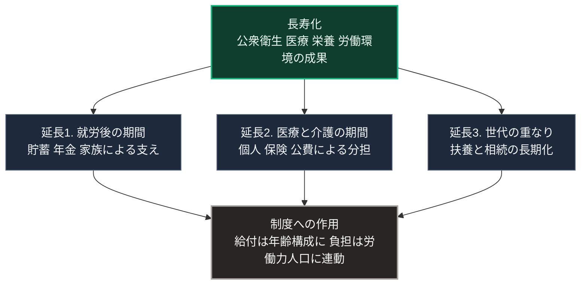

### 序論：本章が扱う範囲

本章は、20世紀を通じて進行した長寿化が、社会の構成と負担の配分に対して持つ意味を整理します。

第Ⅱ部A-2では人口の年齢構成を扱いました。本章はその補論として、年齢構成の変化が個人の生活と制度の設計に及ぼす作用を扱います。

本文は、公表された統計と、そこから導かれる構造の整理に限定します。評価は章末で扱います。

なお第Ⅲ部は推論の部ですが、本章のみ例外として事実の補論を置きます。第Ⅲ部-4以降の推論が前提とする年齢構成の含意を、推論へ入る前に確認するためです。

### 1. 長寿化の経過

日本の平均寿命は、20世紀を通じて延伸しました。内閣府の高齢社会白書によれば、65歳以上の人口が総人口に占める割合は、2024年10月時点で29.3%です [ [ 125 ] ](https://www8.cao.go.jp/kourei/whitepaper/w-2025/html/zenbun/s1_1_1.html) 。

この変化は、公衆衛生、医療、栄養、そして労働環境の改善によってもたらされました。第Ⅰ部C-6で記述した上下水道の整備は、その主要な要因の1つです。

すなわち、長寿化は集約型インフラと制度の成果です。本章はこの成果を前提として、それが生む新たな条件を整理します。

### 2. 生存の条件の変化

長寿化は、個人の生涯における各段階の長さを変えました。

第一に、就労を終えた後の期間が延びました。この期間の生活は、貯蓄、年金、そして家族の支援によって支えられます。

第二に、医療と介護を要する期間が延びました。この期間の費用は、個人と保険制度と公費とによって分担されます。

第三に、世代間の関係が変わりました。複数の世代が同時に生存する期間は延び、扶養と相続の関係も長期化しました。

### 3. 制度への作用

社会保障給付費は、2023年度に135兆4,928億円です [ [ 133 ] ](https://www.ipss.go.jp/ss-cost/j/fsss-R05/fsss_R05.html) 。第Ⅱ部A-2で述べたとおり、給付は年齢構成に連動し、負担は労働力人口に連動します。

この構造は、第Ⅰ部A-6で参照したターチンらの枠組みにおける、人口と資源の比率という観測項目に対応します。

第Ⅱ部C-12で整理したとおり、制度の調整には決定の周期を要します。年齢構成の変化は数十年の時間軸で進行するため、原理的には決定が追随できる速度です。ただし、調整には給付と負担の再配分を伴うため、第Ⅱ部C-7で整理した決定の困難が作用します。

### 4. 死の位置の変化

長寿化と医療化は、死が生じる場所と過程を変えました。

厚生労働省の人口動態統計によれば、1951年には死亡の82.5%が自宅で、9.1%が病院で生じていました。2009年には自宅が12.4%、病院が78.4%です [ [ 323 ] ](https://www.mhlw.go.jp/toukei/saikin/hw/jinkou/suii09/deth5.html) 。同統計は、死亡場所の構成を年次で公表しています [ [ 131 ] ](https://www.mhlw.go.jp/toukei/saikin/hw/jinkou/geppo/nengai25/index.html) 。

この変化は、死に関する判断と作業を、家族と地域から専門の機関へ移しました。第Ⅲ部-7で整理する依存の構造が、この領域にも当てはまります。平時には判断の負荷が軽減され、途絶時にはその判断を担う経験が失われています。

### 🗺️ 図：長寿化が生んだ3つの延長

#### 図の読み方

この図の出発点は、長寿化が成果であるという点です。本章は、長寿化を問題として扱いません。扱うのは、成果が生んだ新しい条件です。

3つの延長は、いずれも制度の設計時には想定されていなかった長さに達しています。年金制度、医療保険制度、そして介護保険制度は、それぞれの設計時点における平均余命と年齢構成を前提としていました。

第Ⅰ部A-6で整理した枠組みに照らすと、この状況は成功が次の条件を変えるという構造です。テインターの分析が示したとおり、問題への対応として追加された仕組みは、それ自体の維持費用を伴います。

Sとして示した作用は、第Ⅲ部の3つのシナリオすべてに共通する前提です。シナリオを分けるのは、この作用に対する制度の調整が、どの時期にどの規模で実施されるかです。

---

### 現代社会構造への射程と本質（本章のまとめ）

本セクションは、著者による解釈です。前節までの記述とは区別して読んでください。

1.  **現代社会構造の原点**

    現在の社会保障制度は、人口の増加が続き、寿命も現在より短かった時期に設計されました。第Ⅰ部A-5で記述した予測可能な貨幣収入という財政原理と同様に、その設計は当時の条件下で合理的でした。

2.  **歴史的事実の本質**

    本章から抽出できるのは、次の点です。ある制度の成功は、その制度が前提とした条件を変えます。長寿化は集約型インフラと医療制度の成功であり、同時にそれらの制度が前提とした年齢構成を変えました。

3.  **現代社会の現状と課題**

    第Ⅳ部-2で述べる地域社会への期待は、本章の第4節と接続します。死を含む生活の判断が専門機関へ移った状態で、途絶時にその判断を誰が担うかという問いです。

    第Ⅴ部の設計は、この問いに直接は答えません。答えるのは、判断に必要な情報と最小限の供給を、途絶時にも局所で維持する構成についてです。
