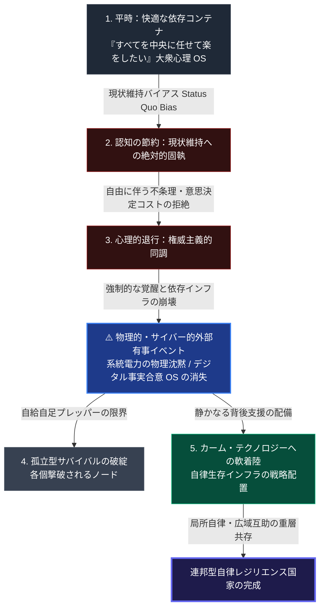

### 自律を拒む大衆心理：自由からの逃走と現状維持バイアス

一元管理型の社会システム（系統電力、統合データベース、国家インフラ）から、局所自律・広域互助の分散型社会OSへと移行する際、最大のボトルネックとなるのは技術的な課題ではありません。
それは、平時において人々が深く抱いている心理状態です。
この心理状態は、「**快適な依存状態（現状維持）を維持し、自律化の費用や不条理から目を背けたい**」というものです。
これは、強力な集団心理として認識されます。
また、集団精神OSの惰性とも表現できるでしょう。

社会心理学者**エーリッヒ・フロム（Erich Fromm）** は、その不朽の名著『自由からの逃走』において、ある心理的退行を明らかにしています。
近代人は、孤独や不安（意思決定の不条理）に直面することがあります。
その際、自ら能動的に自由（自律生存）を獲得する道を選びません。
むしろ、自らの意思決定を強力な一元的権威（中央集権）へと進んで委託するのです。
この心理的退行は、権威主義的な同調として説明されています [ [ 47 ] ](https://books.google.com/books?id=EscapeFromFreedom) 。
自分で状況を分析し、自分でエネルギーや水を調達し、自分でエッジデータを守るという「完全な主権的自律」は、個々の人間に著しい心理的エネルギー（認知コスト）を要求します。

これに呼応するように、行動経済学者ウィリアム・サミュエルソン（William Samuelson）らが「**現状維持バイアス（Status Quo Bias）**」を提唱しました。このバイアスは、現状からの変化に対する強い心理的抵抗を示すものです。人間は、不健全な代替案、または潜在的な危機に直面している場合でも、この抵抗を示します。この力学は実証されています [ [ 49 ] ](https://www.researchgate.net/publication/24056150_Status_Quo_Bias_in_Decision_Making) 。
人間は「平時には、どれだけ依存的なインフラ負債（いつ沈黙するか分からない系統電力や行政システム）を抱えていても、それを自律的に変更するよりも、ただ楽に現状に留まりたい」という強い生存の惰性（Friction）で動いています。
この集団心理の惰性を無視した「100%合理的な自律コモンズ論」は、単なる知的妄想に過ぎません。

---

### 🗺️ 自律社会への移行摩擦と心理障壁の多層トポロジー

この「依存から自律への移行プロセス」が内包する心理障壁と、それを突き崩す外部ショックの干渉プロセスを垂直フロー図で示します。

#### 【図の設計意図および解説：カーム・テクノロジーへの軟着陸】

上図は、人々が快適な依存状態から、いかにして摩擦を伴いながらも自律的なレジリエンス国家へと適合していくかの変遷モデルを示しています。

1.  **平時の惰性（1〜3）**:
人々は平時、サミュエルソンの現状維持バイアスに影響されます。フロムが指摘する権威主義的な同調も、その要因の1つです。このため、能動的な自律を回避する傾向が見られます。そして、中央集権的なシステムを受け入れています。このような状態では、自律分散型のインフラ導入は進みません。例えば、自家発電や自給水循環システムが該当します。これらの啓蒙活動を推進しても、行動変容には至りません。コスト負担を嫌う傾向が、その主な理由です。
2.  **外部有事イベントによる強制終了（Shock）**:
    この「快適な檻」を解体するのは、道徳的教訓ではなく、物理的な「外部の危機イベント（SPOFの沈黙）」です。系統電力網の被弾や、サイバー攻撃による行政OSの不全、生成AIによるデジタル合意形成の崩壊など、既存の一元管理OSが物理的・機能的に「強制終了」させられた時、人々は初めて覚醒（アウェイク）を余儀なくされます。
3.  **カーム・テクノロジーによる調和（4〜5）**:
覚醒した読者にとって、第47章で論じる「孤立型の自給自足（スタンドアロン・プレッパー）」は、1つの脆弱性として認識されます。1ノードだけでサバイバルを試みる場合、深刻な資源枯渇に直面します。その結果、個別の機能不全に陥る可能性が高まります。
    真の適合解は、人々に「自分でシステムを管理しろ」と強要する過度な自律主義ではありません。
本システムは、「 **カーム・テクノロジー（Calm Technology）** 」の原則に基づいています。これは、人間が意識することなく、システムの背後でテクノロジーが生存を静かに支え続けるという考え方です。WOTA水循環システムやPowerX蓄電グリッドは、この原則に従い「重層的コモンズ」として自動的に動作します。その目的は、心理的な負担なく、連邦型コモンズ（Nested Commons）へとしなやかに軟着陸（縮退運転）させることです。

---

### 現代社会構造への射程と本質（本章のまとめ）

#### 1. 現代社会構造の原点（快適な依存と心理ロックイン）
現代社会のインフラ、行政、消費経済のトポロジーは、人々の「楽な状態で居続けたい」という強烈な心理的ロックイン（依存OS）を設計原点として構築されています。すべてのメーター、一元的な行政ID、クラウドデータベースは、この心理的依存に適合することで、莫大な中央独占利益を挙げてきました。

#### 2. 歴史的事実の本質（自律の拒絶と外部ショックの必要性）
フロムやサミュエルソンの実証モデルが示す歴史的事実の本質は、「社会システムは、平時における内部的な自発的契機（教育や説得）だけでは、その生存OSを『依存』から『自律』へとシフトすることは絶対にできない」というシステム設計上の限界にあります。社会OSの不可逆的な移行を駆動するのは、常に「不健全な依存システムの限界を物理的に突きつける、過酷な外部ショック」のみです。

#### 3. 現代社会の現状と課題（摩擦を伴う重層コモンズの社会実装）
現代社会が直面する最大の課題は、この「心理的摩擦」と「物理的崩壊」の狭間で、いかにパニックを起こさずにシステムを軟着陸させるかという制度設計技術にあります。
インテグレーターが追求すべきは、人々に高度なIT技術や物理自給のスキル（認知負荷）を強要する設計ではありません。
日常的には、一元的な電力・水道メーターの利便性を享受しています。しかし、有事の物理切断時には、状況が変化します。第51章および第53章で実装される「カーム（静かな）自律蓄電・水循環デバイス」が自動起動します。これにより、エッジのみで生存を担保する重層コモンズが配備されます。これは、高度に適合されたシステム設計技術です。
