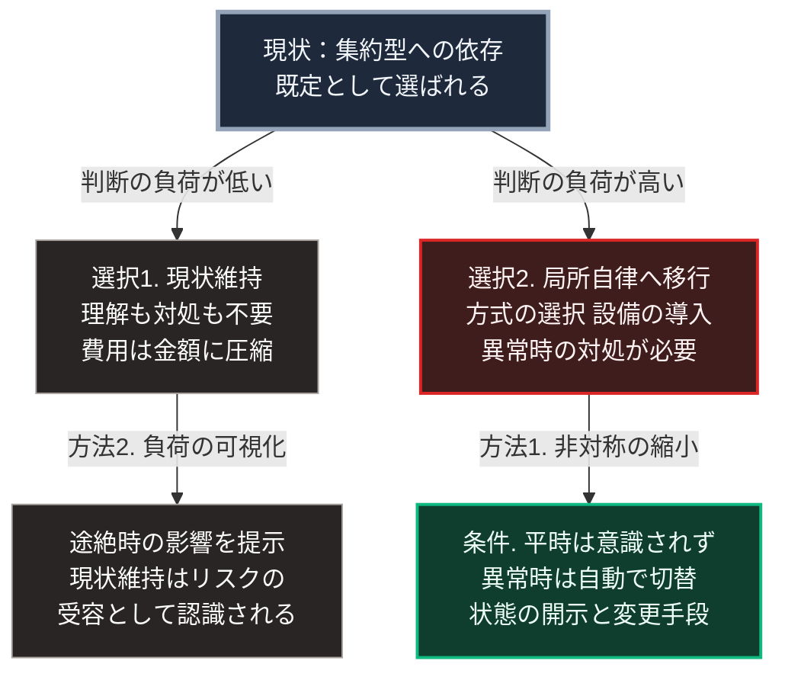

### 序論：本章が扱う範囲

本章は、集約型の供給に依存した状態から、局所自律と広域互助を組み合わせた構成へ移行する際に、心理的な条件がどう作用するかを検討します。

この主題を扱う理由は、第Ⅲ部-12で整理する分岐条件にあります。差分1と差分2、すなわち生産性向上と供給方式の転換は、いずれも意図的な行為を要します。その行為が実際に選ばれるかどうかは、技術や費用だけでは決まりません。

本章の前半は、社会心理学および行動経済学における既存の知見の記述です。後半は、それを前提とした推論です。

### 1. 判断の負荷に関する知見

**判断の系に関する整理**

心理学者ダニエル・カーネマンは、人間の判断を2つの系に整理しました [ [ 173 ] ](https://openlibrary.org/works/OL15992072W) 。

第一の系は、速く自動的で、努力をほとんど要しません。第二の系は、遅く意識的で、注意という限られた資源を消費します。

同書の整理によれば、人は既定で第一の系に依拠し、第二の系の起動は必要と判断された場合に限られます。そして、第二の系を稼働させている間、他の作業への注意は低下します。

**現状が選ばれやすい傾向**

経済学者ウィリアム・サミュエルソンとリチャード・ゼックハウザーは、選択肢の中に現状維持が含まれる場合、その選択肢の選ばれる比率が高まることを実験的に示し、これを現状維持バイアスと名づけました [ [ 49 ] ](https://doi.org/10.1007/BF00055564) 。

同研究は、選択肢の内容が同一であっても、いずれかが現状として提示されるかどうかによって選択率が変化することを報告しています。

**認知資源の節約**

心理学者スーザン・フィスクとシェリー・テイラーは、人が社会的な情報処理において認知資源を節約する傾向を持つことを整理しました [ [ 50 ] ](https://openlibrary.org/works/OL4456806W) 。

**自由が伴う負荷**

精神分析学者エーリッヒ・フロムは、自由が個人に判断の責任を課すこと、そしてその責任が不安を伴うことを論じました [ [ 47 ] ](https://openlibrary.org/works/OL1184906W) 。同書の分析によれば、この不安を回避する行動の1つとして、判断を外部の権威へ委ねる選択が生じます。

### 2. これらの知見が移行に対して持つ含意

前節の4つの知見は、いずれも判断の委託や現状維持を生む機序を記述しています。ただし、その機序は同一ではありません。

フロムが記述したのは、不安の回避です。サミュエルソンとゼックハウザーは、現状維持バイアスの説明として損失回避、埋没費用、そして後悔の回避を挙げています。損失回避とは、同じ大きさの利得より損失を重く評価する傾向であり、カーネマンとエイモス・トベルスキーがプロスペクト理論として定式化しました [ [ 327 ] ](https://doi.org/10.2307/1914185) 。フィスクとテイラー、およびカーネマンの判断の2つの系が扱うのは、認知資源の節約です。

本書は、これらを1つの機序に還元しません。扱うのは、共通する帰結です。すなわち、判断を変える側に費用が偏るという点です。不安、損失の予期、後悔の予期、そして認知的な負荷は、いずれも現状を変える側にのみ生じます。この帰結は、現状が長期的に最適でない場合にも作用します。

集約型の供給は、この傾向に適合しています。利用者は、供給の仕組みを理解する必要がなく、故障時の対処を考える必要もありません。第Ⅰ部C-8で述べたとおり、計量に基づく課金は、利用者の負担を金額という単一の数値へ圧縮します。

これに対し、局所自律型の供給は、少なくとも初期においては判断を要求します。方式の選択、設備の導入、そして異常時の対処です。

したがって、両者の間には負荷の非対称が存在します。この非対称が存在する限り、「自律すべきである」という規範的な主張が行動の変化を導くことは期待しにくいと言えます。

### 3. 設計上の含意

前節の推論が妥当であれば、移行を促す方法は2つに限られます。

**方法1：負荷の非対称を縮小する**

局所自律型の供給に伴う判断の負荷を、集約型に近い水準まで下げることです。

具体的には、平時において利用者が意識せずに動作すること。異常時の切り替えが自動であること。そして、利用者が判断を求められる場面が最小限であることです。

ここで重要なのは、この設計が「判断を奪う」ことと異なる点です。第Ⅲ部-5で述べたとおり、望ましいのは判断の主体を利用者に残したまま、そのための手間を減らすことです。したがって、動作を確認したい利用者には状態が開示され、変更したい利用者には変更の手段が用意されている必要があります。

**方法2：現状の負荷を可視化する**

現状維持が選ばれやすいのは、現状の費用が意識されにくいためです。第Ⅰ部C-8で述べたとおり、計量された指標のみが最適化の対象となります。

現状の供給が途絶した場合の影響が、事前に具体的な形で提示される場合、現状維持の選択は「変化しないこと」ではなく「特定のリスクを受け入れること」として認識されます。

ただし、この方法には限界があります。自然災害に関する研究の総説によれば、リスクの認識の高い人が備えの行動を取るとは限らず、両者の間には乖離が繰り返し観測されています [ [ 328 ] ](https://doi.org/10.1111/j.1539-6924.2012.01942.x) 。同総説は、この乖離の要因として、経験の有無、情報源への信頼、そして対処を自らの責任と見なすかどうかを挙げています。

### 🗺️ 図：移行が生じる条件

判断の負荷という観点から、2つの選択と、移行を促す2つの方法を示します。

#### 図の読み方

上段の箱が現状です。そこから矢印が2本に分かれ、左が選択1の現状維持、右が選択2の局所自律への移行です。矢印に記したとおり、左は判断の負荷が低く、右は高くなっています。

この図が示すのは、移行の可否が意識や理念だけでは決まらず、負荷の配分に強く依存するという点です。左右の箱の間にある負荷の差が、移行を妨げます。この差を縮小しない限り、右の選択2は選ばれにくい状態が続きます。

下段の2つの箱は、本文第3節で述べた2つの方法に対応します。右下の箱は方法1であり、選択2の負荷を下げる設計の条件です。左下の箱は方法2であり、選択1の負荷を可視化することで、現状維持を特定のリスクの受容として認識させます。

右下の箱に記した3項目は、いずれも設計上の要件です。

第一に、平時において意識されないこと。これは、第一の系のみで日常が完結する状態を意味します。

第二に、異常時の切り替えが自動であること。異常時は、注意という資源が最も逼迫する場面です。この時点で複雑な操作を要求する設計は、実際には機能しません。

第三に、状態が開示され、変更の手段があること。この項目がなければ、利用者は依存先を変えただけになります。第Ⅲ部-5で述べた依存対象の移行が、まさにこの状態です。

なお、本章は移行が生じないと主張するものではありません。第Ⅲ部-12で整理するとおり、外部事象が発生した場合、選択の前提そのものが変わります。ただし、事象の発生後に設備を導入することは、事象の発生前に導入することより困難です。この時間的な非対称が、本章の論点の背景にあります。

---

### 本章の位置づけ

本セクションは、著者による解釈です。

1.  **本章が主張しないこと**

    本章は、依存が誤りであるとは主張しません。第Ⅰ部B-2で述べたとおり、分業と依存は豊かさの源泉です。

    また、判断の負荷を避ける傾向を、個人の資質の問題として扱いません。前節で参照した知見は、いずれもこの傾向が人間に一般的なものであることを示しています。

2.  **本章の主要な論点**

    最も重要な論点は、規範的な主張のみでは行動の変化が持続しにくいという点です。

    「自律すべきである」「備えるべきである」という主張は、負荷の非対称を変えません。したがって、この種の主張のみに依拠する計画は、実行段階で機能しにくいと予想されます。

3.  **次章以降への接続**

    第Ⅴ部で扱う設計は、本章で整理した条件を満たすことを要件とします。すなわち、平時において意識されず、異常時に自動で切り替わり、それでいて状態が開示され変更もできる構成です。

    この3条件を同時に満たすことが、技術的な課題となります。
