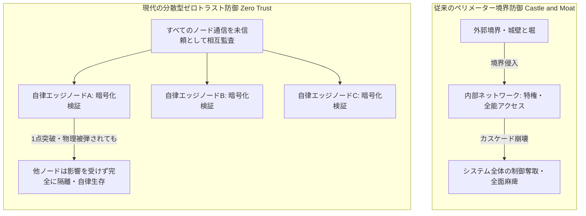

現代国家の安全保障のドクトリンは、長らく「境界防御（ペリメーター・ディフェンス）」という概念に依拠して構築されてきました。これは、国家の物理的、サイバー的な境界線を明確に定め、その外側からの侵入を阻止するという考え方です。しかし、AI技術は急速に進化しています。この進化は、非対称戦の現実をもたらしました。さらに、サイバー・フィジカル空間の融合も進んでいます。これらの要因は、伝統的な境界防御の有効性を根本から揺るがしています。本章では、最新の軍事紛争事例を分析します。そして、国家の「外郭防衛」が数学的、物理的、システム的にいかに破綻しつつあるのかを詳細に論じます。

### 1. 境界防御の数学的・物理的破綻：非対称戦の現実

ウクライナ戦争や紅海・中東紛争の戦場における現実は、ある状況を明確に示しています。近代国家は、巨額の投資をしてきました。この投資は、境界防御のシステムに向けられたものです。しかし、これらのシステムは、安価な自律分散型のAIドローンによって飽和されつつあります。そして、駆逐されつつある状況です。これは、従来の軍事ドクトリンでは想定し得なかった「コストの非対称性」と「弾薬庫の物理的飽和」という構造的課題を浮き彫りにしています。

紅海・中東紛争におけるコスト非対称性の脆弱性が、重要な論点です。

紅海やペルシャ湾におけるイラン関連勢力とアメリカ・同盟国艦隊との間の紛争は、防御側のシステムが抱える致命的な脆弱性を露呈しています。攻撃側が使用するイラン製の自律ドローン「シャヘド136」などは、市販のGPSモジュール、繊維強化プラスチック（FRP）、低燃費の汎用エンジンを組み合わせた、極めて低コストな使い捨て兵器です。その製造コストは1機あたりわずか2万から5万ドル（約300万から750万円）に過ぎません。

これに対し、防御側であるアメリカや同盟国のイージス艦に搭載されるスタンダードミサイル（SM-2）は1発あたり約200万ドル、パトリオットミサイル（PAC-3 MSE）に至っては1発あたり約400万ドルもの費用がかかります。軍事ドクトリンでは、1機のドローンを確実に撃墜するために、通常2発の迎撃ミサイルを発射することが推奨されています。この比率で計算すると、800万円のドローン1機を撃墜するために、約8億円ものミサイルが消費されることになります。これは、攻撃側と防御側の間で**100対1という驚異的なコスト非対称性**が存在することを示しています。

さらに、イージス艦の垂直発射システム（VLS）のセル数には物理的な限界があります。通常、約90から122セル程度です。一度弾薬を使い切ると、安全な母港に退避して再装填する必要があります。安価なドローンを波状攻撃（スウォーム攻撃）で大量に投入するだけで、艦隊は短時間で弾薬を撃ち尽くします。その結果、より高度な弾道ミサイルによる攻撃に対して、艦隊は完全に無防備な状態に陥ります。これは、 **弾薬庫の物理的・弾数的飽和** という、従来の境界防御のシステムが抱える根本的な限界を浮き彫りにしています。

#### 1.2. ウクライナ戦争におけるAI自律化の強制進化

ウクライナ戦争の戦場では、ロシア軍が展開する強力なGPSジャミングや電波妨害（EW：Electronic Warfare）が常時機能しています。これにより、人間のオペレーターによる無線誘導（リモートコントロール）型のドローンは、そのほとんどが機能不全に陥り、撃墜またはジャミングされる確率が90%以上に達しています。この極めて過酷な電磁波環境は、ドローンの進化を強制的に加速させました。

結果として、ドローンは「**エッジAIによる完全自律化**」を遂げました。
ウクライナの防衛スタートアップ「Brave1」やロシアの「MS001」ドローンは、Nvidia Jetson OrinのようなエッジAIチップを搭載しています。
これらのドローンは、無線が遮断された瞬間、オンボードのニューラルネットワークを起動します。
このニューラルネットワークは、画像認識（物体検出）とオプティカルフロー（地形マッチング）を実行します。
これにより、GPSに依存することなく、ドローンは自律的に動作します。
人間を介さず、ドローン自身が標的を識別します。
標的は戦車や歩兵などです。
ドローンは標的の優先順位付けを行い、自律的に突入します。
そして、自爆を完遂します。
この機能は、電波妨害（EWシェル）を完全に無効化します。
これは、「**完全な自律兵器**」の誕生を意味しています。
従来の境界防御の概念は、これにより無力化されます。

### 2. OODAループの超圧縮と人間の排除

AIが戦争システムへ完全に組み込まれた場合、攻撃側が優位に立つと予測される主な要因は、意思決定サイクルにあります。このサイクルは、 **OODAループ** （観察、情勢判断、意思決定、行動）として知られています。人間の認知能力を遥かに超えるスピードで、このループが「超圧縮」されるためです。

従来の人間中心のOODAループでは、観察された情報が指令部に送信されます。人間が会議や承認プロセスを経て、意思決定を行います。その命令が通信を通じて、行動部隊に伝達されます。最終的に行動（射撃など）が実行されます。このプロセスには、数分から数時間もの遅延（レイテンシ）が生じます。ジャミングや誤情報によって、さらに麻痺する可能性があります。

しかし、AIが統合されたOODAループ、特にエッジAIによる自律システムでは、状況は劇的に変化します。エッジカメラによる観察と同時に、オンボードのAIチップがミリ秒単位で情勢判断と意思決定を完遂し、即座に自律的な行動（自爆攻撃など）を実行します。この遅延レイテンシはわずか6〜10ミリ秒に過ぎず、通信を必要としないため、電磁波妨害（EW）も完全に無効化されます。

このようなミリ秒単位で意思決定が完遂するAIドローン群や自律兵器による飽和攻撃に対し、人間が「意思決定の承認ライン（イン・ザ・ループ）」に入っている国家システムは、情報処理の速度限界によって防衛が物理的に間に合いません。防衛網は一瞬で突破され、飽和されることになります。人間は、もはやリアルタイムの意思決定プロセスから「オン・ザ・ループ」（監視役）へと追いやられるか、あるいは完全に排除されることになります。

さらに、攻撃は物理的なミサイルやドローンに限定されません。ロシアの「反射制御（Reflexive Control）」ドクトリンは、この種の攻撃を示唆しています。インターネット空間では、AIが誤情報やフェイクニュースを拡散させます。具体的には、日本語で書かれた超精密な誤情報、フェイクニュース、分断工作が対象です。これらをAIが1日に数百万件、自律的に、そして飽和的に拡散させることも可能です。国民は、物理的な攻撃を受けていることに気づかないままです。「相互不信」「政府への抗議」「マイノリティ排斥」といった感情が助長されます。その結果、国家の協調OS（信頼関係）は、内側から自壊させられます。従来の物理的な防衛線（境界）は、機能しません。このような事態は、「**認知ゼロトラスト空間における有事**」に該当します。この領域では、境界防御の概念が完全に無効化されます。

### 3. 民主主義の構造的脆弱性：国民の反応レイテンシ問題

日本政府や防衛省、デジタル庁は、AIハイブリッド戦、電磁波戦、サイバー有事。そして少子化による自衛隊の人的限界といった複合的な危機に対して、極めて強い危機感を抱いています。防衛DXやサイニック理論に重なる「Society 5.0」「ムーンショット」といった国家ビジョンを掲げ、変革を急いでいることは事実です。

しかし、「**民主主義という統治OSが持つ固有の反応レイテンシ（遅延）**」が、この変革の試みを破綻の危機に瀕させています。
脅威の進化スピードは、AI兵器や認知戦の領域において、1〜2年で倍増する指数関数的なカーブを描いています。
これに対し、国民の課題認識スピードは異なります。
具体的には、法改正、国会論争、世論の合意形成といったプロセスは、10〜20年という線形的な時間軸で進行します。
この間に存在する、埋まらない決定的な「認知と時間のギャップ」こそが、カタストロフ発生の必然性を生み出しています。

#### 3.1. 「生存の不利益」が見えにくいという罠

サイバー攻撃やアルゴリズムによる認知ナッジ、あるいはゆるやかなインフラの老朽化といった脅威は、物理的な爆撃とは異なり、「今日、誰かが死ぬ」という直接的な被害を直ちに可視化しません。そのため、国民はこれらの脅威がもたらす長期的な不利益を実感しにくく、セキュリティ投資やドラスティックなシステム変革（例えば、マイナンバーの義務化、個人データの国家提供、地方自治体の統廃合など）に対して、激しい抵抗勢力（プライバシー侵害反対、地方インフラ維持の要求など）となる傾向があります。この「生存の不利益」の不可視性が、民主主義国家における迅速な意思決定を阻害する大きな要因となっています。

#### 3.2. 合意形成プロセスの遅さ（線形な時間軸）

民主主義国家では、法律を一本改正します。国民の過半数の合意を得るプロセスも必要です。必要な予算を配備し、地方自治体レベルまで実装を完了させるには、最低でも10年から20年という長い期間を要します。これは、人間のライフサイクル（約100年）を基準としたスピード感です。社会システムの安定性を重視する特性です。一方、AIとサイバー空間における有事OSの進化は、1年から2年という指数関数的なスピードで世界を変化させています。この根本的な時間軸の不一致は、国家変革の努力を無力化する可能性を内包しています。

#### 3.3. 間に合わない国家変革

日本政府は、強い危機感を持って「アジャイルな国家防衛OS」へのシフトを試みています。しかし、法制度の壁が存在します。加えて、世論の反応レイテンシ（遅延）によって、その試みは阻まれる現実があります。結果として、ある事態が予測されます。それは、技術的には間に合うはずのシステムが、国民の合意形成の遅れによって物理的に間に合わないというものです。この遅延により、最初の「 **認知的な真珠湾攻撃（カタストロフ）** 」を無防備に被弾する可能性があります。これは、未来予測における「カタストロフ発生の不可避なロジック」です。同時に、境界防御の終焉がもたらす最も深刻な帰結の1つであると考えられます。

### 4. カタストロフ後の自律生存インフラ：空海的エンジニアの必然

国家システムの防衛ラグとカタストロフの不可避性という厳しい現実が存在します。このため、私たちは国家にすべてを委ねて殉職するべきではありません。むしろ、「**カタストロフの後に求められる自律生存インフラを、個人の領域で先行実装（実証）しておくエンジニア**」の役割が極めて重要であると考えられます。

最初のデジタル・フィジカル有事を被弾した瞬間、国家の境界防御（シェル）は部分的に崩壊し、地方や都市郊外のインフラは一時的、あるいは恒久的に麻痺・後退する可能性があります。その時、国民はようやく「政府は万能ではない」「境界はもはや守ってくれない」という現実に直面し、一瞬で危機意識が覚醒するでしょう。

しかし、その覚醒した瞬間には、国主導のインフラは機能していない可能性があります。その時、人々にとって頼りとなり、模倣（コピー）可能なシステムが必要とされます。それは、Home Assistantとローカル蓄電池、エッジAIを活用したシステムです。このシステムは、中央グリッドから切り離されても機能します。これは、自律防衛ノード、すなわち生活空間のプロトタイプと位置付けられます。このようなシステムが、個人の自宅（ローカル）にすでに存在していることは重要であると考えられます。この存在は、社会が大きな混乱に陥った場合において、重要な指針となります。これは「コモンズの設計図」として機能すると考えられます。周囲の隣人や地域社会の救済に貢献します。そして、このシステムは、SINIC理論が提唱する自律協調型の社会、すなわち自律分散型の社会へのブレイクスルーの起点となると考えられます。これは、未来のレジリエンス国家を設計する上で、エンジニアが果たすべき実践的で先駆的な役割を示唆しています。

  [ [ 3 ] ](https://books.google.com/books?id=8bUvDwAAQBAJ)  
