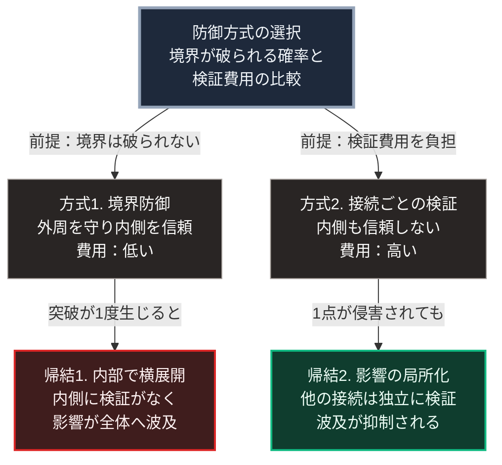

### 序論：本章が扱う範囲

本章は、防御の設計思想が「境界を守る」方式から「各接続を検証する」方式へ移行しつつある経緯を整理します。

この移行は、情報システムの防護において先行して進み、物理的な防衛の議論にも影響を及ぼしています。本章では、両者に共通する構造を扱います。

本文は事実の記述に限定します。解釈は章末で扱います。

### 1. 境界防御という設計

境界防御とは、守るべき対象の外周に防御線を設け、その内側を信頼する設計です。

この設計は、[第Ⅰ部A-1](01_sovereign-state-os)で記述した領域国家の成立と同型です。国境という線を引き、その内側を均質に管理する構成です。情報システムにおいても、組織の内部ネットワークと外部との境界に防護装置を置き、内部の通信は検証を省略する構成が長く標準でした。

この設計が有効であるためには、2つの条件が必要です。第一に、境界が破られないこと。第二に、内側にいる主体が信頼できることです。

### 2. 情報システムにおける前提の崩れ

2020年、米国国立標準技術研究所は、境界を前提としない防護の枠組みを標準文書として公表しました [ [ 216 ] ](https://csrc.nist.gov/pubs/sp/800/207/final) 。

同文書が前提として挙げるのは、次の状況です。組織の資産と利用者が境界の内側に留まらないこと。内部の通信であっても侵害されうること。そして、境界を突破した攻撃者が内部で横方向に移動する事例が繰り返し観測されていることです。

同文書が提示する枠組みでは、接続の要求ごとに、要求者と対象の状態を評価して許可の可否を判定します。内側にいることは、信頼の根拠になりません。この枠組みは、ゼロトラストと呼ばれます。

産業用制御システムについても、同研究所は防護の指針を公表しています [ [ 217 ] ](https://csrc.nist.gov/pubs/sp/800/82/r3/final) 。日本においては、重要インフラの防護に関する施策を国家サイバー統括室が所管しています。同室は、サイバー対処能力の強化を目的として2025年に成立した法律などに基づき、2025年7月、内閣官房に設置されました [ [ 421 ] ](https://www.cyber.go.jp/about/overview/index.html) 。この法律は令和7年法律第42号として2025年5月16日に成立し、同月23日に公布されています [ [ 422 ] ](https://laws.e-gov.go.jp/law/507AC0000000042) 。

### 3. 物理的な防衛における同型の変化

[第Ⅱ部B-1](report-ukraine-war)で参照した分析は、2022年の作戦において、固定的な防空施設が開戦後48時間以内に多数攻撃された一方、分散配置された部隊が残存したことを記述しています [ [ 147 ] ](https://rusi.org/explore-our-research/publications/special-resources/preliminary-lessons-conventional-warfighting-russias-invasion-ukraine-february-july-2022) 。

[第Ⅱ部D-2](22_ai-asymmetric-warfare-math)で参照する分析は、安価な攻撃手段に対して迎撃弾の在庫が制約となる構造を指摘しています [ [ 215 ] ](https://www.csis.org/analysis/depleting-missile-defense-interceptor-inventory) 。

この2つの観測は、境界防御の2条件のうち第一の条件、すなわち境界が破られないという前提に関わります。攻撃の手段が安価で多数になるほど、境界のどこかが破られる確率は上昇します。

### 4. 2つの設計の対比

境界防御と、接続ごとの検証とでは、前提と費用と帰結が異なります。

境界防御は、内部の検証を省略するため費用が低く、境界が保たれる限り有効です。境界が破られた場合、内部に検証がないため影響は全体へ波及します。

接続ごとの検証は、すべての接続に費用がかかります。1点が侵害されても、他の接続は独立に検証されるため、影響は局所にとどまります。

### 🗺️ 図：2つの防御方式の前提と帰結

#### 図の読み方

この図は、上段の1つの問いから左右2列へ分かれる形をしています。左列が方式1、右列が方式2です。各列は上が方式と前提、下がその帰結の2段です。列を比べることで、前提と帰結の対応が読めます。

左列の方式1が有効なのは、境界が破られないという前提が成立する場合に限られます。この前提が成立する限り、方式1は費用の面で有利です。内部での検証を省略できるためです。前提が崩れると、左列下段の帰結に至ります。

右列の方式2は、前提を置きません。すべての接続について、その都度検証します。この方式の費用は方式1より高くなります。一方、右列下段が示すとおり、1点が侵害された場合の影響は局所にとどまります。

したがって、上段の問いが示すとおり、両者の選択は「どちらが優れているか」ではなく、境界が破られる確率と、検証の費用との比較になります。

[第Ⅰ部D-2](war-technology-evolution)で整理した費用構造の観点が、ここでも当てはまります。攻撃の費用が低下し、境界の突破が起こりやすくなるほど、方式2の相対的な有利さが増します。

この構造は、[第Ⅱ部D-5](26_power-grid-cascade-collapse)で記述する電力系統の連鎖停止とも対応します。そこでも、結合を強めれば効率は上がり、障害の波及経路も増えました。

---

### 現代社会構造への射程と本質（本章のまとめ）

本セクションは、著者による解釈です。前節までの記述とは区別して読んでください。

1.  **現代社会構造の原点**

    現代の国家、企業、そして情報システムは、いずれも境界防御を基本設計としてきました。[第Ⅰ部A-1](01_sovereign-state-os)で述べたとおり、領域国家そのものが境界を前提とする統治形態です。

    この設計は、境界の内側を均質に管理できるという利点を持ちます。全国一律の制度も、企業の内部統制も、この利点の上に成立しています。

2.  **歴史的事実の本質**

    本章から抽出できるのは、次の点です。防御方式の妥当性は、攻撃の費用構造に依存します。攻撃が高価で少数であれば境界防御が合理的であり、安価で多数であれば接続ごとの検証が合理的になります。

    情報システムにおいてこの転換が先行したのは、攻撃の費用低下が最も早く進んだ領域だったためと考えられます。

3.  **現代社会の現状と課題**

    [第Ⅴ部](42_taoist-wu-wei-non-action)で扱う自律分散型の設計は、方式2の思想を供給インフラへ適用するものです。各拠点が独立に機能を維持し、他拠点の障害に依存しない構成です。

    ただし方式2には費用が伴います。[第Ⅲ部-5](20_autonomous-society-frictions)で述べるとおり、この費用を誰がどの局面で負担するかが、設計の実現可能性を規定します。
