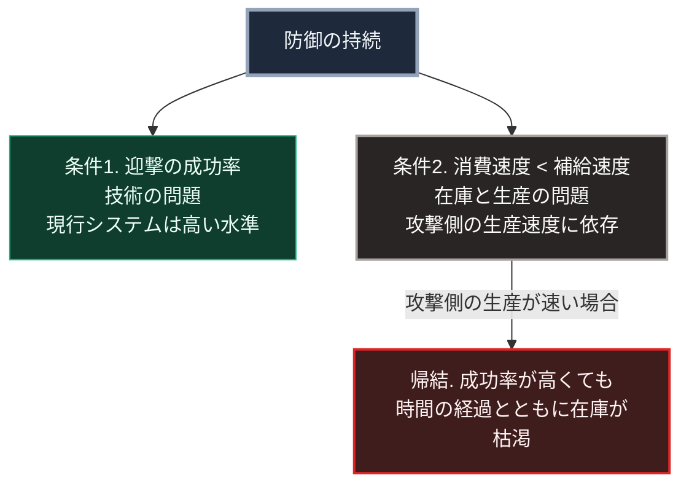

### 序論：本章が扱う範囲

本章は、攻撃側と防御側の費用構造の差が、防御の持続可能性に対して持つ意味を整理します。

本章は、特定の兵器の単価について確定的な数値を主張しません。公表される単価は、調達年度、契約形態、そして含める費用の範囲によって変動するためです。本章が扱うのは、複数の分析機関が共通して指摘している構造です。

本文は事実の記述に限定します。解釈は章末で扱います。

### 1. 指摘されている構造

複数の研究機関が、近年の紛争において攻撃側と防御側の費用に大きな差が生じていることを指摘しています。

英国の研究機関は、紅海における事案について次の点を指摘しています。連合側が直面した主要な課題は、迎撃の技術的な困難さではなく、迎撃に要する費用でした。艦艇は、比較的安価な標的に対して、相対的に高価な迎撃弾を消費する必要がありました [ [ 212 ] ](https://www.rusi.org/explore-our-research/publications/commentary/securing-red-sea-how-can-houthi-maritime-strikes-be-countered) 。

アメリカの研究機関も、この費用比較について分析を公表しています。同分析は、単価の比較のみを取り出すことが誤解を招きうる点も指摘しています。防空の交戦は複雑であり、また防護される対象の価値を考慮する必要があるためです [ [ 213 ] ](https://www.csis.org/analysis/cost-and-value-air-and-missile-defense-intercepts) 。

同様の構造については、別の研究機関も分析を公表しています [ [ 214 ] ](https://www.rand.org/pubs/commentary/2025/03/david-vs-goliath-cost-asymmetry-in-warfare.html) 。

### 2. 単価の差より重要な制約 ―― 保有数

前節で参照した研究機関は、単価の差とは別に、より直接的な制約を指摘しています。迎撃弾の保有数です [ [ 215 ] ](https://www.csis.org/analysis/depleting-missile-defense-interceptor-inventory) 。

この制約の性質は、次のとおりです。

**制約1：搭載数の上限**

艦艇の垂直発射装置には、物理的な搭載数の上限があります。搭載数を使い切った場合、補給のために所定の施設へ移動する必要があります。洋上での再装填については、米海軍が2024年10月11日にサンディエゴ沖で巡洋艦チョーシンを用いて初めて実証しました [ [ 423 ] ](https://www.dvidshub.net/news/483031/navy-demonstrates-first-sea-reloading-vertical-launching-system) 。ただし、この方式は実証の段階にあり、常用化されていません。

**制約2：生産速度**

迎撃弾の生産には、専門的な製造設備と長い調達期間を要します。消費速度が生産速度を上回る場合、在庫は減少を続けます。

**制約3：攻撃側の生産速度**

これに対し、汎用部品を組み合わせた無人機は、比較的短期間で生産できます。

### 3. 構造の定式化

前2節から、次の関係が導かれます。

防御が持続するには、次の2つの条件が必要です。

条件1：迎撃の成功率が十分に高いこと。

条件2：迎撃弾の消費速度が、補給速度を下回ること。

条件1は技術の問題であり、現在の防空システムは高い成功率を達成しているとされています。

条件2は在庫と生産の問題です。ここで、攻撃側の生産速度と防御側の補給速度の比が決定的になります。

攻撃側が防御側より速く生産できる場合、防御側は条件2を満たせません。この状況では、迎撃の成功率がいかに高くても、防御は時間の経過とともに破られます。

すなわち、この問題の本質は命中率ではなく、生産と補給の速度比にあります。

### 🗺️ 図：防御が持続する条件

防御の成否を規定する2条件を示します。

#### 図の読み方

この図が示すのは、防御の評価軸が交戦単位ではなく時間軸にあるという点です。

1回の交戦を切り取れば、防御は成功します。命中率は高く、標的は撃破されます。この観点では、防御は機能しています。

しかし、交戦を繰り返す場合、評価は変わります。消費が補給を上回る限り、在庫は単調に減少します。減少が続けば、いずれ交戦を継続できなくなります。

この構造は、第Ⅰ部D-2で整理した費用構造の観点と重なります。そこで述べたとおり、軍事技術の社会的な帰結を規定するのは破壊力ではなく、それを保有し運用するために必要な資本と組織です。

同時に、この構造は第Ⅱ部D-5で記述する電力系統の連鎖停止とも同型です。個々の動作は正常でありながら、系全体としては望ましくない方向へ進行します。

なお、この構造は防御が無意味であることを意味しません。意味するのは、防御の設計において、単発の交戦性能ではなく、補給を含めた持続能力が評価軸になるということです。

第Ⅱ部B-1で参照した分析が、長距離火力による兵站への脅威を主導権の転換点として記述していたことも、同じ論点を示しています。

---

### 現代社会構造への射程と本質（本章のまとめ）

本セクションは、著者による解釈です。前節までの記述とは区別して読んでください。

1.  **現代社会構造の原点**

    防空システムの設計思想は、少数の高価な標的に対する迎撃を前提として形成されました。この前提のもとでは、1発あたりの単価が高くても、防護対象の価値がそれを上回るため、経済的に成立します。

    この前提は、標的の数が限られている場合にのみ成立します。標的が安価に大量生産される場合、前提は崩れます。

2.  **歴史的事実の本質**

    本章から抽出できるのは、次の一般則です。ある防御方式の有効性は、その方式の性能ではなく、攻撃側と防御側の生産速度の比によって規定されます。

    この一般則は、軍事に限られません。情報セキュリティにおいても、攻撃の試行が安価で、防御の検証が高価である場合、同じ構造が生じます。第Ⅲ部-5で述べる情報の生成と検証の非対称も、同型です。

3.  **現代社会の現状と課題**

    日本の防衛および国民保護の想定について、本書は第Ⅰ部D-5の章末で、短期間の事態を前提としてきたと評価しました。これは著者の評価であり、公的文書の記述ではありません。国民の保護に関する基本指針は、着上陸侵攻の場合に措置の期間が比較的長期に及ぶと記述する一方、事態の想定期間や備蓄の日数を定めていません [ [ 424 ] ](https://www.kokuminhogo.go.jp/pdf/260331shishin.pdf) 。

    本章の構造に照らすと、この前提には検討の余地があります。持続能力が評価軸となる場合、備えの期間設定が決定的になるためです。第Ⅲ部および第Ⅴ部では、この期間設定を具体的に扱います。
