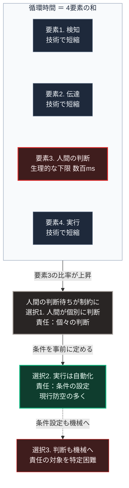

### 序論：本章が扱う範囲

本章は、防衛システムにおける意思決定の速度と、人間が関与できる範囲との関係を整理します。

前章では、防御の持続が生産と補給の速度比に規定されることを示しました。本章で扱うのは、別の速度です。事象が発生してから対応が実行されるまでの時間です。

本文は事実の記述と、そこから導かれる構造的な整理に限定します。解釈は章末で扱います。

### 1. 意思決定の循環という枠組み

作戦行動を1つの循環として記述する枠組みは、ジョン・ボイドによって提示されました。循環は、観測、情勢判断、意思決定、行動の4段階で構成され、英語の頭文字からOODAループと呼ばれます。ボイド自身の講義資料は、米空軍大学の出版局が編纂した資料集に収録されています [ [ 425 ] ](https://www.airuniversity.af.edu/Portals/10/AUPress/Books/B_0151_Boyd_Discourse_Winning_Losing.PDF) 。その形成の経緯については伝記的な研究があります [ [ 199 ] ](https://openlibrary.org/works/OL4311885W) 。

この枠組みの要点は、循環の各段階の性能ではなく、循環全体を回す速度にあります。相手より速く循環を回せる側が、相手の判断が実行される前に状況を変えられるためです。

### 2. 循環速度の物理的な下限

循環に要する時間は、次の要素の和として構成されます。

第一に、事象を検知するまでの時間。

第二に、検知した情報を判断者へ伝達する時間。

第三に、判断に要する時間。

第四に、判断の結果を実行機構へ伝達し、動作させる時間。

このうち第三の要素、すなわち人間の判断に要する時間には生理的な下限があります。単純な刺激への反応でも数百ミリ秒を要します。状況を理解して選択肢を評価する場合は、これより長い時間が必要です。

これに対し、他の3要素は技術によって短縮されてきました。検知の自動化、通信の高速化、機構の応答改善です。

### 3. 短縮の帰結

前節の構造から、次の帰結が導かれます。

技術による短縮が進むほど、循環全体に占める人間の判断時間の比率が上昇します。

ある段階を超えると、人間の判断を待つこと自体が、循環速度の制約となります。この段階において、次の3つの選択が生じます。

**選択1：人間が個々の事象を判断する**

各事象について、人間が判断します。循環速度は人間の判断時間に制約されます。

**選択2：人間が事前に条件を定め、実行は自動化する**

どのような条件で何を行うかを事前に決め、条件の判定と実行を機械が担います。人間は、個々の事象ではなく、条件そのものに対して責任を負います。

**選択3：判断そのものを機械に委ねる**

条件の設定も含めて機械が担います。

現行の防空システムの多くは、選択2にあたります。交戦の条件を人間が設定し、その条件下での交戦を自動化する構成です。

### 4. 責任の所在

[第Ⅳ部-4](implication-individual)で述べるとおり、責任は機械に帰属させることができません。

したがって、選択2と選択3の差異は、技術的な自動化の程度ではありません。人間が何に対して責任を負うかの違いです。

選択2において、人間は条件の設定に対して責任を負います。この場合、条件が適切であったかを事後に検証できます。

選択3において、責任の対象を特定することが困難になります。[第Ⅰ部C-10](14_computing-logical-operations)で述べたとおり、明示的な手順を持たない処理については、出力の妥当性を手順の検査によって確認できないためです。

### 🗺️ 図：循環時間の構成と、人間の関与の位置

意思決定の循環において、どこが短縮され、どこが短縮されないかを示します。

#### 図の読み方

この図は、上から下へ縦に並ぶ形をしています。上段の枠内に4つの要素が縦に並び、その下に帰結と3つの選択が、自動化の程度が高まる順に続きます。選択2から選択3へは点線でつながります。

上段の枠内で、要素3だけが色を変えています。この図が示すのは、人間の役割の変化が、能力の劣位によってではなく、他の要素の短縮によって生じるという点です。要素3の絶対時間は変化していません。変化したのは、要素1、2、4が短縮されたことで、要素3が全体に占める比率です。

この構造は、本書の他の箇所にも現れます。[第Ⅰ部C-12](technology-displacement-history)で整理した職能の置換においても、人間の能力が低下したのではなく、周囲の要素が速くなったことで相対的な位置が変わりました。

帰結の枠に併記した選択1は、各事象を人間が判断する構成です。循環速度は人間の判断時間に制約されます。その下の選択2は、本書全体の設計論に接続します。事前に条件を定め、実行を自動化し、人間は条件の妥当性に対して責任を負う構成です。点線の先の選択3との差異は、自動化の程度ではなく、人間が何に対して責任を負うかの違いです。

[第Ⅲ部-5](20_autonomous-society-frictions)で述べるとおり、有事において複雑な判断を要求する設計は、実際には機能しにくくなります。判断に要する注意という資源が、最も逼迫する局面だからです。したがって、有事の動作は事前に定めておく必要があります。

これは軍事に限られません。[第Ⅴ部](42_taoist-wu-wei-non-action)で扱う供給システムの設計においても、同じ原則が適用されます。切り替えの条件を事前に定め、その条件下での動作を自動化する。人間は、条件の妥当性に対して責任を負う。この構成が、選択2にあたります。

---

### 現代社会構造への射程と本質（本章のまとめ）

本セクションは、著者による解釈です。前節までの記述とは区別して読んでください。

1.  **現代社会構造の原点**

    現在の意思決定制度の多くは、人間の判断時間が制約にならない環境で設計されました。会議、稟議、そして議決といった手続は、いずれも判断に時間を要することを前提とします。

    この前提は、事象の進行速度が人間の判断速度より遅い場合に成立します。

2.  **歴史的事実の本質**

    本章から抽出できるのは、次の点です。自動化の必要性は、機械が人間より優れているからではなく、事象の進行速度が人間の判断速度を上回るために生じます。

    この区別は重要です。前者であれば、人間の関与を減らすことが望ましいという結論になります。後者であれば、人間の関与を「どの層で行うか」という設計の問題になります。

3.  **現代社会の現状と課題**

    [第Ⅰ部B-4](democracy-history)で整理したとおり、民主的な意思決定は、正統性を確保する代償として時間を要します。

    本章の枠組みを適用すると、この時間は要素3にあたります。事象の進行速度が上昇するほど、この要素の比率は上昇します。

    [第Ⅲ部-10](scenario-comparison)で整理する分岐条件のうち、制度の追随速度は、この問題に直結します。人間の判断をどの層に配置するかを事前に設計できるかどうかが、応答の可否を分けます。
