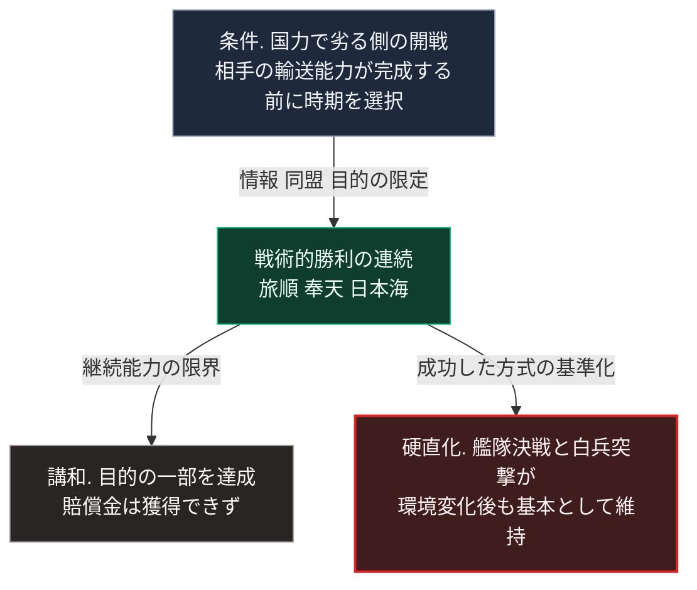

### 序論：本章が扱う範囲

本章は、1904年から1905年にかけての日露戦争について、開戦に至る経緯、戦争の経過、講和の内容、そしてその後の日本の軍事思想への影響を記述します。

本文は事実の記述に限定します。現代との関連については、章末の独立したセクションで扱います。

### 1. 開戦に至る経緯

1895年、日清戦争の講和によって日本は遼東半島を獲得しましたが、ロシア、ドイツ、フランスの勧告により返還しました。1898年、ロシアは遼東半島南部を租借します。

1900年の義和団事件を契機として、ロシアは満洲に軍を駐留させました。撤兵の約束は履行されず、日本とロシアの間で満洲および朝鮮半島をめぐる交渉が続きました。

1902年、日本はイギリスと同盟を締結します。1904年2月、交渉は決裂し、日本はロシアに対して開戦しました。

第Ⅰ部D-1で整理した枠組みに照らすと、この開戦には、将来の力関係に関する予測が作用していました。ロシアはシベリア鉄道の完成によって極東への輸送能力を高めつつあり、日本側には時間の経過が不利に働くという認識がありました。

### 2. 戦争の経過

陸上では、1904年5月の鴨緑江の戦闘に始まり、遼陽、沙河、そして1905年3月の奉天において大規模な会戦が行われました。旅順の要塞は、1904年8月から包囲され、1905年1月に開城しました。これらの経過に関する公文書は、アジア歴史資料センターで公開されています [ [ 250 ] ](https://www.jacar.go.jp/) 。

海上では、1905年5月、日本海においてロシアのバルチック艦隊と日本の連合艦隊が交戦し、ロシア艦隊の大部分が撃沈または拿捕されました。

日本は各会戦において戦術的な勝利を収めましたが、戦争の継続能力には限界がありました。兵員の損耗、弾薬の不足、そして戦費の調達が、1905年半ばには深刻な制約となっていました。

### 3. 講和

1905年9月、アメリカのポーツマスにおいて講和条約が締結されました。この講和の経緯と、その後の影響については、学術的な論集が公刊されています [ [ 37 ] ](https://openlibrary.org/works/OL18716217W) 。

条約により、日本は朝鮮半島における優越的な地位の承認、遼東半島南部の租借権、そして樺太の南半分を獲得しました。賠償金は獲得できませんでした。

賠償金が得られなかったことに対し、国内では講和に反対する集会が開かれ、一部は暴動に発展しました。

### 4. 戦争が示した条件

この戦争において、日本は国力で上回る相手に対して戦術的な勝利を重ねました。その条件として、次の点が指摘されています。

第一に、開戦の時期の選択です。相手の輸送能力が完成する前に開戦しました。

第二に、情報の収集と伝達です。海底電線と無線の利用、そして艦隊の位置に関する情報の収集が、海戦の帰趨に寄与しました。

第三に、同盟による外交上の支援です。

第四に、戦争の目的を限定したことです。相手の全面的な屈服ではなく、特定地域における地位の確保が目的とされました。

一方、戦争の継続能力の限界は、講和において賠償金を獲得できなかった要因の1つとなりました。

### 5. その後の影響

この戦争の勝利は、日本の軍事思想に長期の影響を残しました。

海戦における艦隊決戦の成功は、その後の海軍の建艦計画と戦術思想の基準となりました。陸戦における白兵突撃の経験は、火力の増大した後の時代においても歩兵戦術の基本として維持されました。

この戦争において機能した方式が、その後の環境の変化にもかかわらず維持されたことは、第Ⅰ部A-6で整理した枠組みにおける硬直化の事例として位置づけられます。

### 🗺️ 図：非対称な条件下での勝利と、その後の硬直化

#### 図の読み方

この図は、同じ事象が2つの異なる帰結を持ったことを示しています。

Bにおける勝利の条件は、第Ⅰ部D-1で整理した枠組みと対応します。将来の力関係に関する予測が開戦時期を決め、情報と目的の限定が戦術的な優位を生みました。

Cは、第Ⅰ部D-5で整理する短期決着の論点と対応します。戦術的な勝利が継続能力の限界と結びついたとき、講和の内容は勝利の程度に見合わないものとなりました。

Dが本書にとって重要です。特定の条件下で機能した方式が、条件が変わった後も維持されました。第Ⅰ部D-5で述べるとおり、ある戦争様式の有効性はその成立条件に依存します。条件の検証を伴わない継承は、次の環境において機能しません。

---

### 現代社会構造への射程と本質（本章のまとめ）

本セクションは、著者による解釈です。前節までの事実記述とは区別して読んでください。

1.  **現代社会構造の原点**

    日本の安全保障政策には、この戦争を含む近代の経験が反映されています。同盟の重視、そして戦争目的の限定という考え方は、その系譜に位置づけられます。

2.  **歴史的事実の本質**

    本章から抽出できる論点は2つあります。

    第一に、国力の差は、時期の選択、情報、そして目的の限定によって部分的に補いうるという点です。ただし、それは戦術的な勝利を可能にしても、継続能力の限界を解消しません。

    第二に、成功の経験は、その成功の条件とともに継承されなければ、次の環境において硬直化を招くという点です。

3.  **現代社会の現状と課題**

    第二の論点は、第Ⅲ部の議論に接続します。現在の供給インフラと意思決定制度は、20世紀の条件下で成功した方式を継承しています。第Ⅱ部で確認するとおり、その条件の一部は変化しています。

    条件の検証を伴わない継承が硬直化を招くという本章の論点は、第Ⅲ部-12で整理する早期警戒指標の背景にあります。
