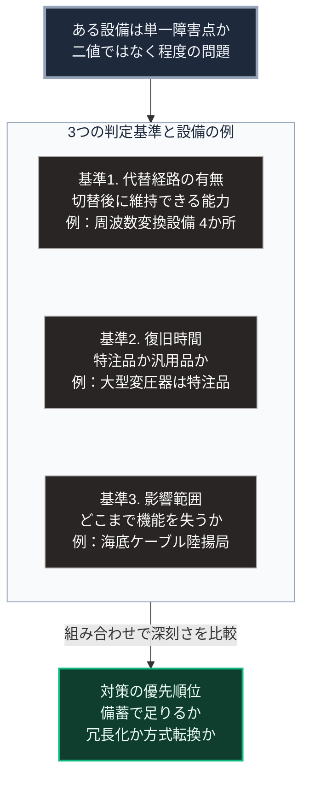

### 序論：本章が扱う範囲

本章は、日本の供給インフラにおいて、どの設備がどのような理由で集中しているかを整理します。

「単一障害点」とは、その1点が機能を失ったとき、系全体が機能を失う箇所を指します。本章では、この定義に照らして、日本の供給設備を点検します。

本文は、公表された資料に基づく事実の記述と、そこから導かれる構造的な整理に限定します。解釈は章末で扱います。

### 1. 電力供給の構造

第Ⅰ部C-7で記述したとおり、電力の供給構造は、発電の大規模化と広域の送電を前提として形成されました。

**発電設備の立地**

日本の火力発電所の多くは、沿岸部に立地しています。この立地には2つの技術的な理由があります。第一に、復水器の冷却に大量の海水を用いるためです。第二に、燃料が海上輸送で搬入されるためです。

第Ⅱ部A-1で示したとおり、2023年度の発電電力量のうち火力が68.6%を占めます。その燃料の大部分は輸入です。

**送電系統の構成**

日本の電力系統は、東日本が50ヘルツ、西日本が60ヘルツで運用されています。両者の間の電力融通は、周波数変換設備を経由します。

系統の構成、需給運用、および広域の連系については、広域機関が資料を公表しています [ [ 189 ] ](https://www.occto.or.jp/) 。

**制御系の位置づけ**

発電と送電の運用は、制御システムによって行われます。産業用制御システムの防護については、各国の機関が指針と注意喚起を公表しています [ [ 200 ] ](https://www.cisa.gov/topics/industrial-control-systems) 。

日本においては、重要インフラの情報セキュリティに関する施策を、2025年7月に設置された国家サイバー統括室が所管しています [ [ 421 ] ](https://www.cyber.go.jp/about/overview/index.html) 。

### 2. 単一障害点の判定基準

ある設備が単一障害点にあたるかどうかは、次の3点によって判定できます。

**基準1：代替経路の有無**

その設備を経由せずに同じ機能を果たす経路が存在するか。

**基準2：復旧に要する時間**

その設備が失われた場合、機能を回復するまでに要する期間はどの程度か。設備が特注品であり、製造に長期間を要する場合、この時間は長くなります。

**基準3：影響が波及する範囲**

その設備の停止が、どこまでの範囲に影響するか。

この3つの基準を組み合わせると、単一障害点の深刻さを比較できます。代替経路がなく、復旧に長期間を要し、影響範囲の広いものほど深刻です。

### 3. 基準に照らした点検

**燃料の受入設備**

液化天然ガスの受入基地は、太平洋岸を中心に、発電所や都市ガスの需要地の近隣に立地しています。経済産業省の資料によれば、2014年時点で32か所の一次受入基地が稼働し、8か所が建設中でした。同資料は、アメリカの11か所、EU加盟国全体の20か所と比較し、日本の基地数が世界でも例を見ない規模であると記述しています [ [ 426 ] ](https://www.meti.go.jp/shingikai/enecho/kihon_seisaku/gas_system/pdf/011_03_00.pdf) 。基準1について、代替の受入先は存在しますが、輸送と貯蔵の能力に制約があります。基準2について、設備の復旧に要する期間は、被害の程度に依存します。

**大型の変圧器**

送電系統の変電所に設置される大型変圧器は、需要地ごとに仕様が異なる特注品です。基準2について、汎用品と異なり、即時の代替は困難です。製造期間と予備の保有状況に関する公的な数値は、本書では確認できていません。

**周波数変換設備**

東西の系統間で電力を融通する設備です。広域機関の長期方針によれば、この設備は新信濃、飛騨信濃、佐久間、東清水の4か所にあり、増強工事中のものを含めた合計容量は300万キロワットです [ [ 427 ] ](https://www.occto.or.jp/assets/kouikikeitou/chokihoushin/files/chokihoushin_23_01_01.pdf) 。基準1について、東西間の融通はこの4か所に限られ、これを代替する経路は存在しません。

**通信の集約点**

国際通信の大部分は海底ケーブルを経由します。総務省の令和7年版の情報通信白書によれば、国際海底ケーブルの陸揚局は房総半島と志摩半島およびその周辺に集中しています。同白書は、東京圏と大阪圏が被災した場合に通信サービスへ全国規模の影響が生じる可能性を指摘しています [ [ 428 ] ](https://www.soumu.go.jp/johotsusintokei/whitepaper/ja/r07/html/nd222430.html) 。海底ケーブルの保護に関する国際的な取り組みについては、関連団体が情報を公表しています [ [ 202 ] ](https://www.iscpc.org/) 。

**上水道の浄水場**

第Ⅰ部C-6で記述したとおり、上水道は集約型の設備から管路を通じて供給されます。浄水場が停止した場合、その供給区域全体が影響を受けます。

### 🗺️ 図：単一障害点の深刻さを判定する3基準

どの設備がより深刻な単一障害点かを比較する枠組みと、その適用例を示します。

#### 図の読み方

この図は、上から下へ縦に並ぶ形をしています。最上段が問い、中段の枠内が3つの判定基準、最下段が対策の優先順位です。枠内の各基準には、本文で点検した設備のうち、その基準で最も深刻な例を1つずつ併記しています。

最上段が示すのは、単一障害点という概念が二値ではなく、程度の問題であるという点です。多くの設備には、何らかの代替経路があります。問われるのは代替経路の有無ではなく、切り替えた際にどの程度の能力を維持できるかです。

中段の基準2が実務上は最も重要です。復旧に1週間を要する設備と、1年を要する設備とでは、備えの性質が根本的に異なります。前者は備蓄で対応できます。後者は、設備そのものの冗長化か、供給方式の転換によってしか対応できません。

枠内に併記した例のうち、周波数変換設備は、東西間の融通を代替する経路がありません。大型変圧器は特注品であり、即時の代替が困難です。海底ケーブルの陸揚局は特定の地域に集中し、被災時の影響が全国に及びます。

第Ⅰ部C-7で整理したとおり、現在の供給設備は、稼働率を高めて単位あたり原価を下げる設計です。この設計のもとでは、予備設備を持たない判断が合理的になります。予備設備は稼働率を下げるためです。

したがって、単一障害点の存在は設計上の欠陥ではありません。効率を基準とした設計が導く必然的な帰結です。この点を認識しないまま「冗長性を高めるべきだ」と主張しても、その費用を誰が負担するかという問いに答えられません。

第Ⅲ部および第Ⅴ部では、この費用負担の問題を含めて検討します。

---

### 現代社会構造への射程と本質（本章のまとめ）

本セクションは、著者による解釈です。前節までの記述とは区別して読んでください。

1.  **現代社会構造の原点**

    本章で列挙した集中は、いずれも第Ⅰ部Cで記述した経緯に由来します。冷却水と燃料輸送のための沿岸立地、規模の経済に基づく発電の大規模化、そして稼働率を高めるための予備設備の最小化です。

    これらはすべて、平時における費用を最小化する設計として合理的でした。

2.  **歴史的事実の本質**

    本章から抽出できるのは、単一障害点が「見落とし」ではなく「設計上の選択」であるという点です。

    第Ⅰ部A-2で記述したローマの事例でも、水道は単一の系統として設計されています。分岐と迂回を設ければ費用は増加します。その費用を支払わないという判断は、当時から現在まで繰り返されています。

3.  **現代社会の現状と課題**

    問題は、この判断の前提が変化しているかどうかです。

    第Ⅱ部Bで記述したとおり、供給設備が攻撃対象として選択される事例が観測されています。また第Ⅱ部A-2で示したとおり、人口密度の低下は維持費用の負担構造を変えます。

    前提が変化したのであれば、費用の判断も見直されるべきです。ただし第Ⅲ部-6で述べるとおり、この見直しは自動的には生じません。第Ⅴ部では、既存の設備を置き換えるのではなく、その上に局所的な供給を重ねる構成を検討します。この構成であれば、既存設備の稼働率を下げずに、復旧までの期間を埋めることができます。
