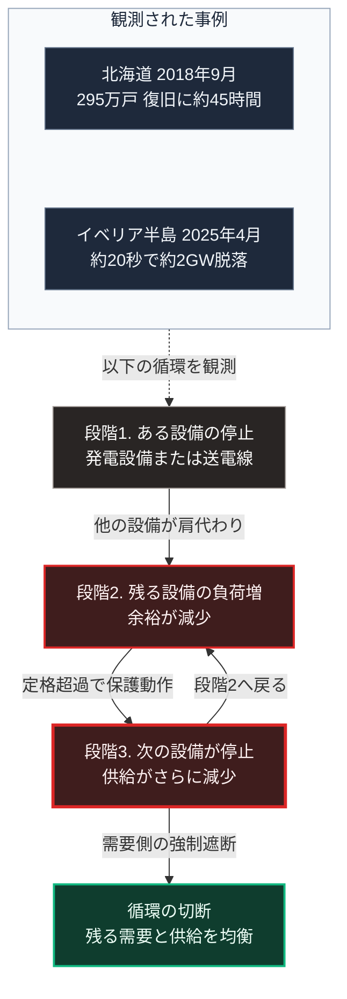

### 序論：本章が扱う範囲

本章は、電力系統がどのような制約のもとで運用され、その制約が破られたときに何が起きるかを記述します。

電力を独立した章として扱う理由は、その物理的な性質にあります。電力は、他の供給財と異なり、大量の貯蔵が困難です。この性質が、系統の運用と障害の波及の仕方を規定します。

本文は事実の記述に限定します。解釈は章末で扱います。

### 1. 需給の同時性という制約

電力系統には、他の供給網にない制約があります。発電量と消費量を、常時一致させる必要があるという制約です。

上水道であれば、配水池に貯めた水で一定時間の変動を吸収できます。ガスであれば、管路内の圧力が緩衝として働きます。電力については、系統規模での貯蔵手段が限られます。

この制約は、系統周波数として現れます。消費が発電を上回れば周波数は低下し、発電が消費を上回れば上昇します。周波数が一定の範囲を外れると、発電機は保護のために系統から切り離されます。

### 2. 連鎖停止の機序

前節の性質から、次の連鎖が生じます。

第一段階として、ある発電設備または送電線が停止します。

第二段階として、失われた供給量を他の設備が肩代わりします。このとき、残った設備と送電線の負荷が上昇します。

第三段階として、負荷が定格を超えた設備が保護動作によって停止します。

第四段階として、第二段階へ戻ります。

この循環が続くと、停止する設備が加速度的に増加します。これが連鎖停止です。

この機序を止めるために、系統には負荷を強制的に遮断する仕組みが備えられています。需要側を意図的に切り離すことで、残る需要と供給を均衡させる方式です。

**観測された事例1：2018年9月の北海道**

日本で全域の停電が生じた事例は、2018年9月6日に北海道で発生した地震（胆振東部地震）によるものです。広域機関の検証委員会が2018年12月19日付で公表した最終報告によれば、午前3時7分の地震発生の後、午前3時25分、北海道全域の停電が発生しました。主因は、主力の火力発電所である苫東厚真の3基の停止と、送電線の事故による水力発電の停止が複合したことでした。ほぼ全域への供給が回復するまでに45時間程度を要しています [ [ 429 ] ](https://www.occto.or.jp/assets/iinkai/hokkaido_kensho/files/181219_hokkaido_saishu_gaiyou.pdf) 。総務省の資料によれば、この停電は295万戸に及びました [ [ 430 ] ](https://www.soumu.go.jp/main_content/000585075.pdf) 。

**観測された事例2：2025年4月のイベリア半島**

2025年4月28日の12時33分、スペインとポルトガルの電力系統が停電しました。欧州の送電系統の運用者団体が2026年3月20日に公表した最終報告は、これを過去20年で欧州最大の停電と位置づけています。同報告によれば、系統電圧の制御不能な急上昇と電圧制御の喪失を起点として、発電設備の出力低下と解列が連鎖しました。約20秒の間に約2ギガワットの発電が脱落しています。ポルトガルの復旧は翌29日0時22分、スペインの送電系統の完全復旧は同4時でした [ [ 431 ] ](https://eepublicdownloads.blob.core.windows.net/public-cdn-container/clean-documents/Publications/2025/iberian-blackout/Final%20Report%20on%20the%20Grid%20Incident%20in%20Spain%20and%20Portugal%20on%2028%20April%202025.pdf) 。

### 3. 運用と計画の枠組み

日本の電力系統については、広域的な需給運用、系統計画、および連系線の運用を担う機関が設置されています。同機関は、系統の構成、需給の見通し、運用実績に関する資料を公表しています [ [ 189 ] ](https://www.occto.or.jp/) 。

電力の需給に関する政策と制度については、所管する官庁が資料を公表しています [ [ 206 ] ](https://www.enecho.meti.go.jp/category/electricity_and_gas/electric/summary/) 。

系統の運用に用いられる制御システムの防護については、産業用制御システムに関する指針が各国で整備されています [ [ 200 ] ](https://www.cisa.gov/topics/industrial-control-systems) 。北米においては、系統運用者に対する遵守要件が基準として定められています [ [ 207 ] ](https://www.nerc.com/pa/Stand/Pages/CIPStandards.aspx) 。

### 4. 再生可能エネルギーの増加が変える条件

第Ⅱ部A-1で示したとおり、2023年度の発電電力量のうち再生可能エネルギーは22.9%です。

この構成の変化は、系統の運用条件を2つの点で変えます。

第一に、出力が気象条件に依存する電源の比率が上昇します。これにより、需給を一致させるための調整が難しくなります。

第二に、回転する機械を持たない電源の比率が上昇します。従来の発電機は、回転体の慣性によって周波数の急変を緩和する働きを持ちました。この慣性が減少すると、周波数の変動が速くなります。第2節で述べたイベリア半島の事例は、電圧の制御という別の側面ではありますが、発電構成の変化のもとで連鎖が生じた事例として、この論点に関わります。

一方で、蓄電設備の導入は、この条件を緩和します。資源エネルギー庁の2026年2月の資料によれば、2025年9月末の時点における全国の系統用蓄電池の契約申込みは約2,400万キロワットであり、前年同期の約3.9倍です [ [ 432 ] ](https://www.meti.go.jp/shingikai/enecho/denryoku_gas/saisei_kano/smart_power_grid_wg/pdf/007_01_01.pdf) 。

国際的な電力需給の動向については、国際エネルギー機関が2026年2月に報告を公表しています [ [ 433 ] ](https://www.iea.org/reports/electricity-2026) 。

### 🗺️ 図：連鎖停止が生じる循環

需給の同時性という制約が、どのように連鎖を生むかを示します。

#### 図の読み方

この図は、上段の枠内に2つの事例が並び、その下に3段の循環があり、循環の外へ出る1つの出口を置いた形をしています。段階3から段階2へ戻る矢印が、循環を閉じています。

この図が示すのは、連鎖停止が正のフィードバックであるという点です。段階2から段階3への移行は、各設備が自らを保護するための正常な動作です。故障でも設計不良でもありません。個々の設備にとって合理的な動作が、系全体としては停止の拡大を招きます。

この構造は、第Ⅰ部B-5で記述した計画経済の分析と同型です。そこでも、各主体にとって合理的な行動が、系全体としては望ましくない結果を導きました。

右下の出口が示すのは、循環を切るには外部からの介入が必要だという点です。需要側の強制遮断は、その介入にあたります。

ここに、本書全体に通じる論点があります。連鎖を止める手段は、あらかじめ用意されていなければ機能しません。連鎖の進行速度は、人間が判断して実行できる速度を上回るためです。上段の2つの事例では、北海道で地震発生の3時7分から全域停電の3時25分まで、イベリア半島で約20秒の間に連鎖が進行しました。

第Ⅲ部-11で述べる悲観シナリオにおける連鎖も、同じ構造を持ちます。段階2から段階3への移行を、事後に止めることは困難です。事前に切断の手段を組み込んでおく必要があります。

---

### 現代社会構造への射程と本質（本章のまとめ）

本セクションは、著者による解釈です。前節までの記述とは区別して読んでください。

1.  **現代社会構造の原点**

    電力系統の設計思想は、第Ⅰ部C-7で記述した経緯に由来します。大規模な発電設備を高い稼働率で運用し、広域の送電網で需要地へ届ける構成です。

    この構成は、需給の同時性という制約のもとで、最も低い費用を実現します。同時に、系統全体が1つの同期した機械として振る舞うため、局所の障害が全体へ波及する経路を持ちます。

2.  **歴史的事実の本質**

    本章から抽出できるのは、次の一般則です。効率を高めるための結合が、障害の波及経路にもなります。

    結合を弱めれば波及は抑制されますが、効率は低下します。この関係は、第Ⅰ部B-6で整理した速度と分散のトレードオフと同型です。

3.  **現代社会の現状と課題**

    現在、この条件に2つの変化が生じています。第一に、気象条件に依存する電源の比率上昇です。第二に、蓄電設備の導入です。

    前者は制約を強め、後者は緩和します。両者の比率が、今後の系統の安定性を規定します。

    第Ⅴ部では、この論点を局所の側から扱います。系統からの供給が途絶した区域において、局所の発電と蓄電で必要最小限の機能を維持する構成です。この構成は、系統の代替ではありません。系統の復旧までの期間を埋める備えとして位置づけられます。
