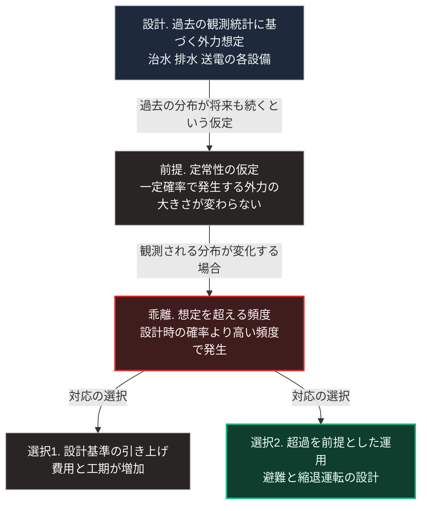

### 序論：本章が扱う範囲

本章は、気候に関して観測されている変化と、その変化がインフラの設計前提に対して持つ意味を記述します。

本章の情報源は、政府間の評価機関および気象庁の公表資料に限定します。個別の災害事例については、それが観測された事実として記述し、因果の帰属については慎重に扱います。

本文は事実の記述に限定します。解釈は章末で扱います。

### 1. 国際的な評価

気候変動に関する政府間パネルは、2021年に第6次評価報告書の第1作業部会報告を公表しました [ [ 45 ] ](https://www.ipcc.ch/report/ar6/wg1/chapter/chapter-4/) 。2023年には統合報告書が公表されています [ [ 170 ] ](https://www.ipcc.ch/report/ar6/syr/) 。

同報告書は、複数の社会経済経路を仮定した場合の気温変化の推計を示しています。この推計は、単一の予測ではなく、排出量の想定に応じた複数の経路として提示されます。

日本語による同報告書の解説は、気象庁が公表しています [ [ 209 ] ](https://www.data.jma.go.jp/cpdinfo/ipcc/index.html) 。

### 2. 日本における観測

気象庁は、極端な気象現象に関する長期の観測結果を公表しています [ [ 210 ] ](https://www.data.jma.go.jp/cpdinfo/extreme/extreme_p.html) 。

同資料は、統計期間における各種指標の推移を示しています。対象には、日降水量が一定の閾値を超えた日数、短時間強雨の発生回数、そして猛暑日の日数が含まれます。

代表的な指標は、1時間降水量50ミリメートル以上の大雨の年間発生回数です。気象庁の2025年の報告によれば、この回数を全国の観測所1,300地点あたりへ換算した値は、1976年から1985年の平均が約226回、2015年から2024年の平均が約334回です。すなわち、最近10年間は最初の10年間の約1.5倍です [ [ 437 ] ](https://www.data.jma.go.jp/cpdinfo/ccj/2025/html_honpen/cc2025_honpen_5.html) 。

同庁はまた、将来の気候に関する推計を、地域別の情報として公表しています [ [ 211 ] ](https://www.data.jma.go.jp/cpdinfo/riskmap/index.html) 。

### 3. 個別事象の扱いについて

ある個別の豪雨や台風について、それが気候変動によって引き起こされたと断定する根拠はありません。

その理由は、気象現象が本来的に変動を伴うためです。単一の事象は、変動の範囲内で生じた可能性を排除できません。

一方、近年の研究では、特定の事象の発生確率が気候の変化によってどの程度変化したかを推定する手法が用いられるようになっています。この手法は、イベント・アトリビューションと呼ばれます。気象庁の気象研究所は2020年12月、2019年の東日本台風による関東甲信地方の大雨について、気温と海面水温の上昇が総降水量を約11%から約14%増加させたと見積もりました [ [ 438 ] ](https://www.mri-jma.go.jp/Topics/R02/021224-1/press_021224-1.html) 。この手法は、個別事象の原因を特定するのではなく、発生確率や規模の変化を推定するものです。

したがって本書は、次の形で記述します。個別の災害については、発生した事実と被害の内容を記述します。気候の変化については、長期の観測に基づく傾向として記述します。両者の因果を、個別事象の水準で断定することはしません。

### 4. インフラ設計の前提

インフラの設計は、想定される外力の大きさを前提とします。

治水施設は、一定の確率で発生する降雨を想定して設計されます。排水施設は、一定の降雨強度を想定します。送電設備は、一定の風速を想定します。

これらの想定は、過去の観測に基づく統計から導かれます。すなわち、過去の統計が将来も同じ分布に従うという仮定を含みます。

観測される分布が変化している場合、この仮定は成立しません。設計時に想定した確率の事象が、想定より高い頻度で発生することになります。

第Ⅱ部A-3で述べたとおり、これは施設の欠陥ではなく、設計の前提と実際の条件との乖離です。

### 🗺️ 図：設計前提と観測との乖離

インフラの設計が何を前提としているかを示します。

#### 図の読み方

この図が示すのは、気候の変化がインフラに対して持つ意味が「壊れやすくなる」ことではないという点です。

問題は、設計が置いた前提そのものにあります。そこで用いられているのは、過去の統計が将来も同じ分布に従うという仮定です。この仮定を、水文学では定常性の仮定と呼びます。2008年、学術誌サイエンスに掲載された論文は、この仮定がもはや成立しないと論じ、水資源管理の基礎の見直しを求めました [ [ 439 ] ](https://doi.org/10.1126/science.1151915) 。

この仮定が成立しなくなった場合、対応は2つに分かれます。

選択1は、新しい分布に合わせて設計基準を引き上げる方法です。この方法は、既存施設の改修を要するため、費用と工期が大きくなります。また、将来の分布をどう見積もるかという問題が残ります。

選択2は、想定を超える事象が発生することを前提として、その際の運用を設計する方法です。避難の計画、機能の一部を維持する縮退運転、そして復旧の手順が、この選択に含まれます。

両者を排他的に扱う必要はありません。実際には、費用と便益の比較に基づいて組み合わせられます。

本書が第Ⅴ部で扱うのは、主として選択2にあたります。第Ⅱ部D-4で整理したとおり、復旧に長期間を要する設備については、備蓄では対応できません。局所的に機能を維持する構成が必要になります。

---

### 現代社会構造への射程と本質（本章のまとめ）

本セクションは、著者による解釈です。前節までの記述とは区別して読んでください。

1.  **現代社会構造の原点**

    現在のインフラは、20世紀の観測統計に基づいて設計されました。この設計は、当時の条件のもとで合理的でした。

    重要なのは、設計基準が「安全」を保証するものではないという点です。基準が保証するのは、想定した確率の外力に対して機能するということだけです。想定を超える外力に対しては、機能しません。

2.  **歴史的事実の本質**

    本章から抽出できるのは、次の点です。設計の妥当性は、外力の分布が変わらない限りにおいて成立します。

    この構造は、第Ⅰ部B-7で整理した統治形態の失効条件と同型です。そこでも、形態の妥当性は環境が一定である限りにおいて成立していました。環境が変われば、妥当性の評価も変わります。

3.  **現代社会の現状と課題**

    第Ⅲ部-4で定義する区分Aのうち、気候の変化は階層2に属します。すなわち、傾向が持続する場合に外挿できる事象です。

    したがって、この項目の論点は発生の有無ではなく、進行の速度になります。第Ⅲ部の3つのシナリオは、いずれもこの変化を共通の前提として含みます。シナリオを分けるのは、変化そのものではなく、それに対する応答の速度です。
