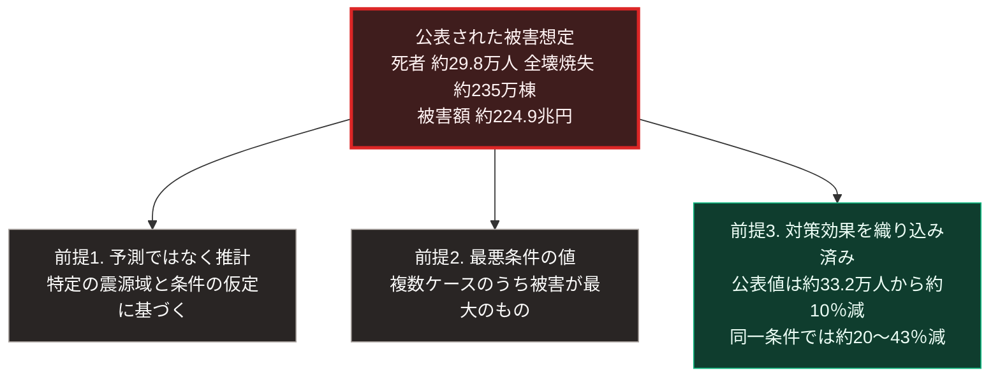

### 序論：本章が扱う範囲

本章は、南海トラフ沿いで発生が想定される大規模地震について、政府が公表している被害想定を整理します。

本章の情報源は、中央防災会議のもとに設置された検討組織が公表した報告書に限定します。第三者による推計や解説は本文では扱いません。

本文は事実の記述に限定します。解釈は章末で扱います。

### 1. 検討の経緯

政府は2012年8月および2013年3月に、南海トラフ沿いで想定される最大クラスの地震と津波について被害想定を公表しました。この想定に基づく減災目標は、推進基本計画に定められました。推進基本計画とは、中央防災会議が2014年3月、南海トラフ地震の防災対策のために策定した計画です。同計画は2025年7月1日に変更され、想定される死者数を今後10年間でおおむね8割、全壊焼失棟数をおおむね5割減少させることを減災目標としています [ [ 440 ] ](https://www.bousai.go.jp/jishin/nankai/pdf/nankaitrough_keikaku_honbun.pdf) 。

なお、この地震に関する情報の制度として、南海トラフ地震臨時情報があります。2024年8月8日、日向灘を震源とするマグニチュード7.1の地震を受けて、気象庁は同情報の運用開始後初めて「巨大地震注意」を発表しました [ [ 441 ] ](https://www.jma.go.jp/jma/press/2408/08e/NT_202408081945sv.pdf) 。

その後、目標期間である10年が経過したことを受けて、対策の進捗を確認し、新たな目標を定めるための検討が実施されました。想定手法の見直しについては専門の検討会が設置され [ [ 203 ] ](https://www.bousai.go.jp/jishin/nankai/kento_wg/index.html) 、対策の検討はワーキンググループが担当しています [ [ 204 ] ](https://www.bousai.go.jp/jishin/nankai/taisaku_wg_02/index.html) 。

2025年3月、この検討結果が報告書として公表されました [ [ 205 ] ](https://www.bousai.go.jp/jishin/nankai/taisaku_wg_02/pdf/nankai_hokoku.pdf) 。

### 2. 公表された被害想定

同報告書によれば、最悪の条件を仮定した場合の推計は次のとおりです。

揺れおよび津波などによる死者数は、約29万8,000人。

全壊および焼失する建物は、約235万棟。

資産等の被害額は、約224兆9,000億円 [ [ 205 ] ](https://www.bousai.go.jp/jishin/nankai/taisaku_wg_02/pdf/nankai_hokoku.pdf) 。

公表値の比較では、2014年の推進基本計画の設定時に約33万2,000人であった最大の死者数が、約29万8,000人へ約10%減少しました。同報告書は、この比較とは別に、対策の効果のみを評価する推計を示しています。震度分布と津波の推計手法を前回と同じにしたうえで、耐震化や避難施設などのデータのみを更新した場合、死者数は約33万2,000人から約26万4,000人へ約20%減少します。さらに意識調査に基づく早期避難率53%を仮定した場合、約43%の減少と推計されています [ [ 205 ] ](https://www.bousai.go.jp/jishin/nankai/taisaku_wg_02/pdf/nankai_hokoku.pdf) 。すなわち、公表値の減少幅が対策の効果より小さいのは、想定手法の見直しによる増加分が対策の効果を相殺したためです。

### 3. 推計値の性質

これらの数値を読む際には、次の3点に留意する必要があります。

**第一に、これは予測ではありません**

同報告書が示すのは、特定の震源域と条件を仮定した場合の推計です。実際に発生する地震の規模、震源域、発生時刻、季節、そして気象条件によって、結果は大きく変動します。

**第二に、最悪条件を仮定した値です**

公表されている数値は、複数の想定ケースのうち被害が最大となるものです。他のケースでは、より小さい値が推計されています。

**第三に、対策の効果が織り込まれています**

同一条件で比較した場合に死者数が約20%から約43%減少するという記述は、過去の対策が効果を持ったことを示します。同時に、今後の対策によってさらに変動しうることも意味します。ただし、43%という値は早期避難率の仮定を含むため、実際の避難行動を反映したものではないと同報告書は注記しています。

### 4. 供給インフラへの影響

同報告書および関連する検討資料は、ライフラインへの影響についても推計を示しています。

影響が想定される項目には、上水道、下水道、電力、都市ガス、通信、そして道路と鉄道が含まれます。

内閣府が公表した定量的な被害量によれば、最大の場合、断水人口は発災1日後に約3,690万人であり、1か月後も約460万人が断水します。停電は最大約2,950万軒、都市ガスの供給停止は最大約175万戸、固定電話の不通は最大約1,310万回線です [ [ 362 ] ](https://www.bousai.go.jp/jishin/nankai/taisaku_wg_02/pdf/saidai_01.pdf) 。

第Ⅱ部D-4で整理した判定基準に照らすと、この事象は次の性質を持ちます。基準3の影響範囲が広域に及びます。同時に、複数の系統が同時に影響を受けるため、相互の復旧支援が制約されます。

### 🗺️ 図：推計値を読む際の3つの前提

公表された数値が何を意味するかを整理します。

#### 図の読み方

この図が示すのは、数値そのものより、その数値が置いている前提のほうが重要だという点です。

前提1は、第Ⅲ部-1で整理する確度の階層に対応します。地震の発生は階層3、すなわち発生時期の特定が困難な事象です。なお、政府の地震本部は、南海トラフ沿いの大規模地震について30年以内の発生確率を長期評価として公表しており、本書はこの数値を評価手法の前提とともに参照します [ [ 324 ] ](https://www.jishin.go.jp/regional_seismicity/rs_kaiko/k_nankai/) 。したがって、この推計は「いつ起きるか」ではなく「起きた場合にどうなるか」を示すものです。

前提2は、備えの水準を考えるうえで重要です。最悪条件の値を基準とすれば、備えは過大になる可能性があります。一方、平均的な値を基準とすれば、最悪の場合に不足します。この選択は、費用と許容できる被害の大きさとの比較になります。

前提3が、本書の議論において最も重要です。公表値の減少は約10%にとどまりますが、同一条件で比較した場合には約20%から約43%の減少と評価されています。この差は、対策が数値を動かしたことと、想定手法の見直しがそれを相殺したことの両方を示します。

すなわち、この推計値は固定された運命ではありません。対策の実施状況によって変動する変数です。

第Ⅲ部-12で整理する分岐条件に照らすと、この事象は差分3、すなわち外部から到来する事象にあたります。発生そのものは制御できません。しかし、発生時の被害は、事前の対策によって変化します。

---

### 現代社会構造への射程と本質（本章のまとめ）

本セクションは、著者による解釈です。前節までの記述とは区別して読んでください。

1.  **現代社会構造の原点**

    日本の防災体制は、過去の災害の経験を踏まえて段階的に整備されてきました。建築基準の耐震要求、津波の避難計画、そしてインフラの耐震化は、いずれもこの蓄積の産物です。

    前節で述べた死者数推計の減少は、この蓄積が機能していることを示します。

2.  **歴史的事実の本質**

    本章から抽出できる論点は2つあります。

    第一に、推計値は前提に依存するという点です。数値のみを取り出して引用することは、その前提を捨象することになります。

    第二に、この事象が複数の系統に同時に影響するという点です。第Ⅲ部-4で定義する区分Cの複合事象は、まさにこの構造を扱っています。復旧に必要な資材、燃料、人員が同時に制約される状況です。

3.  **現代社会の現状と課題**

    第Ⅱ部D-4で整理したとおり、復旧に長期間を要する設備については、備蓄では対応できません。設備の冗長化か、供給方式の転換が必要になります。

    第Ⅴ部では、この論点を扱います。そこでの要件は、集約型設備の復旧を待つ間、局所的に生存に必要な水準を維持することです。第Ⅲ部-11で述べるとおり、この期間の長さが、居住の分布が不可逆に変化するかどうかを分けます。
