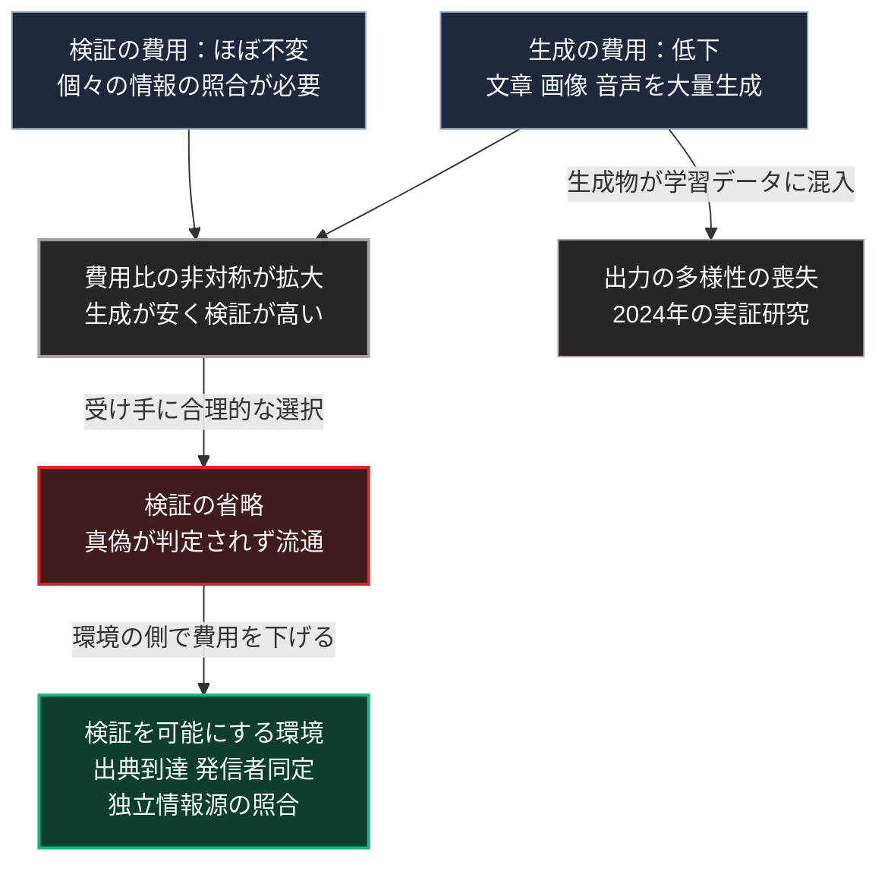

### 序論：本章が扱う範囲

本章は、生成AIによる情報の生成費用の低下が、情報環境に対して持つ意味を整理します。

本章が扱うのは、第Ⅱ部C-7で整理する4つの分析のうち、情報環境の劣化に関する分析の前提です。事実認識の共有が困難になる機序については、第Ⅱ部C-7を参照してください。

本文は、観測された事実と、そこから導かれる構造の整理に限定します。評価は章末で扱います。

### 1. 情報量と内容の区別

1948年、クロード・シャノンは、通信における情報量を定量的に扱う理論を提示しました [ [ 26 ] ](https://web.archive.org/web/19980715013143/http://cm.bell-labs.com/cm/ms/what/shannonday/shannon1948.pdf) 。

この理論が扱うのは、伝送の量です。送り手がどれだけの選択肢から選んだかによって情報量が定義され、内容の真偽や有用性は対象になりません。

この区別が、本章の出発点です。生成AIが変えたのは、伝送される量ではなく、生成される内容の量と、その生成に要する費用です。

### 2. 生成費用の低下と、その帰結

第Ⅲ部-5で整理するとおり、生成AIは文章、画像、音声を低い費用で生成します。この変化は、次の2つの帰結を持ちます。

第一に、特定の主張を支持する情報を大量に生成し流通させる費用が低下します。

第二に、生成された情報が実在の記録と区別しにくい場合、受け手は個々の情報について検証を要します。検証の費用は、生成の費用ほどには低下していません。

この結果、生成と検証の間で費用の非対称が拡大します。生成が安価で検証が高価であるとき、検証は現実的に実行されなくなります。

### 3. 生成された情報が学習に用いられる場合

生成AIの出力が、次世代の生成AIの学習データに含まれる状況について、実証研究が公表されています。

2024年に公表された研究は、生成されたデータで繰り返し学習させた場合に、モデルの出力の多様性が失われていく現象を報告しました [ [ 235 ] ](https://www.nature.com/articles/s41586-024-07566-y) 。同研究は、この現象を、元のデータ分布の裾が段階的に失われる過程として記述しています。

この観測が示すのは、生成された情報の増加が、情報環境だけでなく、生成AI自身の性能にも作用しうるという点です。

### 4. 検証の側の構造

前2節から、検証の費用が相対的に上昇した状況において、何が検証の手段として残るかが問題になります。

検証の手段は、次の3つに分類できます。

**手段1：出典への到達**。情報が参照している一次資料へ直接到達し、照合すること。本書が各記述に出典への直接リンクを付す理由は、ここにあります。

**手段2：発信者の同定**。情報の発信者が誰であるかを、暗号的な署名などによって確認すること。

**手段3：複数の独立した情報源の照合**。異なる経路から得た情報が一致するかを確認すること。

いずれの手段も、受け手に費用を要求します。第Ⅲ部-6で整理するとおり、負荷の高い選択肢は選ばれにくいため、これらの手段が実際に用いられるかどうかは、環境の設計に依存します。

### 🗺️ 図：生成と検証の費用の非対称

#### 図の読み方

この図は、上段の左右2つの費用が中段の1つの非対称へ集まり、そこから下段の帰結へ下りる形をしています。左上の生成費用からは、右側へ別の矢印が出ています。

上段が示すのは、問題が情報の量そのものではなく、生成と検証の費用比にあるという点です。情報の量は、第Ⅰ部C-4で記述した活版印刷以来、増加を続けてきました。量の増加だけであれば、新しい現象ではありません。

新しいのは、左上の生成費用が右上の検証費用を大きく下回る状態です。中段がその非対称です。この状態では、その下の検証の省略が、個々の受け手にとって合理的な選択になります。

右側の枠は、この構造が生成AI自身に及ぶことを示します。生成物が学習に混入すると、出力の多様性が失われます。これは情報環境の劣化が、自己強化的に進行しうることを意味します。

最下段の環境は、第Ⅴ部で扱う設計要件に対応します。検証を受け手の努力に委ねるのではなく、検証に要する費用を環境の側で下げる構成です。

---

### 現代社会構造への射程と本質（本章のまとめ）

本セクションは、著者による解釈です。前節までの記述とは区別して読んでください。

1.  **現代社会構造の原点**

    第Ⅰ部C-4で述べたとおり、活版印刷は同一の本文を多数の人が参照できる状態を作り、議論の共通基盤を成立させました。この基盤は、複製の費用が下がる一方で、原本を作る費用は残ったことに支えられていました。

    生成の費用が低下したことで、この条件が変化しています。

2.  **歴史的事実の本質**

    本章から抽出できるのは、次の点です。情報環境の質を規定するのは、情報の量ではなく、生成と検証の費用比です。

    この費用比は技術によって変動します。したがって、検証の費用を下げる技術と設計が、情報環境の質を回復する経路となります。

3.  **現代社会の現状と課題**

    第Ⅲ部-11で述べる悲観シナリオにおいて、供給の停止と情報環境の機能不全が重なる状況は、本章の構造から導かれます。災害時に必要なのは、供給の維持と、状況に関する検証可能な情報の流通です。

    第Ⅴ部では、局所の情報基盤において、出典への到達と発信者の同定を実装する構成を扱います。
