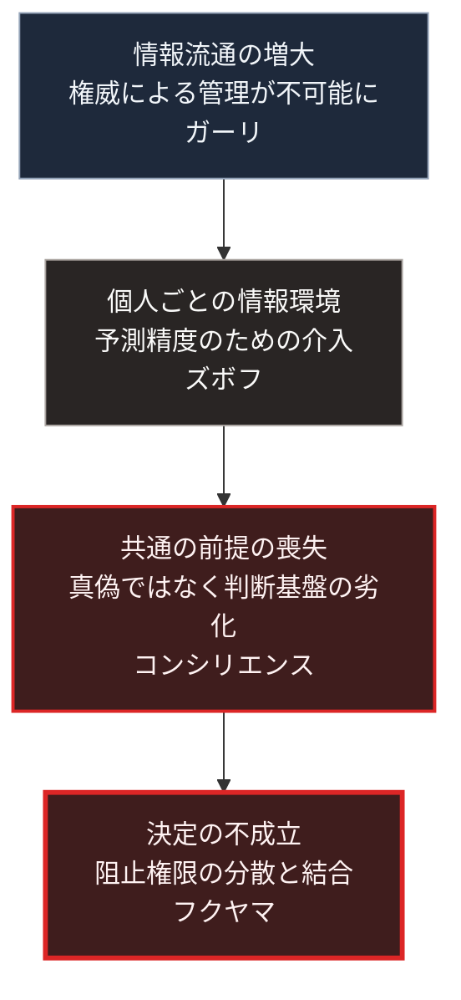

### 序論：本章が扱う範囲

本章は、社会が共通の事実認識を形成しにくくなっているという指摘について、代表的な4つの分析を整理します。

本章は、第Ⅱ部Cの他の章から参照される基準章です。以降の章では、これらの分析を繰り返し説明せず、本章を参照します。

本文は、各分析が何を主張しているかの記述に限定します。評価は章末で扱います。

### 1. 情報流通の増大と権威の変容 ―― ガーリ

元情報分析官のマーティン・ガーリは、2014年の著作において、情報の流通量が増大した局面で既存の権威が異議申し立てにさらされる過程を分析しました [ [ 197 ] ](https://openlibrary.org/works/OL20789949W) 。

同書の論旨は次のとおりです。20世紀の権威は、情報の流通を管理できることによって成立していました。流通が管理できなくなると、権威の判断の誤りが公衆の目に触れやすくなります。その結果、公衆は既存の権威を否定する方向へ動きますが、代替となる秩序を提示するには至りません。

同書はこの状態を、肯定を伴わない否定として記述しています。

### 2. 決定を阻止する権限の分散 ―― フクヤマ

政治学者フランシス・フクヤマは、2014年の著作において、アメリカの統治機構における決定の困難を分析しました [ [ 198 ] ](https://openlibrary.org/works/OL19986556W) 。

同書が用いる概念は、決定を阻止する権限が多数の主体に分散した状態です。同書はこれを拒否権政治、すなわちヴェトクラシーと呼びます。各主体は、自らに不利な決定を阻止できます。その結果、いずれの決定も実行に至りにくくなります。

第Ⅰ部B-6で整理した共和制の設計原理、すなわち権力の分割と相互の抑制が、この状態の制度的な背景にあります。

### 3. 認知環境の劣化 ―― コンシリエンス・プロジェクト

思想家ダニエル・シュマッテンバーガーらが運営する研究組織は、情報環境の劣化に関する一連の分析を公表しています [ [ 230 ] ](https://consilienceproject.org/) 。代表的な論考は、2022年2月に公表された、悪意ある情報発信の帰結に関するものです [ [ 331 ] ](https://consilienceproject.org/the-endgames-of-bad-faith-communication/) 。これらは査読を経た学術資料ではなく、同組織による非学術の分析です。

これらの分析が扱うのは、次の状況です。情報の生成と流通が容易になった結果、相手を説得するためではなく、相手の判断能力を損なうための情報発信が増加します。この状況では、個々の情報の真偽よりも、判断の前提となる共通の基盤そのものが失われます。

同組織は、この状況を単一の危機ではなく、複数の危機が相互に強化し合う状態として記述しています。

### 4. 行動データの商品化 ―― ズボフ

第Ⅱ部C-2で整理したとおり、ショシャナ・ズボフは、行動データから予測を生産して取引する経済形態を分析しました [ [ 5 ] ](https://openlibrary.org/works/OL18201749W) 。

本章の文脈で重要なのは、予測精度を高めるための行動への介入が、個人ごとに異なる情報環境を生むという点です。各人が異なる情報を提示される場合、共通の事実認識は形成されにくくなります。

### 5. 4つの分析の関係

4つの分析は、異なる領域を対象としています。ガーリは権威、フクヤマは制度、コンシリエンス・プロジェクトは情報環境、ズボフは経済構造です。

しかし、これらは1つの構造の異なる側面として整理できます。

情報の流通が増大し（ガーリ）、個人ごとに異なる情報が提示され（ズボフ）、判断の前提となる基盤が失われる（コンシリエンス）。この状態において、決定を阻止する権限が分散していれば（フクヤマ）、決定は実行に至りにくくなります。

### 🗺️ 図：4つの分析が指す共通の構造

#### 図の読み方

この図は、4つの分析を因果の連鎖として並べたものです。ただし、この連鎖は本書による整理であり、4者がこの順序で相互に参照しているわけではありません。

重要なのは、Dの段階です。第Ⅰ部B-4で述べたとおり、民主的な意思決定は参加者が共通の事実を前提とすることを条件とします。AからCまでの過程は、この条件を損ないます。そこにフクヤマの指摘する制度的な条件が重なると、決定そのものが成立しなくなります。

第Ⅰ部B-7で整理した失効の2経路に照らすと、これは経路1、すなわち正統性の供給源が成立しなくなる過程にあたります。同意という供給源は、参加者が同じ事実を前提としていることを要件とするためです。

第Ⅲ部-11で述べる悲観シナリオにおいて、段階2から段階3への移行を決定づけるのは、この構造です。

---

### 現代社会構造への射程と本質（本章のまとめ）

本セクションは、著者による解釈です。前節までの記述とは区別して読んでください。

1.  **現代社会構造の原点**

    共通の事実認識という条件は、第Ⅰ部C-4で記述した活版印刷の帰結の1つでした。同一の本文を多数の人が参照できる状態によって、議論の共通基盤は作られました。

    本章で整理した4つの分析は、この基盤が別の技術によって損なわれつつあるという指摘です。同じ技術の系譜が、基盤を作り、基盤を損なっています。

2.  **歴史的事実の本質**

    本章から抽出できるのは、次の点です。合意形成の困難は、意見の対立から生じるのではなく、対立を解消するための共通の前提が失われることから生じます。

    意見の対立は、共通の前提があれば議論によって処理できます。前提が失われた場合、議論は処理の手段として機能しません。

3.  **現代社会の現状と課題**

    第Ⅲ部-12で整理する早期警戒指標のうち、差分4、すなわち事実認識の共有に関する指標は、本章の構造に対応します。

    第Ⅴ部では、判断の根拠を提示し、情報源へ到達できる仕組みを設計要件として扱います。これは本章で整理した構造のうち、BとCの段階に対する応答です。
