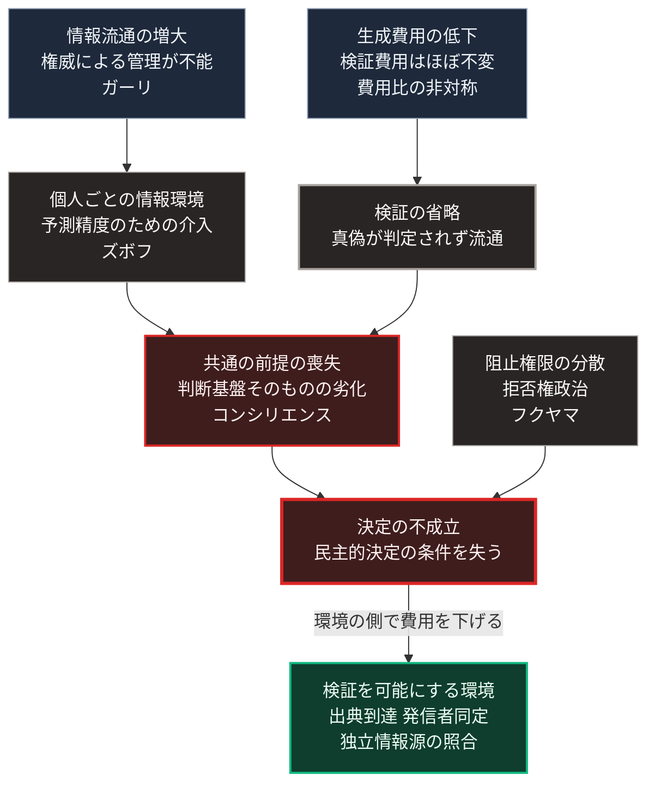

### 序論：本章が扱う範囲

本章は、社会が共通の事実認識を形成しにくくなっているという指摘について、代表的な4つの分析を整理します。

あわせて、その背景にある技術的な条件を扱います。すなわち、生成AIによる情報の生成費用の低下と、検証費用との間に生じた非対称です。前半では4つの分析が何を主張しているかを述べ、後半ではこの費用の非対称が情報環境に対して持つ意味を整理します。

本章は、[第Ⅱ部C](15_platform-capitalism-centralization)の他の章から参照される基準章です。以降の章では、これらの分析を繰り返し説明せず、本章を参照します。

本文は、観測された事実と、そこから導かれる構造の整理に限定します。評価は章末で扱います。

### 1. 情報流通の増大と権威の変容 ―― ガーリ

元情報分析官のマーティン・ガーリは、2014年の著作において、情報の流通量が増大した局面で既存の権威が異議申し立てにさらされる過程を分析しました [ [ 197 ] ](https://openlibrary.org/works/OL20789949W) 。

同書の論旨は次のとおりです。20世紀の権威は、情報の流通を管理できることによって成立していました。流通が管理できなくなると、権威の判断の誤りが公衆の目に触れやすくなります。その結果、公衆は既存の権威を否定する方向へ動きますが、代替となる秩序を提示するには至りません。

同書はこの状態を、肯定を伴わない否定として記述しています。

### 2. 決定を阻止する権限の分散 ―― フクヤマ

政治学者フランシス・フクヤマは、2014年の著作において、アメリカの統治機構における決定の困難を分析しました [ [ 198 ] ](https://openlibrary.org/works/OL19986556W) 。

同書が用いる概念は、決定を阻止する権限が多数の主体に分散した状態です。同書はこれを拒否権政治、すなわちヴェトクラシーと呼びます。各主体は、自らに不利な決定を阻止できます。その結果、いずれの決定も実行に至りにくくなります。

[第Ⅰ部B-6](monarchy-aristocracy-republic)で整理した共和制の設計原理、すなわち権力の分割と相互の抑制が、この状態の制度的な背景にあります。

### 3. 認知環境の劣化 ―― コンシリエンス・プロジェクト

思想家ダニエル・シュマッテンバーガーらが運営する研究組織は、情報環境の劣化に関する一連の分析を公表しています [ [ 230 ] ](https://consilienceproject.org/) 。代表的な論考は、2022年2月に公表された、悪意ある情報発信の帰結に関するものです [ [ 331 ] ](https://consilienceproject.org/the-endgames-of-bad-faith-communication/) 。これらは査読を経た学術資料ではなく、同組織による非学術の分析です。

これらの分析が扱うのは、次の状況です。情報の生成と流通が容易になった結果、相手を説得するためではなく、相手の判断能力を損なうための情報発信が増加します。この状況では、個々の情報の真偽よりも、判断の前提となる共通の基盤そのものが失われます。

同組織は、この状況を単一の危機ではなく、複数の危機が相互に強化し合う状態として記述しています。

### 4. 行動データの商品化 ―― ズボフ

[第Ⅱ部C-2](17_surveillance-capitalism-algocracy)で整理したとおり、ショシャナ・ズボフは、行動データから予測を生産して取引する経済形態を分析しました [ [ 5 ] ](https://openlibrary.org/works/OL18201749W) 。

本章の文脈で重要なのは、予測精度を高めるための行動への介入が、個人ごとに異なる情報環境を生むという点です。各人が異なる情報を提示される場合、共通の事実認識は形成されにくくなります。

### 5. 4つの分析の関係

4つの分析は、異なる領域を対象としています。ガーリは権威、フクヤマは制度、コンシリエンス・プロジェクトは情報環境、ズボフは経済構造です。

しかし、これらは1つの構造の異なる側面として整理できます。

情報の流通が増大し（ガーリ）、個人ごとに異なる情報が提示され（ズボフ）、判断の前提となる基盤が失われる（コンシリエンス）。この状態において、決定を阻止する権限が分散していれば（フクヤマ）、決定は実行に至りにくくなります。

### 6. 情報量と内容の区別

前節までの4つの分析のうち、情報環境の劣化に関する指摘は、情報の生成と流通に要する費用が下がったことを前提としています。以下では、その費用の側を整理します。

1948年、クロード・シャノンは、通信における情報量を定量的に扱う理論を提示しました [ [ 26 ] ](https://web.archive.org/web/19980715013143/http://cm.bell-labs.com/cm/ms/what/shannonday/shannon1948.pdf) 。

この理論が扱うのは、伝送の量です。送り手がどれだけの選択肢から選んだかによって情報量が定義され、内容の真偽や有用性は対象になりません。

この区別が、後半の出発点です。生成AIが変えたのは、伝送される量ではなく、生成される内容の量と、その生成に要する費用です。

### 7. 生成費用の低下と、その帰結

[第Ⅲ部-4](risk-ai-and-dependency)で整理するとおり、生成AIは文章、画像、音声を低い費用で生成します。この変化は、次の2つの帰結を持ちます。

第一に、特定の主張を支持する情報を大量に生成し流通させる費用が低下します。

第二に、生成された情報が実在の記録と区別しにくい場合、受け手は個々の情報について検証を要します。検証の費用は、生成の費用ほどには低下していません。

この結果、生成と検証の間で費用の非対称が拡大します。生成が安価で検証が高価であるとき、検証は現実的に実行されなくなります。

### 8. 生成された情報が学習に用いられる場合

生成AIの出力が、次世代の生成AIの学習データに含まれる状況について、実証研究が公表されています。

2024年に公表された研究は、生成されたデータで繰り返し学習させた場合に、モデルの出力の多様性が失われていく現象を報告しました [ [ 235 ] ](https://www.nature.com/articles/s41586-024-07566-y) 。同研究は、この現象を、元のデータ分布の裾が段階的に失われる過程として記述しています。

この観測が示すのは、生成された情報の増加が、情報環境だけでなく、生成AI自身の性能にも作用しうるという点です。

### 9. 検証の側の構造

前2節から、検証の費用が相対的に上昇した状況において、何が検証の手段として残るかが問題になります。

検証の手段は、次の3つに分類できます。

**手段1：出典への到達**。情報が参照している一次資料へ直接到達し、照合すること。本書が各記述に出典への直接リンクを付す理由は、ここにあります。

**手段2：発信者の同定**。情報の発信者が誰であるかを、暗号的な署名などによって確認すること。

**手段3：複数の独立した情報源の照合**。異なる経路から得た情報が一致するかを確認すること。

いずれの手段も、受け手に費用を要求します。[第Ⅲ部-5](20_autonomous-society-frictions)で整理するとおり、負荷の高い選択肢は選ばれにくいため、これらの手段が実際に用いられるかどうかは、環境の設計に依存します。

### 🗺️ 図：4つの分析と、費用の非対称が集まる先

共通の前提が失われる過程と、生成と検証の費用比の非対称が、同じ帰結へ集まる構造を示します。

#### 図の読み方

この図には、最上段に2つの起点があります。1つは情報の流通の増大であり、もう1つは生成と検証の費用比の非対称です。2つの流れは中段で合流し、制度的な条件と合わせて、1つの帰結へ集まります。ただし、この連鎖は本書による整理であり、各分析がこの順序で相互に参照しているわけではありません。

情報の流通の増大から下る流れは、共通の前提が失われる過程です。権威による管理が及ばなくなり、個人ごとに異なる情報が提示され、判断の前提となる基盤が失われます。

もう1つの流れが示すのは、問題が情報の量そのものではなく、生成と検証の費用比にあるという点です。情報の量は、[第Ⅰ部C-4](12_printing-press-religious-reformation)で記述した活版印刷以来、増加を続けてきました。量の増加だけであれば、新しい現象ではありません。

新しいのは、生成の費用が検証の費用を大きく下回る状態です。この状態では、検証の省略が個々の受け手にとって合理的な選択になり、真偽の判定されない情報が流通します。その帰結は、左の流れと同じ箱、すなわち共通の前提の喪失に合流します。

フクヤマの分析は、これら2つの過程とは独立した制度的な条件です。決定を阻止する権限が分散していれば、決定は実行に至りにくくなります。

重要なのは、決定の不成立という帰結です。[第Ⅰ部B-4](democracy-history)で述べたとおり、民主的な意思決定は参加者が共通の事実を前提とすることを条件とします。上段からの2つの流れは、この条件を損ないます。そこに制度的な条件が重なると、決定そのものが成立しなくなります。

[第Ⅰ部B-7](isms-failure-comparison)で整理した失効の2経路に照らすと、これは経路1、すなわち正統性の供給源が成立しなくなる過程にあたります。同意という供給源は、参加者が同じ事実を前提としていることを要件とするためです。

図の末尾に置いた箱は、この構造への応答です。検証を受け手の努力に委ねるのではなく、検証に要する費用を環境の側で下げる構成であり、[第Ⅴ部](42_taoist-wu-wei-non-action)で扱う設計要件に対応します。

[第Ⅲ部-9](scenario-pessimistic)で述べる悲観シナリオにおいて、段階2から段階3への移行を決定づけるのは、この構造です。

---

### 現代社会構造への射程と本質（本章のまとめ）

本セクションは、著者による解釈です。前節までの記述とは区別して読んでください。

1.  **現代社会構造の原点**

    共通の事実認識という条件は、[第Ⅰ部C-4](12_printing-press-religious-reformation)で記述した活版印刷の帰結の1つでした。同一の本文を多数の人が参照できる状態によって、議論の共通基盤は作られました。

    この基盤は、複製の費用が下がる一方で、原本を作る費用は残ったことに支えられていました。生成の費用が低下したことで、この条件は変化しています。

    本章で整理した4つの分析は、この基盤が別の技術によって損なわれつつあるという指摘です。同じ技術の系譜が、基盤を作り、基盤を損なっています。

2.  **歴史的事実の本質**

    本章から抽出できるのは、次の2点です。

    第一に、合意形成の困難は、意見の対立から生じるのではなく、対立を解消するための共通の前提が失われることから生じます。意見の対立は、共通の前提があれば議論によって処理できます。前提が失われた場合、議論は処理の手段として機能しません。

    第二に、情報環境の質を規定するのは、情報の量ではなく、生成と検証の費用比です。この費用比は技術によって変動します。したがって、検証の費用を下げる技術と設計が、情報環境の質を回復する経路となります。

3.  **現代社会の現状と課題**

    [第Ⅲ部-10](scenario-comparison)で整理する早期警戒指標のうち、差分4、すなわち事実認識の共有に関する指標は、本章の構造に対応します。

    [第Ⅲ部-9](scenario-pessimistic)で述べる悲観シナリオにおいて、供給の停止と情報環境の機能不全が重なる状況も、本章の構造から導かれます。災害時に必要なのは、供給の維持と、状況に関する検証可能な情報の流通です。

    [第Ⅴ部](42_taoist-wu-wei-non-action)では、判断の根拠を提示し、情報源へ到達できる仕組みを設計要件として扱います。局所の情報基盤において、出典への到達と発信者の同定を実装する構成です。これは本章で整理した構造のうち、BとCの段階に対する応答です。
