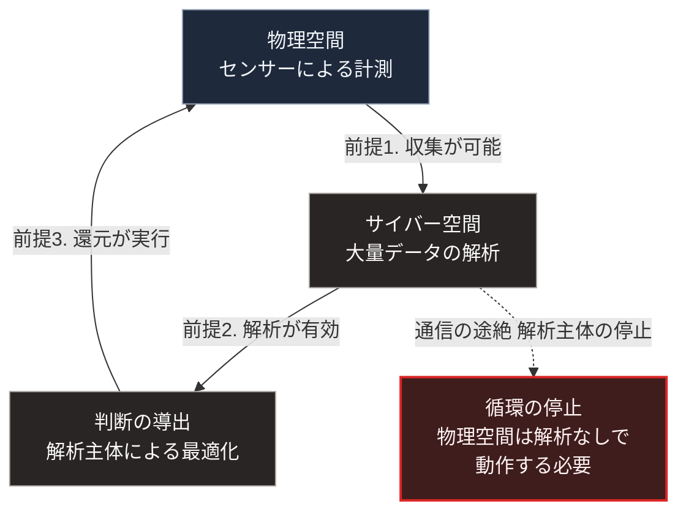

### 序論：本章が扱う範囲

本章は、日本政府が掲げる社会像であるSociety 5.0について、その内容と前提を整理します。あわせて、同じ政府が設定している長期の研究開発目標を扱い、両者が本書の枠組みでどの位置に来るかを確認します。

本章の情報源は、内閣府の公式資料に限定します [ [ 7 ] ](https://www8.cao.go.jp/cstp/society5_0/) 。本文は、構想が何を主張しているかの記述と、その前提の整理に限定します。第2節の前提の整理は、公式資料の記述から著者が再構成したものです。評価は図の読み方および章末で扱います。

### 1. 構想の内容

Society 5.0は、狩猟社会、農耕社会、工業社会、情報社会に続く社会像として、2016年の第5期科学技術基本計画において提示されました。

同構想の中核は、サイバー空間と物理空間を高度に融合させることにあります。物理空間のセンサーから得られる大量のデータをサイバー空間で解析し、その結果を物理空間へ還元する循環です。

同構想が掲げる目的は、経済発展と社会的課題の解決を両立させることです。対象として挙げられる課題には、少子高齢化、地方の過疎化、そしてエネルギーと環境の制約が含まれます。

### 2. 構想が置いている前提

同構想は、次の3つを前提としています。

**前提1：データの収集が可能であること**。物理空間の状態を十分な密度と精度で計測できること。

**前提2：解析の結果が有効であること**。収集したデータから、課題の解決に資する判断を導けること。

**前提3：還元が実行されること**。導かれた判断が、物理空間で実際に実行されること。

この3つの前提は、第Ⅰ部C-8で整理した計量の問題と、第Ⅰ部B-3で整理した情報の集約の問題に、それぞれ対応します。

### 3. 第Ⅰ部の枠組みとの対応

**計量の観点**。前提1は、計量の対象を拡大することを意味します。第Ⅰ部C-8で述べたとおり、計量された指標は最適化の目標となり、計量されない側面は軽視されます。したがって、何を計測するかの選択が、何が改善されるかを決めます。

**情報集約の観点**。前提2は、分散した情報を集約して判断を導くことを意味します。第Ⅰ部B-3で参照したハイエクの議論は、集計になじまない局所知識が集約の過程で失われると指摘しました。センサーによる計測は、この制約を部分的に緩和しますが、解消はしません。計測されるのは計測可能な量であり、現場の判断に用いられる暗黙の知識ではないためです。

**集中の観点**。前提2と前提3は、解析と判断を担う主体が存在することを意味します。第Ⅰ部C-11で述べたとおり、設計が規定しない層では経済的な誘因に従って集中が生じます。

### 4. 長期の研究開発目標

政府は、統合管理を支える技術についても、長期の目標を設定しています。内閣府が推進するムーンショット型研究開発制度は、2050年前後を到達時期とする複数の目標を掲げ、それに向けた研究開発を支援する制度です [ [ 233 ] ](https://www8.cao.go.jp/cstp/moonshot/index.html) 。

同制度は、総合科学技術・イノベーション会議のもとで運用されています。目標は複数設定されています。内容には、身体、脳、空間、時間の各制約からの解放が含まれます。疾病の早期予測と予防、AIとロボットの共進化、そして持続可能な資源循環も対象です。

同制度の目標は、次の性質を持ちます。

第一に、到達時期が2050年前後に設定されています。第Ⅲ部-1で整理する確度の階層に照らせば、これは階層3または階層4に属する事象です。

第二に、目標は達成が保証されるものではなく、挑戦的な水準に設定されています。同制度自身が、失敗を許容する設計であることを明示しています。

第三に、目標は技術の到達点として記述されており、社会への実装の経路は別途検討されます。

第Ⅰ部C-1で整理した4段階モデルにおいて、同制度が対象とするのは主として効果1です。すなわち、作業の代替を可能にする技術の実現です。

効果2から効果4までは、同制度の直接の対象ではありません。ここでいう効果2から効果4とは、組織の再設計、職能の再編、そして制度の変更です。

第Ⅰ部C-1で参照したデイヴィッドの分析が示したとおり、技術の効果は組織の再設計を経て発現します。第Ⅰ部C-12で整理したとおり、効果1から効果4までの所要時間は、過去の事例で数十年に及びました。

### 5. 構想と本書の関係

本書は、Society 5.0の目的、すなわち経済発展と社会的課題の解決の両立を否定するものではありません。

本書が扱うのは、同構想が前提とする統合管理が機能しない局面です。第Ⅱ部D-6で記述するとおり、通信の途絶は日常的な作業の誤りからも生じます。統合管理は、通信と中央の解析が維持されている限りにおいて機能します。

したがって、本書の設計は同構想と競合するものではなく、同構想が前提とする条件が失われた期間を埋めるものとして位置づけられます。

### 🗺️ 図：統合管理の循環と、その前提

#### 図の読み方

この図は、左側に3つの枠で閉じた循環があり、そこから右側へ点線で出る1つの枠を置いた形をしています。循環をつなぐ3本の矢印に、構想が置く3つの前提を記しています。

循環は、3つの前提がすべて成立している間、機能します。いずれか1つが失われると、循環は止まります。

右側の点線の先が、本書の関心です。通信が途絶した場合、あるいは解析を担う主体が停止した場合、物理空間の設備は解析の結果なしに動作しなければなりません。

第Ⅱ部D-6で整理する機能の3類型に照らせば、統合管理に依存する機能は類型3、すなわち通信がなければ動作しない機能にあたります。第Ⅴ部で扱うのは、生存に必要な機能を類型1へ移す設計です。

なお、この整理は統合管理を否定するものではありません。循環が機能している間、統合管理は効率と課題解決に寄与します。本書の論点は、循環が止まった期間の設計が別途必要であるという点に限られます。

---

### 現代社会構造への射程と本質（本章のまとめ）

本セクションは、著者による解釈です。前節までの記述とは区別して読んでください。

1.  **現代社会構造の原点**

    統合管理という構想は、第Ⅰ部A-6で記述した明治期の中央集権化と同じ系譜にあります。全国の状態を中央が把握し、中央の判断を全国で実行する構成です。異なるのは、把握の手段がセンサーとなり、判断の手段が解析となった点です。

    国家が長期の技術目標を設定し、研究開発を支援する方式にも前例があります。第Ⅰ部C-10で記述した計算機の成立過程では、第二次世界大戦期の国家主導の開発が基盤技術を成立させました。

2.  **歴史的事実の本質**

    本章から抽出できるのは、次の点です。統合管理の有効性は、統合を支える接続が維持されている限りにおいて成立します。この条件は、第Ⅱ部D-5およびD-6で記述するとおり、日常的な事象によっても失われます。

    第4節で整理した研究開発目標については、別の点が抽出できます。技術目標の達成時期と、社会的効果の発現時期とは、区別して扱う必要があります。前者は研究開発の問題であり、後者は組織と制度の問題です。

    第4節で示した制度の対象が効果1に限られることは、制度の欠陥ではありません。研究開発の支援制度として、対象を技術の実現に限定するのは合理的です。本書の観点から重要なのは、効果2から効果4を担う仕組みが別途必要になるという点です。

3.  **現代社会の現状と課題**

    第Ⅲ部-9で述べるベースラインでは、統合管理と局所自律が併存します。両者は代替関係ではなく、平時と途絶時とで役割を分ける関係にあります。

    第Ⅴ部の設計は、この役割分担を具体化するものです。統合管理の下に、接続が失われても動作する層を置く構成です。

    研究開発目標については、次の見通しが導かれます。2050年前後に技術目標が達成された場合でも、その社会的な効果が発現するのはさらに後になります。第Ⅲ部の3つのシナリオが扱う20年の時間軸において、これらの目標が社会構造を変える主要因となる可能性は限定的です。

    第Ⅲ部-10で述べる楽観シナリオの成立条件は、技術の性能ではなく、組織の適応速度と制度の追随速度です。第4節で整理した制度は、この条件のうち技術の側を扱うものです。

    したがって、技術目標の進捗だけでは、楽観シナリオへの分岐を判断できません。第Ⅲ部-12で整理するとおり、業務手順を変更した組織の比率と制度改定の実施状況のほうが、直接の指標となります。
