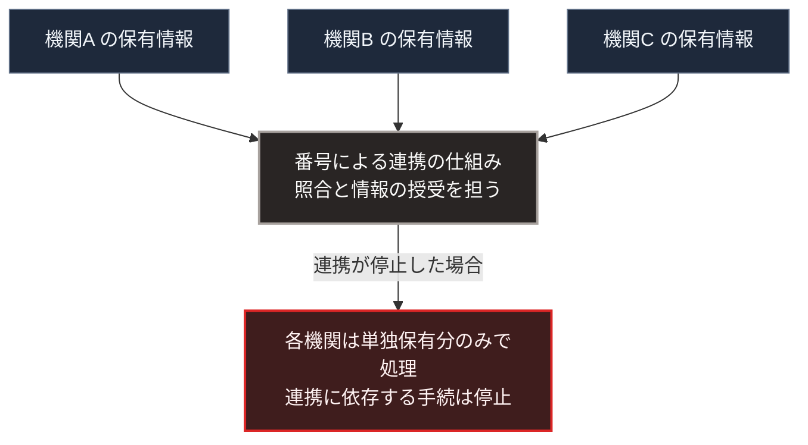

### 序論：本章が扱う範囲

本章は、日本政府が進める行政のデジタル化について、その計画と制度の構成を整理します。

本章の情報源は、デジタル庁の公式資料に限定します。本文は、計画と制度が何を定めているかの記述に限定し、評価は章末で扱います。

### 1. 重点計画

デジタル庁は、デジタル社会の実現に向けた重点計画を策定し、毎年改定しています [ [ 234 ] ](https://www.digital.go.jp/policies/priority-policy-program) 。現行の計画は、2026年7月21日に閣議決定されたものです [ [ 332 ] ](https://www.digital.go.jp/assets/contents/node/basic_page/field_ref_resources/5ecac8cc-50f1-4168-b989-2bcaabffe870/208168e8/20260721_policies_priority_outline_03.pdf) 。

同計画は、政府全体のデジタル化の方針と、各府省が実施する施策を体系化した文書です。対象には、行政手続のオンライン化、データの標準化と連携、そして自治体の情報システムの統一が含まれます。

自治体の情報システムについては、2025年度末を原則の期限として、標準仕様に準拠したシステムへの移行が進められました。この移行により、自治体ごとに異なっていたシステムの構成が共通化されます。

デジタル庁が2026年6月30日付で公表した資料によれば、対象となる全34,366システムのうち、2025年度末までに24,353システム、すなわち70.9%が移行を完了しました。残る10,013システムは特定移行支援システムとして扱われ、該当する団体は全1,788団体のうち1,015団体です。同庁は、2026年度末までに全体の約90%が移行を完了する見込みとしています [ [ 333 ] ](https://www.digital.go.jp/assets/contents/node/basic_page/field_ref_resources/c58162cb-92e5-4a43-9ad5-095b7c45100c/d70e8d19/20260630_policies_local_governments_doc_1.pdf) 。

### 2. マイナンバー制度

マイナンバー制度は、住民票を持つすべての人に固有の番号を付与し、行政機関の間で情報を連携させる制度です [ [ 8 ] ](https://www.digital.go.jp/policies/mynumber/) 。

同制度の構成は、次のとおりです。番号は、社会保障、税、災害対策の分野において、複数の機関が保有する情報を同一人物のものとして照合するために用いられます。カードは、本人確認と電子的な認証の手段として用いられます。

同制度は、情報を1か所に集約するのではなく、各機関が分散して保有する情報を、番号を介して連携させる設計を採っています。

### 3. 第Ⅰ部の枠組みとの対応

第Ⅰ部A-5で記述したとおり、明治期の中央集権化は4つの機能の集約として実施されました。そのうち人材規格の集約は、戸籍と地籍という記録の整備を前提としていました。

第Ⅰ部C-2で述べたとおり、記録の様式が確立すると、業務は担当者の記憶や判断から独立します。行政のデジタル化は、この記録の様式を電子的に標準化する過程として位置づけられます。

第Ⅰ部C-8で整理した計量の観点からは、次の点が重要です。標準化された記録は、統計として集計しやすくなります。同時に、様式に載らない情報は捨象されます。

### 4. 構成上の特徴

マイナンバー制度が採る分散保有と番号による連携という設計は、第Ⅱ部D-4で整理する単一障害点の観点から2つの性質を持ちます。

第一に、情報そのものは分散しているため、1か所の障害がすべての情報の喪失を意味しません。

第二に、連携の仕組みは集約されています。連携が停止した場合、各機関は自らの保有する情報のみで業務を行う必要があります。

第Ⅱ部D-6で整理する機能の3類型に照らせば、連携に依存する手続は類型3に、各機関が単独で処理できる手続は類型1に属します。

### 🗺️ 図：分散保有と集約された連携

#### 図の読み方

この図は、マイナンバー制度の構成を、保有と連携という2つの層に分けて示したものです。

保有の層は分散しています。この点で、単一の障害がすべての情報を失わせる構成にはなっていません。

連携の層は集約されています。第Ⅰ部C-11で述べたとおり、分散設計は明示的に規定した層でのみ分散を保証します。保有が分散していても、連携が集約されていれば、連携に依存する機能は集約に伴う性質を持ちます。

この整理は、制度の設計を批判するものではありません。連携を集約することは、整合性の確保と運用費用の面で合理的です。本書の論点は、連携が停止した期間において、どの手続が継続できるかを事前に区別しておく必要があるという点にあります。

---

### 現代社会構造への射程と本質（本章のまとめ）

本セクションは、著者による解釈です。前節までの記述とは区別して読んでください。

1.  **現代社会構造の原点**

    行政の記録を標準化し、中央が把握可能にする過程は、第Ⅰ部C-2で記述した文字の成立以来の系譜に属します。デジタル化は、この系譜における様式の変更です。

2.  **歴史的事実の本質**

    本章から抽出できるのは、次の点です。分散と集約は、層ごとに独立して設計されます。ある層の分散は、他の層の分散を保証しません。

3.  **現代社会の現状と課題**

    第Ⅳ部-1で述べる「代行から開示へ」という期待の変化は、行政のデジタル化にも当てはまります。手続の自動化が進むほど、決定の根拠を検証できることの重要性が高まります。

    第Ⅴ部で扱う局所の情報基盤は、行政の情報基盤を代替するものではありません。連携が停止した期間において、個人と地域が自らの記録を参照できる状態を保つための構成です。
