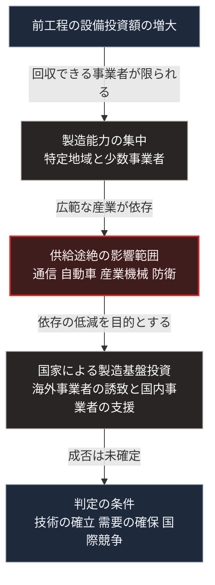

### 序論：本章が扱う範囲

本章は、半導体の供給網がどのように集中しているか、そして日本政府がそれに対してどのような施策を採っているかを整理します。

本章の情報源は、経済産業省の公式資料に限定します [ [ 9 ] ](https://www.meti.go.jp/policy/mono_info_service/joho/semiconductor/) 。本文は、事実と政策の内容の記述に限定し、評価は章末で扱います。

### 1. 供給網の構造

半導体の製造は、設計、前工程、後工程という段階に分かれます。前工程、すなわちウェハ上に回路を形成する段階は、巨額の設備投資と高度な製造技術を要します。

最先端の前工程については、製造能力が特定の地域と少数の事業者に集中しています。この集中は、製造技術の高度化に伴う設備投資額の増大によって進行しました。

半導体は、通信機器、自動車、産業機械、そして防衛装備に用いられます。したがって、供給の途絶は広範な産業に影響します。

### 2. 日本政府の施策

経済産業省は、半導体およびデジタル産業に関する戦略を公表しています。

同戦略の柱は、次のとおりです。第一に、国内における製造基盤の確保。第二に、次世代技術の研究開発。第三に、設計や製造装置など、日本が強みを持つ分野の維持です。

国内製造基盤の確保については、海外事業者の国内工場への支援と、国内事業者による最先端の前工程の立ち上げ支援が実施されています。

前者の代表は、台湾のTSMCが熊本県に設立したJASMへの助成です。経済産業省の資料によれば、2022年6月17日に認定された第1工場の計画に最大4,760億円、2024年2月24日に認定された第2工場の計画に最大7,320億円の助成が決定されています [ [ 334 ] ](https://www.kanto.meti.go.jp/seisaku/iot_robot/digital_industry/data/1_251029meti.pdf) 。

後者の代表は、Rapidusです。2025年4月25日、情報処理の促進に関する法律の改正法が成立し、同年5月14日に令和7年法律第30号として公布されました [ [ 335 ] ](https://www.sangiin.go.jp/japanese/joho1/kousei/gian/217/meisai/m217080217011.htm) 。この改正により、政府による出資が可能となりました。経済産業省は2025年11月21日、同法に基づく出資の対象としてRapidusを選定したと公表しています [ [ 336 ] ](https://www.meti.go.jp/press/2025/11/20251121001/20251121001.html) 。

これらの支援の枠組みとして、政府は2024年11月に、2030年度までに合計10兆円以上の公的支援をAIと半導体の分野に行う方針を定めました。内訳は、金融支援が4兆円以上、補助と委託が6兆円程度です [ [ 334 ] ](https://www.kanto.meti.go.jp/seisaku/iot_robot/digital_industry/data/1_251029meti.pdf) 。

### 3. 第Ⅰ部の枠組みとの対応

第Ⅰ部C-11で整理したとおり、規模の経済が働く領域では集中が生じます。半導体の前工程は、この典型です。設備投資額が大きいほど、投資を回収できる事業者は限られます。

第Ⅱ部B-3で整理した外部依存の3類型のうち、半導体は依存3、すなわち技術と部材の供給網に属します。この依存は、平時においても途絶しうる性質を持ちます。輸出規制、事故、災害、そして相手国の産業政策の変更が、その要因です。

第Ⅰ部A-5で記述した明治期の中央集権化において、国家が基幹産業の立ち上げを主導した事例があります。現在の施策は、この系譜に位置づけられます。

### 4. 施策の性質

国家による製造基盤への投資は、次の性質を持ちます。

第一に、投資の回収には長期間を要します。製造技術の確立と量産の安定には、複数年を要するためです。

第二に、成否は技術の確立だけでなく、需要の確保に依存します。製造能力が確立しても、製品を購入する需要がなければ事業は継続しません。

第三に、国際的な競争の中で実施されます。他国も同種の施策を実施しており、その帰結は相互作用によって決まります。

これらの性質から、施策の成否を現時点で判定できません。第Ⅲ部-1で整理する確度の階層に照らせば、階層3に属する事象です。

### 🗺️ 図：集中の理由と、施策の位置

#### 図の読み方

この図は、集中が生じた理由と、それに対する施策の位置を示しています。

集中の起点は、設備投資額の増大という経済的な条件です。この条件は、政策によって変えられるものではありません。したがって、国家による投資は集中そのものを解消するのではなく、集中した製造能力の一部を国内に置くことを目的とします。

Eとして示した判定の条件は、いずれも現時点で確定していません。本書は、この施策の成否について予測を示しません。示すのは、成否を判定する際に確認すべき条件です。

第Ⅲ部-12で整理する差分3、すなわち外部事象の発生において、半導体の供給途絶は主要な項目の1つです。国内の製造基盤は、途絶時の影響を軽減する備えとして位置づけられます。

---

### 現代社会構造への射程と本質（本章のまとめ）

本セクションは、著者による解釈です。前節までの記述とは区別して読んでください。

1.  **現代社会構造の原点**

    半導体の供給網の集中は、第Ⅰ部B-2で述べた分業の深化の帰結です。分業が深化するほど生産性は向上し、同時に特定の工程への依存も深まります。

2.  **歴史的事実の本質**

    本章から抽出できるのは、次の点です。効率のために形成された集中は、途絶時には脆弱性となります。この二面性は、第Ⅱ部D-5で記述する電力系統の結合と同型です。

    国家による製造基盤への投資は、効率の一部を犠牲にして冗長性を確保する選択です。第Ⅱ部D-4で述べるとおり、この費用を誰が負担するかが、選択の実現可能性を規定します。

3.  **現代社会の現状と課題**

    第Ⅴ部で扱う局所の設計においても、半導体への依存は避けられません。局所の発電、蓄電、水処理、そして情報処理は、いずれも半導体を用いる機器によって実現されます。

    したがって、局所自律の設計は、機器の供給が制約された期間においても既存の機器を維持できることを要件とします。修理と部品交換の可能性が、設計上の論点となります。
