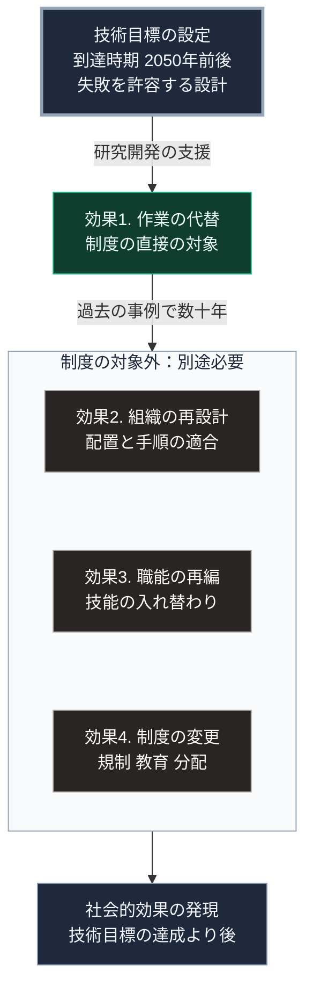

### 序論：本章が扱う範囲

本章は、日本政府が設定している長期の研究開発目標について、その内容を整理します。

対象は、内閣府が推進するムーンショット型研究開発制度です。本章の情報源は、同制度の公式資料に限定します。

本文は、制度が何を目標として掲げているかの記述に限定します。評価は図の読み方および章末で扱います。

### 1. 制度の概要

ムーンショット型研究開発制度は、2050年前後を到達時期とする複数の目標を設定し、それに向けた研究開発を支援する制度です [ [ 233 ] ](https://www8.cao.go.jp/cstp/moonshot/index.html) 。

同制度は、総合科学技術・イノベーション会議のもとで運用されています。目標は複数設定されており、身体、脳、空間、時間の制約からの解放、疾病の早期予測と予防、AIとロボットの共進化、そして持続可能な資源循環などが含まれます。

### 2. 目標の性質

同制度の目標は、次の性質を持ちます。

第一に、到達時期が2050年前後に設定されています。第Ⅲ部-1で整理する確度の階層に照らせば、これは階層3または階層4に属する事象です。

第二に、目標は達成が保証されるものではなく、挑戦的な水準に設定されています。同制度自身が、失敗を許容する設計であることを明示しています。

第三に、目標は技術の到達点として記述されており、社会への実装の経路は別途検討されます。

### 3. 第Ⅰ部の枠組みとの対応

第Ⅰ部C-1で整理した4段階モデルにおいて、同制度が対象とするのは主として効果1、すなわち作業の代替を可能にする技術の実現です。

効果2以降、すなわち組織の再設計、職能の再編、制度の変更については、同制度の直接の対象ではありません。

第Ⅰ部C-1で参照したデイヴィッドの分析が示したとおり、技術の効果は組織の再設計を経て発現します。したがって、技術目標の達成と社会的な効果の発現との間には、相当の時間差が生じます。

### 🗺️ 図：技術目標と社会的効果の間にある段階

#### 図の読み方

この図は、上から下へ縦に並ぶ形をしています。上段が技術目標、2段目が制度の対象である効果1、3段目の枠内が制度の対象外である効果2から効果4、最下段が社会的効果の発現です。

制度の対象が2段目の効果1に限られることは、制度の欠陥ではありません。研究開発の支援制度として、対象を技術の実現に限定するのは合理的です。

ただし、本書の観点からは、3段目の枠内が別途必要になるという点が重要です。第Ⅰ部C-12で整理したとおり、効果1から効果4までの所要時間は、過去の事例で数十年に及びました。2段目から3段目への矢印に、この時間を記しています。

したがって、2050年前後に技術目標が達成された場合でも、その社会的な効果が発現するのはさらに後になります。第Ⅲ部の3つのシナリオが扱う20年の時間軸において、これらの目標が社会構造を変える主要因となる可能性は限定的です。

---

### 現代社会構造への射程と本質（本章のまとめ）

本セクションは、著者による解釈です。前節までの記述とは区別して読んでください。

1.  **現代社会構造の原点**

    国家が長期の技術目標を設定し、研究開発を支援する方式は、第Ⅰ部C-10で記述した計算機の成立過程に前例があります。第二次世界大戦期における国家主導の開発が、基盤技術を成立させました。

2.  **歴史的事実の本質**

    本章から抽出できるのは、次の点です。技術目標の達成時期と、社会的効果の発現時期とは、区別して扱う必要があります。前者は研究開発の問題であり、後者は組織と制度の問題です。

3.  **現代社会の現状と課題**

    第Ⅲ部-10で述べる楽観シナリオの成立条件は、技術の性能ではなく、組織の適応速度と制度の追随速度です。本章で整理した制度は、この条件のうち技術の側を扱うものです。

    したがって、技術目標の進捗だけでは、楽観シナリオへの分岐を判断できません。第Ⅲ部-12で整理するとおり、業務手順を変更した組織の比率と制度改定の実施状況のほうが、直接の指標となります。
