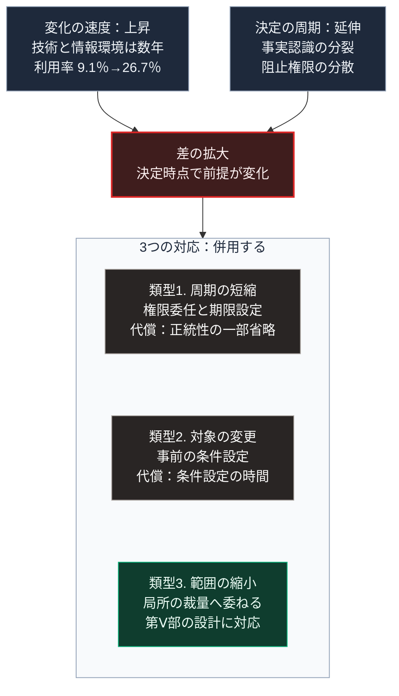

### 序論：本章が扱う範囲

本章は、民主的な意思決定に要する時間と、外部環境の変化速度との関係を整理します。

第Ⅰ部B-4で述べたとおり、民主主義は正統性の周期的な更新と引き換えに、決定に要する時間という費用を支払います。本章では、この費用が現在どのように現れているかを扱います。

本文は、構造の整理に限定します。評価は章末で扱います。

### 1. 決定に要する時間の構成

民主的な制度において、1つの政策が実施されるまでには、次の段階を要します。

第一に、争点の認識です。ある問題が、政策の対象として認識される段階です。

第二に、情報の共有です。争点に関する事実が、意思決定に関与する人々の間で共有される段階です。

第三に、討議と合意です。複数の選択肢が比較され、いずれかが選ばれる段階です。

第四に、成文化です。選ばれた選択肢が、法律や予算として定められる段階です。

第五に、執行です。成文化された内容が、行政機構を通じて実施される段階です。

各段階には固有の時間を要します。とりわけ第三の段階は、第Ⅰ部B-6で整理した速度と分散のトレードオフに直接規定されます。

### 2. 変化の速度との比較

第Ⅲ部-1で整理する確度の階層のうち、階層2に属する変化は、その速度を過去の推移から推定できます。

人口の年齢構成の変化は、数十年の時間軸で進行します。この速度は、前節の5段階の合計より遅い場合が多く、決定は変化に追随できます。

一方、技術の普及と情報環境の変化は、数年の時間軸で進行する事例が観測されています。第Ⅰ部C-12で整理したとおり、生成AIの業務への導入は、観測データの蓄積が始まってから数年で広範に及びました。2023年に公表された研究は、顧客対応業務への導入から数か月の観測で、生産性の変化を報告しています [ [ 118 ] ](https://www.nber.org/papers/w31161) 。第Ⅱ部C-3で示したとおり、日本の個人の生成AI利用率は2023年度の9.1%から2024年度の26.7%へ1年で上昇しました [ [ 405 ] ](https://www.soumu.go.jp/johotsusintokei/whitepaper/ja/r07/html/nd112210.html) 。

変化の速度が決定の周期を上回る場合、決定が実施された時点で、その決定が前提とした状況は既に変化しています。

### 3. 第Ⅱ部C-6の枠組みとの関係

第Ⅱ部C-6で整理した4つの分析は、前節の5段階のうち第二と第三の段階に作用します。

共通の事実認識が形成されにくい状態では、第二の段階に要する時間が延びます。決定を阻止する権限が分散している状態では、第三の段階が完了しにくくなります。

すなわち、変化の速度が上昇すると同時に、決定の周期も延びる方向の圧力が生じています。両者の差は、双方から拡大します。

### 4. 対応の類型

この差に対する対応は、3つに分類できます。

**類型1：決定の周期を短縮する**。手続の簡素化、権限の委任、そして期限の設定です。第Ⅰ部B-6で記述したローマの独裁官の制度は、非常時における周期の短縮の古典的な事例です。

**類型2：決定の対象を変える**。個々の事象について決定するのではなく、事象が発生した場合の対応の条件をあらかじめ決定します。第Ⅱ部D-3で述べる、事前の条件設定へ役割を移す構成です。

**類型3：決定を要する範囲を縮小する**。中央が決定する事項を減らし、局所の裁量に委ねる範囲を広げます。第Ⅱ部A-6で記述したEUの権限配分は、この類型の事例です。

### 🗺️ 図：決定の周期と変化の速度の関係

#### 図の読み方

この図は、上段の左右2つの動きが中段の1つの差へ集まり、下段の枠内で縦に並ぶ3つの対応へ下りる形をしています。

上段が示すのは、差の拡大が2つの方向から生じることです。左は変化が速くなる方向、右は決定が遅くなる方向です。第Ⅱ部C-6で整理した4つの分析は、右の側に作用します。

下段の3つの対応類型は、それぞれ異なる代償を伴います。

類型1は、正統性の調達を一部省略します。第Ⅰ部B-6で述べたとおり、ローマの独裁官には期間の限定が付されていました。限定がなければ、非常時の権限集中が常態化します。

類型2は、事前に条件を定めることを要します。条件の設定そのものには時間を要しますが、事象の発生後には時間を要しません。

類型3は、中央の決定を減らします。この類型は、第Ⅴ部で扱う自律分散型の設計に直接対応します。局所で決定できる範囲が広いほど、中央の決定周期による制約は小さくなります。

本書は、いずれか1つの類型のみを解とはしません。3つは組み合わせて用いられます。

---

### 現代社会構造への射程と本質（本章のまとめ）

本セクションは、著者による解釈です。前節までの記述とは区別して読んでください。

1.  **現代社会構造の原点**

    現在の意思決定制度は、第Ⅰ部B-4で記述した経緯を経て成立しました。その設計は、変化の速度が決定の周期より遅い環境を前提としています。

2.  **歴史的事実の本質**

    本章から抽出できるのは、次の点です。決定の遅さは民主主義の欠陥ではなく、正統性の調達に伴う費用です。問題は、その費用が環境の変化によって相対的に増大していることにあります。

3.  **現代社会の現状と課題**

    第Ⅲ部-10で整理する差分1と差分2、すなわち生産性向上と供給方式の転換は、いずれも決定を要します。決定の周期が変化に追随できない場合、これらは実現しません。

    第Ⅴ部の設計が類型3に対応するのは、この理由によります。中央の決定を待たずに局所で実施できる範囲を広げることが、決定の周期という制約を回避する経路の1つです。
