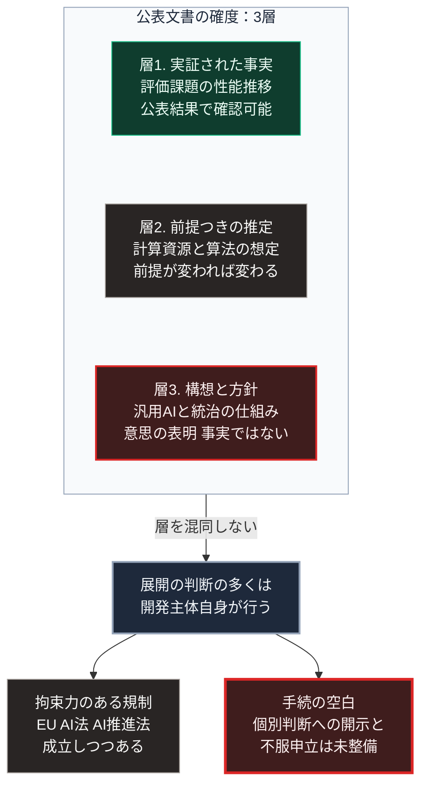

### 序論：本章が扱う範囲

本章は、AIの開発主体および関連する研究組織が公表している将来像と統治の構想について、その内容を整理します。

本章の情報源は、当該組織自身が公表した文書に限定します。これは、第三者の要約や報道ではなく、主張の原文を確認するためです。

本文は、各文書が何を主張しているかの記述に限定します。評価は章末で扱います。

### 1. 開発主体による方針の表明

OpenAIは2023年2月24日に、汎用的な人工知能の実現を目指すにあたっての方針を公表しました [ [ 231 ] ](https://openai.com/index/planning-for-agi-and-beyond/) 。

同文書の要点は、次のとおりです。第一に、能力の向上を段階的に展開し、社会が適応する時間を確保すること。第二に、利益の配分と統治の仕組みについて、広範な参加が必要であること。第三に、安全性の研究を能力の研究と並行して進めることです。

この文書は方針の表明であり、その履行を検証する外部の仕組みについては規定していません。

### 2. 研究組織による将来推定

AI Futures Projectという研究組織は、2025年4月3日に「AI 2027」と題する文書を公表しました。同文書は、今後数年間の能力向上と社会への影響について、時系列の推定を示しています [ [ 406 ] ](https://ai-2027.com/) 。同組織の活動全般については、その公式サイトで公表されています [ [ 232 ] ](https://ai-futures.org/) 。

この文書は、査読を経ていない予測文書です。したがって、本書の規範上は学術的な資料ではなく、当該組織自身の主張を示す一次資料として扱います。

同文書の推定は、単一の予測ではなく、複数の分岐を持つ経路として提示されています。推定の前提として、計算資源の増加率、算法の改善率、そして開発主体間の競争が置かれています。

同文書は、推定の前提と、それが外れる条件を明示しています。この点で、第Ⅲ部-1で本書が採用する方法と共通します。

### 3. 主張の確度の区別

次章の第Ⅱ部C-5で量子計算について採用する3層の区別が、ここでも適用できます。この3層は主張の実証度による区別であり、第Ⅲ部-1で定義する発生時期の予測可能性による階層1から階層4とは、別の体系です。

**層1：実証された事実**。特定の評価課題における性能の推移は、公表された結果として確認できます。

**層2：明示された前提に基づく推定**。前節の研究組織による時系列推定は、この層に属します。前提が変われば結果は変わります。

**層3：構想**。汎用的な人工知能の実現と、その統治の仕組みは、現時点では構想です。

開発主体の方針表明は、層3に関する意思の表明であり、層1の事実ではありません。

### 4. 統治の主体に関する論点

前2節の文書に共通するのは、統治の仕組みが未確立であるという認識です。

一方、拘束力のある規制は成立しつつあります。EUの人工知能規則、いわゆるAI法は、規則2024/1689として2024年7月12日に官報で公布され、同年8月1日に発効しました。汎用AIモデルに関する義務は2025年8月2日から、規則の大部分は2026年8月2日から適用されています [ [ 407 ] ](https://eur-lex.europa.eu/eli/reg/2024/1689/oj) 。

日本では、通称AI推進法が令和7年法律第53号として2025年5月28日に成立し、同年6月4日に公布されました。同法は、人工知能に関連する技術の研究開発と活用の推進に関する基本的な事項を定め、内閣に人工知能の戦略本部を置いています [ [ 408 ] ](https://laws.e-gov.go.jp/law/507AC0000000053) 。

国際的には、欧州評議会の人工知能と人権、民主主義、法の支配に関する枠組条約が、2024年9月5日に署名のために開放されました [ [ 409 ] ](https://www.coe.int/en/web/artificial-intelligence/the-framework-convention-on-artificial-intelligence) 。

したがって、規制そのものが存在しないという状態ではありません。現在、AIの開発と展開に関する判断の多くは、依然として開発主体自身によって行われています。未整備なのは、開発主体の個別の判断に対して、根拠の開示と不服申立を求める手続です。

第Ⅰ部C-1で整理した4段階モデルに照らすと、これは効果4、すなわち制度の変更が効果1から効果3に対して遅れている状態です。第Ⅰ部C-4で記述した活版印刷においても、出版の規制が整備されるまでには長い期間を要しました。

### 🗺️ 図：公表された文書の確度による分類

#### 図の読み方

この図は、上段の枠内に3つの層が縦に並び、中段の1つの状態を経て、下段で左右2つへ分かれる形をしています。

上段が示すのは、開発主体が公表する文書を読む際に、その確度を区別する必要があるという点です。層1の事実を根拠に層3の構想を確実なものとして扱うことは、推論として成立しません。逆に、層3が構想にすぎないことを理由に、層1の事実を軽視することも適切ではありません。

中段は、3層に共通する現状です。AIの開発と展開に関する判断の多くは、依然として開発主体自身によって行われています。

下段の左は、成立しつつある規制です。EUのAI法や日本のAI推進法は、空白を縮小する方向の制度です。ただし、個別の判断に対する手続を直ちに保証するものではありません。

下段の右が、本書にとって重要です。行政手続には決定の根拠を開示し不服を申し立てる制度がありますが、開発主体の判断について同等の手続は保証されていません。第Ⅲ部-5で整理する依存対象の移行は、この手続の空白の中で進行します。

第Ⅳ部-1で述べる「代行から開示へ」という期待の変化は、この空白に対する要請として理解できます。

---

### 現代社会構造への射程と本質（本章のまとめ）

本セクションは、著者による解釈です。前節までの記述とは区別して読んでください。

1.  **現代社会構造の原点**

    技術の展開に関する判断が開発主体に集中する構造は、第Ⅰ部C-11で記述した層3と層4の集中の延長にあります。情報の所在と探索を担う少数の事業者が、判断を担う主体にもなりつつあります。

2.  **歴史的事実の本質**

    本章から抽出できるのは、次の点です。開発主体の方針表明は、その意図を示しますが、履行を保証しません。履行の保証には、外部の検証と制度が必要です。

    第Ⅰ部D-1で整理した合意の履行保証の欠如という条件が、ここにも当てはまります。

3.  **現代社会の現状と課題**

    第Ⅲ部の3つのシナリオは、いずれもこの手続の空白を前提として構築されています。シナリオを分けるのは、空白が制度によってどの程度埋められるかです。

    第Ⅲ部-12で整理する指標のうち、判断の根拠を提示する設計の実装状況は、この空白の縮小を測る指標にあたります。
